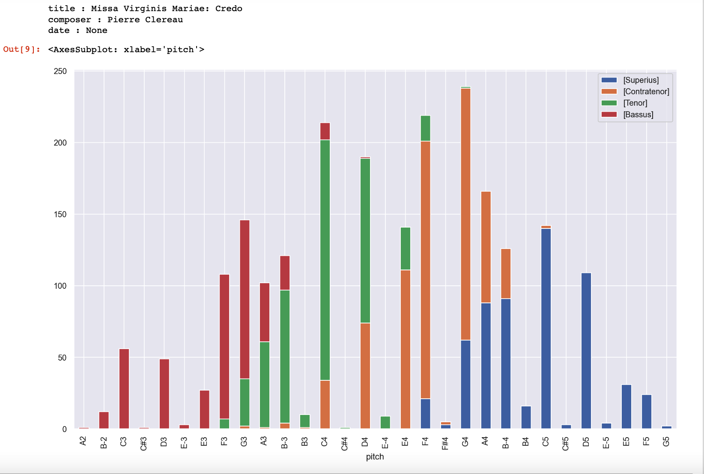
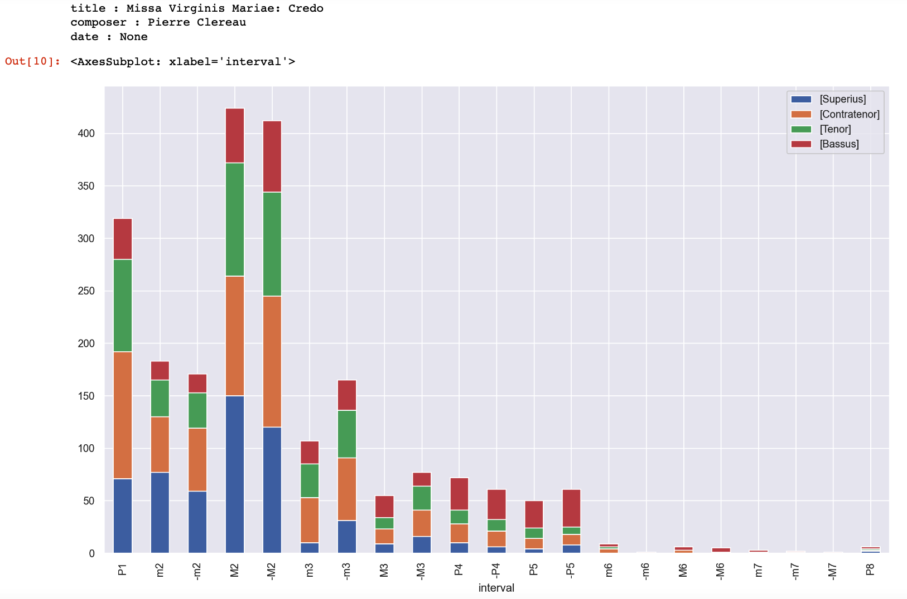

# Visualizations with CRIM Intervals

Various Python libraries exist to help create graphs and charts. To date (as of 2023) the CRIM Intervals team has developed tools for:

* Histograms (to show distribution or ranges of notes and melodic intervals, for example)
* Ngram Heat Maps (to show distribution of ngrams across a composition)
* Melodic Families (plots that show melodies as a branching series of intervallic steps)
* Cadence Radar Plots (circular grids that show the distribution of cadences in one or more pieces)

Note that some of these are built in to CRIM Intervals, and called with a simple function.  Others are built up in a series of steps, as shown in the samples below. 

All of following examples work in Jupyter Notebooks with CRIM Intervals. Some will work in VS Code or similar environments with some modfication.

### Histograms

#### Histogram of Notes

Below is an example of how to use Matplot to create a histogram of the of how many times each pitch is heard in each voice of the given piece. 

Note that this will only work in a Jupyter Notebook:

    pitch_order = ['E-2', 'E2', 'F2', 'F#2', 'G2', 'A2', 'B-2', 'B2', 
               'C3', 'C#3', 'D3', 'E-3','E3', 'F3', 'F#3', 'G3', 'G#3','A3', 'B-3','B3',
               'C4', 'C#4','D4', 'E-4', 'E4', 'F4', 'F#4','G4', 'A4', 'B-4', 'B4',
               'C5', 'C#5','D5', 'E-5','E5', 'F5', 'F#5', 'G5', 'A5', 'B-5', 'B5']
    %matplotlib inline  
    nr = piece.notes().fillna('-')  
    nr = nr.apply(pd.Series.value_counts).fillna(0).astype(int).reset_index().copy()  
    nr.rename(columns = {'index':'pitch'}, inplace = True)  
    nr['pitch'] = pd.Categorical(nr["pitch"], categories=pitch_order)  
    nr = nr.sort_values(by = "pitch").dropna().copy()  
    voices = nr.columns.to_list()  
    palette = sns.husl_palette(len(voices), l=.4)  
    md = piece.metadata  
    for key, value in md.items():  
        print(key, ':', value)  
    sns.set(rc={'figure.figsize':(15,9)})  
    nr.set_index('pitch').plot(kind='bar', stacked=True)  

**Sample Output**

#### Histogram of Intervals

Or use the Matplot library to create a chart of the frequence of interval usage: 

    %matplotlib inline
    int_order = ["P1", "m2", "-m2", "M2", "-M2", "m3", "-m3", "M3", "-M3", "P4", "-P4", "P5", "-P5", "m6", "-m6", "M6", "-M6", "m7", "-m7", "M7", "-M7", "P8", "-P8"]
    mel = piece.melodic()
    mel = mel.fillna("-")
    #count up the values in each item column--sum for each pitch.  
    #make a copy 
    mel = mel.apply(pd.Series.value_counts).fillna(0).astype(int).reset_index().copy()
    #rename the index column to something more useful
    mel.rename(columns = {'index':'interval'}, inplace = True)
    #apply the categorical list and sort
    mel['interval'] = pd.Categorical(mel["interval"], categories=int_order)
    mel = mel.sort_values(by = "interval").dropna().copy()
    voices = mel.columns.to_list()
    #collect and print information about composer and piece
    md = piece.metadata
    for key, value in md.items():
        print(key, ':', value)
    #set the figure size, type and colors
    palette = sns.husl_palette(len(voices), l=.4)
    sns.set(rc={'figure.figsize':(15,9)})
    mel.set_index('interval').plot(kind='bar', stacked=True)

**Sample Output**

#### NGram Heat Maps

#### Melody Families

#### Cadence Radar Plots

