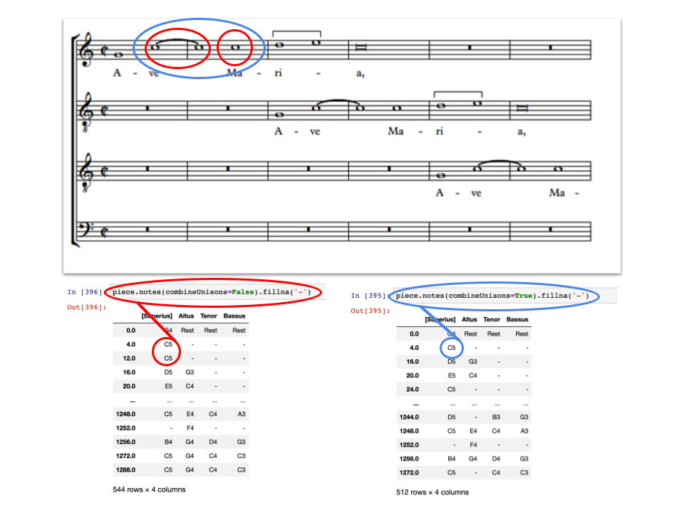
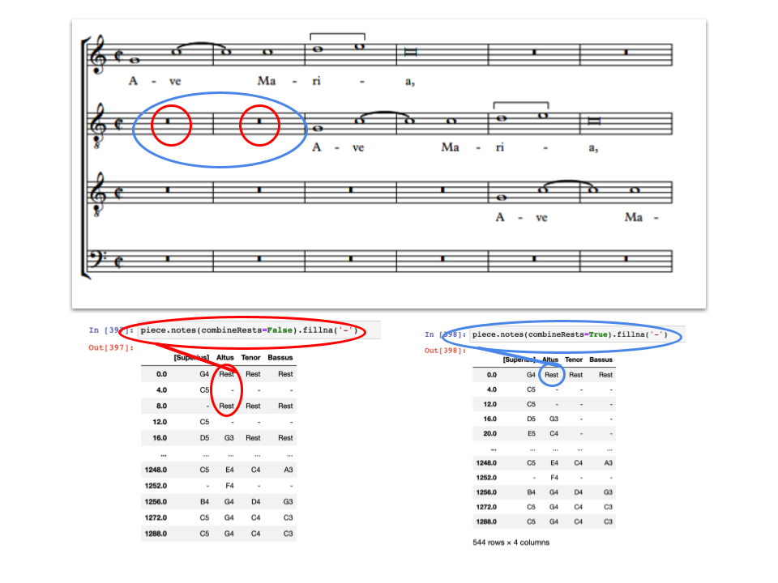
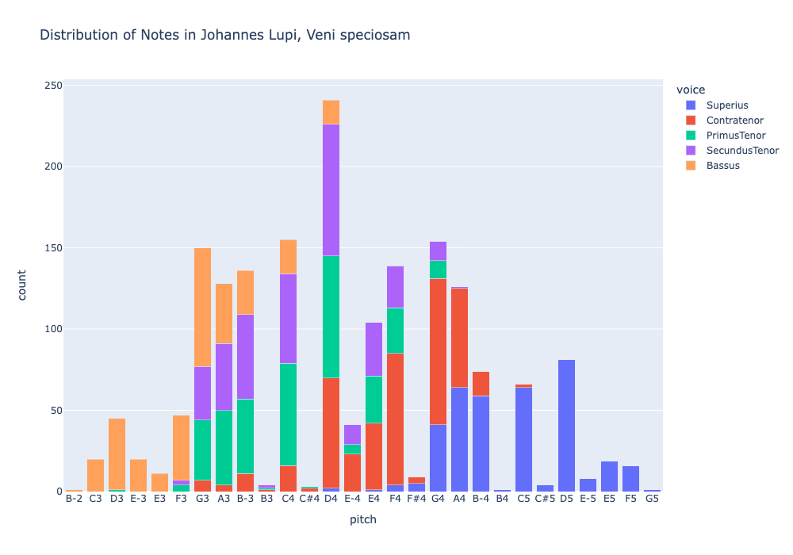

# Finding the Notes and Rests in Pieces

## The `notes()` Function  

After importing one or more pieces, the `notes()` function can be run to create a table of all of a piece's notes and rests, in order:  

```python
piece.notes()
```

These notes will be printed in a table, where each new row contains some new note in any voice. The left-most column is an index representing the offset of the change in note, where 0 represents the first note of the piece, and 1 unit of offset represents a quarter note. Note that this index will not necessarily be regularly spaced. Each column of the `notes()` table represents a different voice of the pieces, as indicated by the headings of these columns. By default, printing `piece.notes()` will print the first and last five rows of the table. That is, the first and last 5 points in the piece at which any voice changes in note. To control how many rows are printed:  

To print only the first 20 rows of the table:  

```python
piece.notes().head(20)
```

To print only the last 20 rows of the table:  

```python
piece.notes().tail(20)
```

While in its simplest form, the `notes()` function simply produces a DataFrame of each note or group of rests, it can be modified through its parameters:  

* `combineUnisons`, which controls how consecutive pitch repetitions are treated; default treats unisons as separate notes  
* `combineRests`, which controls how consecutive rests are treated; default sums consecutive rests into a single extended rest  

## `notes()` Parameters  

### Dealing with Consecutive Pitch Repetition: The `combineUnisons` Parameter:  

A unison is when a new note is sounded, but the pitch remains the same (e.g. a C5 half note followed by a C5 quarter note). the `notes()` function contains a parameter called `combineUnisons`, which defaults to `False`. When `combineUnisons` is set to `True`, any unisons will be treated as a continuation of the previous note, effectively adding a tie between those notes. As a result, the table output of the `notes()` function will not printing anything at the offset of the given note's repetiton. The `combineUnisons` parameter may be run as follows:  

```python
piece.notes(combineUnisons = True)  
#Or, the default value:  
piece.notes(combineUnisons = False)
```   



The `head()` function can be combined with `notes(combineUnisons = True)` as shown in the following examples:  

```python
whole_piece = piece.notes(combineUnisons = True)
whole_piece.head(20)
``` 

Or, more directly:  

```python
piece.notes(combineUnisons = True).head(20)
```  

The first example demonstrates declaring a variable, and then performing functions on it, while the second demonstrates performing multiple functions simultaneously. Beyond applications of the CRIM Intervals library, the first option is often more efficient when coding in general. This is because it avoids unnecessary repetitions of the same statement, saving system memory as well as time.

### Dealing with Consecutive Rests: The `combineRests` Parameter:  

The `combineRests` parameter operates similarly to the `combineUnisons` parameter, where any rests in the piece that does not preceed the first non-rest note are combined with neighboring rests (e.g. three whole rest measures in a row will be treated as a single 3 measure-long rest). By default, the `combineRests` parameter of the `notes()` function is set to `True`. Note that this is different from the default state of the `combineUnisons` parameter. This can be controlled similarly to the `combineUnison` parameter by the following code:  

```python
piece.notes(combineRests = False)  
#Or, the default value:  
piece.notes(combineRests = True)
```



Or, once again, incorporated with the `head()` function;  

```python
piece_separate_rests = piece.notes(combineRests = False)  
piece_separate_rests.head(20)
```
  
Additionally, the `combineRests()` and `combineUnisons()` parameters may be changed simultaneously as follows:  

```python
piece.notes(combineRests = False, combineUnisons = True).head(20)
```

### Dealing with "NaN" Outputs: The `fillna()` Function  

It is important to realize that in code, '0' is not the same as Nothing. Where the former is an integer value, the latter is the lack of any value. These 'absent values' are often called 'Nulls' or, in Python and Pandas, 'NaN' values. Inevitably, appling the CRIM Intervals functions to a piece will result in some 'NaN' values. This is because the `notes()` function, for example, indicates any point where a pitch or rest *begins*, but does not indicate when it is *held*. As a result of this, any offset of the piece where a note is held in any voice will produce a 'NaN' value in that frame. To decrease the visual clutter of the table, these "NaN" outputs can be replaced with the `fillna()` function, which is used as follows; The `fillna()` function accepts a parameter of any data to replace the "NaN" elements of the `notes()` output table. This field may contain empty quotes, as shown above, or another symbol such as '-'. Any of the following are valid ways to replace "NaN" values with a more discrete symbol (though `fillna(0)` is somewhat more specialized):  

```python
piece.notes().fillna('')  
piece.notes().fillna('-')  
piece.notes().fillna(0)
```


Note that the parameter of the `fillna()` function is not necessarily a text string, as any valid data could be provided, such as an integer value in place of the text field. Later, we will examples of cases where replacing 'NaN' values with 0 rather than a text string is optimal, but in many cases, it is simply beneficial to pass some discrete symbol to the `fillna()` function for the benefit of a human reader.  

Once again, this function can be modified by adding a `.head()` function to the line:  

```python
piece.notes().fillna('-').head(20)
```  

## More About Measures, Beats, and Offsets: The `detailIndex()` Function  

By default, the `notes()` function returns a DataFrame which indexes by offsets: That is, events in the piece are counted by which overall beat in the piece they fall on. This is useful for measuring time distances between events, but not for a human reader to refer back to the musical score itself. It is easy to include measure and beat indexes by passing the result of the function to the `detailIndex()` function as shown:  

```python
notes_rests = piece.notes()  
notes_rest_DI = piece.detailIndex(notes_rests)
```

For more information about the `detailIndex` function, consult [the function's documentation](09_DetailIndex.md).  


## Plotly Bar Charts

Bar charts are used to display categorical data. They consist of vertical or horizontal bars that represent different categories and their corresponding values. Bar charts are excellent for comparing data across different categories.  Learn more at [Plotly Express](https://plotly.com/python/bar-charts/)


### Bar Graphs of Notes in Each Voice

Here we the counts of each pitch (including octave) in each voice of a given piece.  Note that we can declare a custom 'order' for the pitches, so it's possible to present these as you like.  Here we have sorted them from lowest to highest.  You could also display only a subset of pitches.


<br>

<Details>

<Summary>Code to Produce this Chart</Summary>

```python
# assuming all the usual CRIM Intervals imports already done .  . 
url = 'https://crimproject.org/mei/CRIM_Model_0001.mei'
piece = importScore(url)

# give the chart a meaningful title based on your piece:
md = piece.metadata  
chart_title = "Distribution of Notes in " + md['composer'] + ", " + md['title']

# set the custom order for pitches
pitch_order = ['E-2', 'E2', 'F2', 'F#2', 'G2', 'A2', 'B-2', 'B2', 
               'C3', 'C#3', 'D3', 'E-3','E3', 'F3', 'F#3', 'G3', 'G#3','A3', 'B-3','B3',
               'C4', 'C#4','D4', 'E-4', 'E4', 'F4', 'F#4','G4', 'A4', 'B-4', 'B4',
               'C5', 'C#5','D5', 'E-5','E5', 'F5', 'F#5', 'G5', 'A5', 'B-5', 'B5']

# get the notes and create the dataframe for the chart
nr = piece.notes().fillna('-')  
nr = nr.apply(pd.Series.value_counts).fillna(0).astype(int).reset_index().copy()  
nr.rename(columns={'index': 'pitch'}, inplace=True)  
nr['pitch'] = pd.Categorical(nr["pitch"], categories=pitch_order)  
nr = nr.sort_values(by="pitch").dropna().copy()  
voices = nr.columns.to_list()[1:]  # Exclude 'pitch' column
# melt the dataframe to long format suitable for px.bar
melted_nr = nr.melt(id_vars='pitch', var_name='voice', value_name='count')
# create a custom color palette
custom_palette = px.colors.qualitative.Plotly + px.colors.qualitative.Dark24 + px.colors.qualitative.Light24
color_dict = {voice: custom_palette[i % len(custom_palette)] for i, voice in enumerate(voices)}
# Plot using Plotly Express with stacked bars
fig = px.bar(melted_nr, 
             x='pitch', 
             y='count', 
             color='voice', 
             facet_col='voice', 
             category_orders={'pitch': pitch_order}, 
             color_discrete_map=color_dict, barmode='stack',
             height=700,
             width=1000,
             title=chart_title)

fig.update_layout(showlegend=True)
fig.show()
``` 
</Details>


### Barcharts of Notes in Each Voice Stacked in One Chart




<Details>

<Summary>Code to Produce this Chart</Summary>

```python
import plotly.express as px
# set order of tones
pitch_order = ['E-2', 'E2', 'F2', 'F#2', 'G2', 'A2', 'B-2', 'B2', 
               'C3', 'C#3', 'D3', 'E-3','E3', 'F3', 'F#3', 'G3', 'G#3','A3', 'B-3','B3',
               'C4', 'C#4','D4', 'E-4', 'E4', 'F4', 'F#4','G4', 'A4', 'B-4', 'B4',
               'C5', 'C#5','D5', 'E-5','E5', 'F5', 'F#5', 'G5', 'A5', 'B-5', 'B5']
nr = piece.notes().fillna('-')  
nr = nr.apply(pd.Series.value_counts).fillna(0).astype(int).reset_index().copy()  
nr.rename(columns={'index': 'pitch'}, inplace=True)  
nr['pitch'] = pd.Categorical(nr["pitch"], categories=pitch_order)  
nr = nr.sort_values(by="pitch").dropna().copy()  

voices = nr.columns.to_list()[1:]  # Exclude 'pitch' column

# Melt the dataframe to long format suitable for px.bar
melted_nr = nr.melt(id_vars='pitch', var_name='voice', value_name='count')

# Create a custom color palette
custom_palette = px.colors.qualitative.Plotly + px.colors.qualitative.Dark24 + px.colors.qualitative.Light24
color_dict = {voice: custom_palette[i % len(custom_palette)] for i, voice in enumerate(voices)}

# Create the stacked bar chart
fig = px.bar(nr_melted, 
             x='pitch', 
             y='count', 
             color='voice', 
             barmode='stack',
            title="Chart of Melodic Intervals")

fig.show()
```

</Details>


### Barcharts of Notes in a Corpus

with the `corpus.batch` methods, it is also possible to do same kind of thing for a collection of pieces.


<br>


<Details>

<Summary>Code to Run</Summary>

```python
# notes in a corpus
def corpus_notes(corpus, combine_unisons_choice, combine_rests_choice):
    func = ImportedPiece.notes  # <- NB there are no parentheses here
    list_of_dfs = corpus.batch(func = func, 
                                kwargs = {'combineUnisons': combine_unisons_choice, 'combineRests': combine_rests_choice}, 
                                metadata=False)
    func1 = ImportedPiece.numberParts
    list_of_dfs = corpus.batch(func = func1,
                               kwargs = {'df' : list_of_dfs},
                               metadata=True)
    
    
    nr = pd.concat(list_of_dfs)
    cols_to_move = ['Composer', 'Title', 'Date']
    nr = nr[cols_to_move + [col for col in nr.columns if col not in cols_to_move]]
    return nr

# settings
combine_unisons_choice = False
combine_rests_choice = False
kind_choice = 'd'
directed = True
compound = True
exclude_rests = True

# load corpus
file_list = ['https://crimproject.org/mei/CRIM_Model_0001.mei', 'https://crimproject.org/mei/CRIM_Model_0008.mei']
corpus = CorpusBase(file_list)

# run function and create chart
nr = corpus_notes(corpus, combine_unisons_choice, combine_rests_choice)
nr_no_mdata = nr.drop(['Composer', 'Title', "Date"], axis=1)

nr_counts = pd.DataFrame(nr_no_mdata.apply(pd.Series.value_counts))

if exclude_rests == True:
    nr_counts = nr_counts.drop('Rest', axis=0)
                                                               
voices = nr_counts.columns.to_list() 

chart_title = "Distribution of Notes in Corpus"
fig = px.bar(nr_counts, x=nr_counts.index, y=list(nr_counts.columns),
                    title=chart_title)
fig.update_layout(xaxis_title="Note", 
                    yaxis_title="Count",
                    legend_title='Voices',
                       height=700,
                       width=1000)
fig.show()
```

</Details>

<br>

-----

## Sections in this guide

  * [01_Introduction_and_Corpus](/tutorial/01_Introduction_and_Corpus.md)
  * [02_Notes_Rests](/tutorial//02_Notes_Rests.md)
  * [03_Durations](/tutorial//03_Durations.md) 
  * [04_TimeSignatures_Beat_Strength](/tutorial//04_TimeSignatures_Beat_Strength.md)
  * [05_Detail_Index](/tutorial//05_Detail_Index.md)
  * [06_Melodic_Intervals](/tutorial//06_Melodic_Intervals.md)
  * [07_Harmonic_Intervals](/tutorial//07_Harmonic_Intervals.md)
  * [08_Contrapuntal_Modules](/tutorial//08_Contrapuntal_Modules.md)
  * [09_Ngrams_Heat_Maps](/tutorial//09_Ngrams_Heat_Maps.md)
  * [10_Lyrics_Homorhythm](/tutorial//10_Lyrics_Homorhythm.md)
  * [11_Cadences](/tutorial//11_Cadences.md)
  * [12_Presentation_Types](/tutorial//12_Presentation_Types.md)
  * [13_Musical_Examples_Verovio](/tutorial//13_Musical_Examples_Verovio.md)
  * [14_Model_Finder](/tutorial//14_Model_Finder.md)
  * [15_Visualizations_Summary](/tutorial//15_Visualizations_Summary.md)
  * [16_Network_Graphs](/tutorial//16_Network_Graphs.md)
  * [17_Python_Basics](/tutorial//17_Python_Basics.md)
  * [18_Pandas_Basics](/tutorial//18_Pandas_Basics.md)
  * [19_Music21_Basics](/tutorial//18_Music21_Basics.md)
  * [20_Melodic_Interval_Families](/tutorial//20_Melodic_Interval_Families.md)
  * [99_Local_Installation](/tutorial//99_Local_Installation.md)