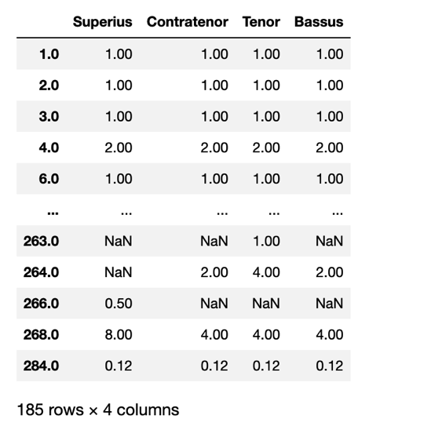

# Finding Durations of Notes in Pieces

In addition to finding pitches and melodic/harmonic intervals in pieces, we can find the durations of pitches with the `durations()` function  

## The `durations()` Function  

Unlike previous DataFrames, which contained strings or integers, the `durations()` function outputs a DataFrame of floats (number values with decimal). By default, the `durations()` function will output a pandas DataFrame of the duration of each note or rest in the piece or corpus of pieces provided:  

    dur = piece.durations()  

This function's output can be modified by changing its various parameters:  

* `df`, which allows the `durations()` function to be applied to a specific DataFrame of a piece, such as the piece's melodic or harmonic intervals
* `n`, which changes the amount of consecutive notes, intervals, or other objects in a DataFrame whose durations are summed together into each frame of the `durations()` output. By default, `n = 1`, which separates each consecutive duration into its own frame.
* `mask_df`, which allows a filter to be applied to an existing DataFrame of information to selectively display certain DataFrames sampled from a different DataFrame.

## `durations()` Parameters:  

### Applying `durations()` to a Custom Set of Information: The `df` Parameter  

Normally `duration()` will be used with a complete piece, as in `piece.durations()`. But sometimes it is useful to pass only a selection of notes (as might be necessary if the `combineUnisons` parameter is **True** for `notes()`).  The only way to check the durations in that case is to first create the df of the notes with unisons combined and then pass that to durations().  For example:

    mel = piece.melodic(combineUnisons = True)  
    piece.durations(df = mel)  

### Sizing the Duration-finding Window: The `n` Parameter  

We already saw notes(combineUnisons), and notes(combineRests).  Now we are combining events, possibly notes, but possibly things like harmonic patterns or lyrics or anything that has a duration.  The number in this case thus represents not some duration, but rather the *number of successive non-NANs to be combined and 'summed' as a single aggregated duration*. When an `n` parameter is added to the `durations()` function, the DataFrame created will therefore combine the first *n* durations found after a given offset into a single sum at that first offset. Therefore, at its default value of 1, it will prints every individual duration, and does not combine any frames:  

    piece.durations()  
    #is equivalent to
    piece.durations(n = 1)  

If a piece contained 8 consecutive quarter notes, for example, this code will return 8 durations (at every offset) of '1.0',   

    piece.durations()  

but this code will return 7 consecutive durations of '2.0', since the code is "looking ahead" to find the sum of the next *2* durations (counting the duration of the offset itself as one duration). Another way to phrase this is that the following code will group together the durations found on beats 1 and 2, 2 and 3, 3 and 4...6 and 7, and 7 and 8, finding 7 total *pairs* of durations.  

    piece.durations(n = 2)  

There is a special case when `n = -1`, which will sum the largest possible groups of consecutive **non-rest** durations found in the piece. The code will output the durations of the longest series (no sub-sets within a phrase starting from the 2nd note, from the 3rd note, etc.) of every series of consecutive harmonic intervals in a piece. This type of application could be useful to find the length of a melody (if applied to melodic intervals), or how long two voices remained in harmony, as shown:  

    harm = piece.harmonic()  
    longest_harm_durs = piece.durations(df = harm, n = -1)

### Selectively Finding Durations: The `mask_df` Parameter  

Rather than finding all of the durations in a piece, a `mask_df` DataFrame can be applied to the `durations()` function to only find durations which align with certain events found in some other DataFrame. For instance we could find all the melodic ngrams of length 'n', then find the duration of each of those ngrams: 

    mel = piece.melodic()
    _n = 5
    mel_ngrams = piece.ngrams(df = mel, n = _n).fillna('')
    mel_ngram_Durations = piece.durations(df = mel, n = _n, mask_df = mel_ngrams).fillna('')
    mel_ngram_Durations

Or the same for harmonic ngrams:

    har = piece.harmonic()
    _n = 5
    har_ngrams = piece.ngrams(df = har, n = _n).fillna('')
    har_ngram_Durations = piece.durations(df = har, n = _n, mask_df = har_ngrams).fillna('')
    har_ngram_Durations  

## Durational Ratios

Durational ratios are a good way to measure the 'temporal distance' from one note to the next.

Since these can be irrational numbers (as when a quarter note follows a dotted half), we can round the results to any given number of decimal places:

    piece.durationalRatios().round(2)



And these could in turn be used as the basis of ngrams (to find rhythmic motives), or combined with melodic intervals to describe motives in great detail.

But in this case we need to use Python `applymap(str)` to transform the original durational ratios (which are floats) into strings.  You might also need to dropna values.


```
dur_rat = piece.durationalRatios().fillna('').round(2).applymap(str)
ng = piece.ngrams(df=dur_rat)
ng
```


## More About Measures, Beats, and Offsets: The `detailIndex()` Function  

By default, the `durations()` function returns a DataFrame which indexes by offsets: That is, events in the piece are counted by which overall beat in the piece they fall on. This is useful for measuring time distances between events, but not for a human reader to refer back to the musical score itself. It is easy to include measure and beat indexes by passing the result of the function to the `detailIndex()` function as shown:  

    piece_durs = piece.durations()  
    piece_durs_DI = piece.detailIndex(piece_durs)  

For more information about the `detailIndex` function, consult [the function's documentation](09_DetailIndex.md).  

-----
## Sections in this guide

  * [01_Introduction_and_Corpus](tutorial/01_Introduction_and_Corpus.md)
  * [02_Notes_Rests](tutorial/02_Notes_Rests.md)
  * [03_Durations](tutorial/03_Durations.md) 
  * [04_TimeSignatures_Beat_Strength](tutorial/04_TimeSignatures_Beat_Strength.md)
  * [05_Detail_Index](tutorial/05_Detail_Index.md)
  * [06_Melodic_Intervals](tutorial/06_Melodic_Intervals.md)
  * [07_Harmonic_Intervals](tutorial/07_Harmonic_Intervals.md)
  * [08_Contrapuntal_Modules](tutorial/08_Contrapuntal_Modules.md)
  * [09_Ngrams_Heat_Maps](tutorial/09_Ngrams_Heat_Maps.md)
  * [10_Lyrics_Homorhythm](tutorial/10_Lyrics_Homorhythm.md)
  * [11_Cadences](tutorial/11_Cadences.md)
  * [12_Presentation_Types](tutorial/12_Presentation_Types.md)
  * [13_Model_Finder](tutorial/13_Model_Finder.md)
  * [14_Visualizations_Summary](tutorial/14_Visualizations_Summary.md)
  * [15_Network_Graphs](tutorial/15_Network_Graphs.md)
  * [16_Python_Basics](tutorial/16_Python_Basics.md)
  * [17_Pandas_Basics](tutorial/17_Pandas_Basics.md)
  * [18_Music21_Basics](tutorial/18_Music21_Basics.md)