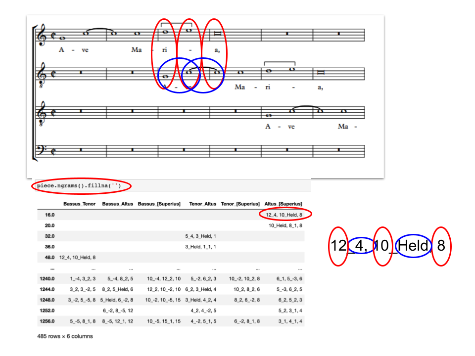
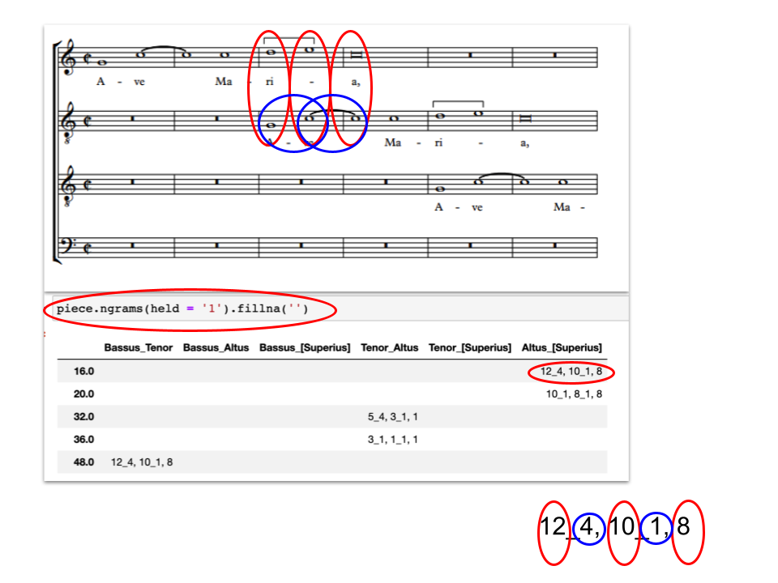
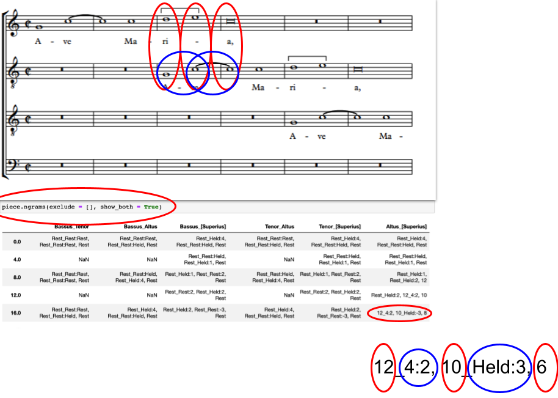
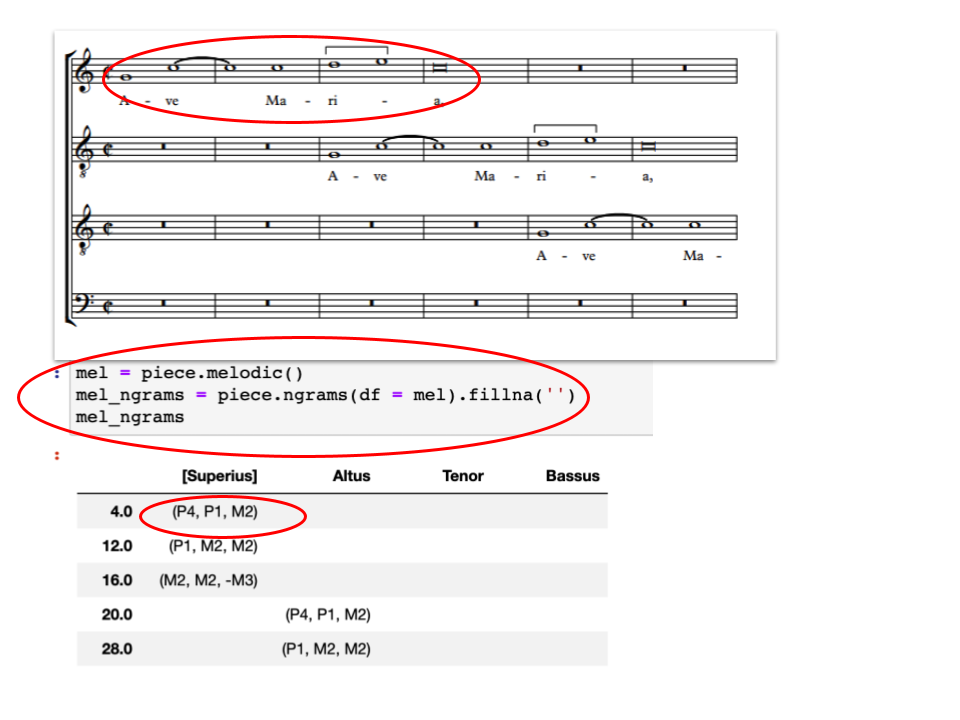
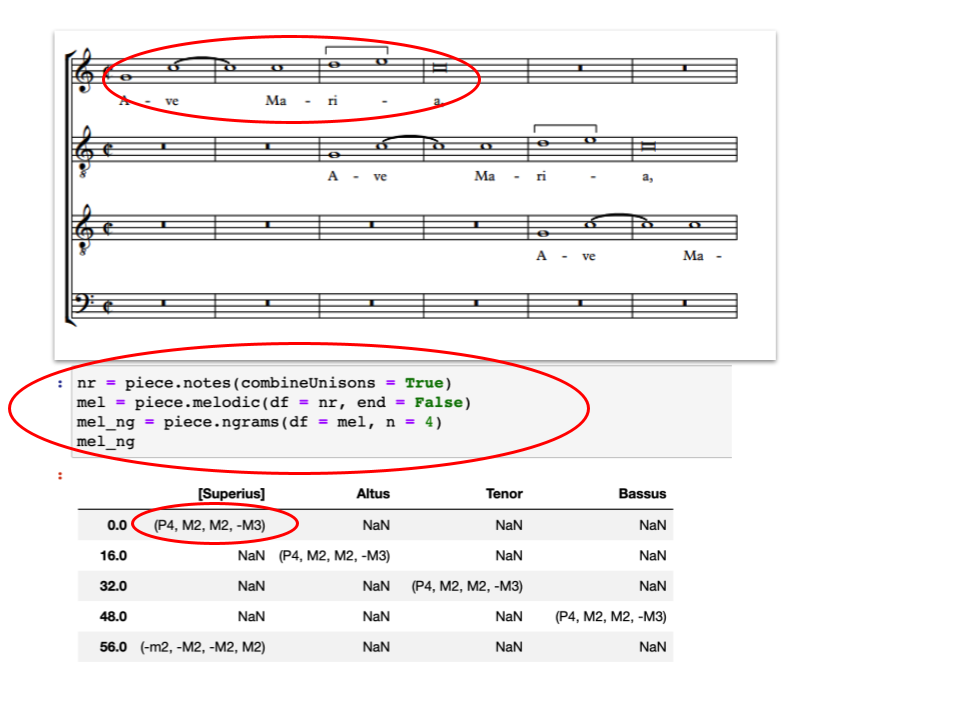
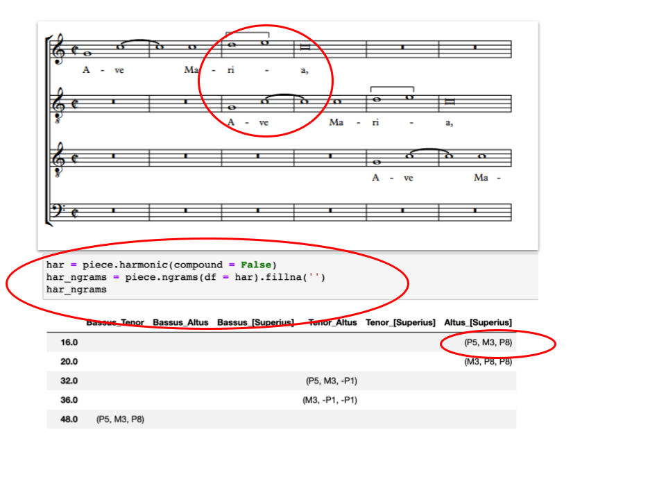
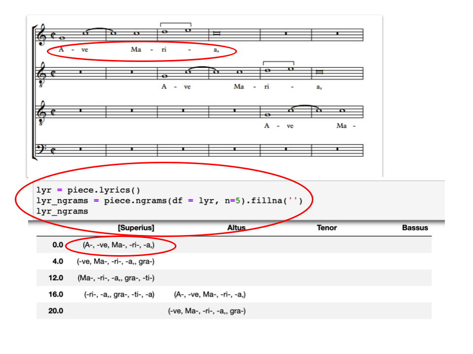
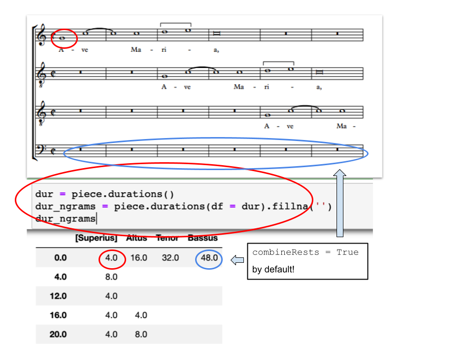

# Finding ngrams and Entries with CRIM Intervals 

An **n-gram** (hereafter simply 'ngram') is a commonly used linguistic term for a continuous string of characters or events. A series of any musical expressions in pieces of music, specifically of some length *N*, can similarly be refered to as an **ngram**. With the `ngrams()` function we are able to represent various different types of ngrams depending on the data input type:

* An ngram of notes, harmonic intervals, durations, or lyrics will involve *N* notes, or in the case of harmonic (vertical) intervals, *N* pairs of notes  
* An ngram of melodic intervals will involve (*N* + 1) notes, since it involves *N* **lateral intervals between** notes

## The `ngrams()` Function in Brief

By gathering all ngram of a given length, we can make a DataFrame of every instance in which a series of *N* consecutive events is found. These can in turn be used to find patterns within a piece (such as recurring melodies), or across a corpus of compositions.

By default, the `piece.ngrams()` function returns ngrams of *contrapuntal modules*. These are in fact combinations of harmonic and melodic ngrams heard in pairs of voices, as explained below. They are priviledged in CRIM Intervals because of their value in working with the complexities of the `piece.cadences()` function.

It is nevertheless relatively easy to find other kinds of ngrams for a single musical feature (such as all all the melodic ngrams, or harmonic ones, or even lyric and durational ngrams. 

Note that the `entries()` function (explained below) can be used in conjunction with `ngrams()` to find important events in a piece.

## The Parameters:

Various parameters afford the means to adjust results; some are used only with the contrapuntal module method. Others (like the basic length setting, 'n') are useful regardless of the kind of ngrams sought.

### Parameters Used for All Kinds of Ngrams

* `n`, which controls the length of the ngram being found; default creates ngram of length 3 (involving *3* notes for a `notes()`, `harmonic()`, `durations()`, or `lyrics()` DataFrame, but *4* notes for a `melodic()` DataFrame)  
* `df`, which allows a custom DataFrame to be passed into the `ngrams()`, and is the only way to create ngrams other than the default 'contrapuntal module' type
* `other`, which allows a *second* custom DataFrame to be passed into the `ngrams()` function to consider multiple types of events in a piece simultaneously, thus producing 'combination ngrams' of things like lyrics and durations
* `unit`, which will regularize the frequency of ngram polling rather than finding every occurence 
* `exclude`, which omits any ngram containing a given string from the output; default excludes 'Rest' 
* `offsets`, which controls if an ngram is associated with the first or last offset of its duration; default places ngram at the onset of their first note  
 
### Parameters Used for Contrapuntal Ngrams Only

* `held`, which controls how unisons appear in the lower voice of a contrapuntal module; default is 'Held' 
* `interval_settings`, which allows custom settings for the intervals reported in the contrapuntal modules `kind`, `directed`, and `compound` parameters provided that *no data is passed* into the `df` or `other` parameters; default is `kind = 'd'`, `directed = True`, and `compound = True`.  This parameter is **not** used when passing in a df for melodic or harmonic ngrams alone.
* `show_both`, which allows the melodic motion of both voices in a contrapuntal model to be shown; default only displays the melodic motion of the lower voice.

## Contrapuntal Ngrams in Detail

### Default Contrapuntal Module Ngrams

By default, the `ngrams()` function will always find **contrapuntal modules**. These consist of alternating sequences of the harmonic and melodic intervals formed by every pair of voices in a piece. Also by default in the case of these contrapuntal modules, only the melodic motion of the lower voice in the pair is shown (see `show_both` below for how to show the melodic motion of the upper voice, too). 

The result is thus sequence of N items expresses as a string. If n = 3, for instance (`piece.ngrams(n = 3).fillna('')`, an ngram of '12_4, 10_Held, 8' between two voices means that three harmonic intervals (12, 10, 8) were formed while the lower voice first went up a fourth, then 'held' (via a tie). The melodic motion of the upper part could be inferred from these five pieces of information.  The following example will serve to illustrate:

### Modifying Contrapuntal Module `kind`, `compound`, and `directed`: the `interval_settings` parameter  

By default the contrapuntal modules use `kind = 'diatonic'`, `directed = True`, and `compound = True` for the harmonic and melodic intervals it reports. Of course it is vital that the intervals for both dimensions of these modules always match.  Fortunately the `ngrams` function provides a simple way to do this via the `interval_settings` parameter.  The values must be applied in this order:  **kind, directed, compound** and enclosed in parenthesis as a single parameter called 'interval_settings'.  Here for instance the kind is chromatic, directed is True, and compound is False:

    piece.ngrams(interval_settings = ('c', True, False))  

This is the equivalent of the rather verbose sequence:

    mel = piece.melodic(kind = "c", directed = True, compound = False)
    har = piece.harmonic(kind = "c", directed = True, compound = False)
    ngrams = piece.ngrams(df = har, other = mel)
    ngrams  

See more about combining different dataframes into ngrams below.

### Other Features of Contrapuntal Module Ngrams  

* **contrapuntal ngrams** (since they contain an odd number of harmonic 'slices' and even number of intervening melodic 'motions') are best used with **odd-numbered values for 'n'**.  See more about setting `n` below.
* **Melodic unisons in the lower part of a contrapuntal pair** are by default reported as 'held'. To substitue another string for these situations (such as "1", or "0"), used the `held` parameter: `piece.ngrams(held = '1')` [note that the value must be passed as a string]

* **showing melodic motion in both voices of a contrapuntal module** is made possible by setting *two* parameters:  use `exclude = []` (since otherwise all rests will be excluded from the results) and `show_both = True`.  The full function will thus be: `piece.ngrams(exclude = [], show_both = True)`

### Melodic, Harmonic, Lyric, and Durational Ngrams:  Using the `df` Parameter

Note:  Ngrams produced in the following ways will be dataframes of 'tuples'.  See more about how to work with these under 'Tuple Trouble' below.

Ngrams that represent a **single dimension of the score** are build by passing a dataframe to the `ngram()` function via the `df` parameter. For example, the following code will find the **melodic ngrams** in a piece:  

    mel = piece.melodic()
    mel_ngrams = piece.ngrams(df = mel)
    mel_ngrams  

*Adjust the parameters of the original function first!* For instance to find **melodic ngrams with combined unisons and chromatic intervals**, first specify the relevant parameters with `piece.melodic()`, and then pass those results to `piece.ngrams()` with the `df` parameter:

    nr = piece.notes(combineUnisons = True)
    mel = piece.melodic(df = nr, end = False)
    mel_ng = piece.ngrams(df = mel, n = 4) 
    mel_ng

Similar strategies would work for harmonic, durations, or lyrics:

    har = piece.harmonic(compound = False)
    har_ngrams = piece.ngrams(df = har).fillna('')
    har_ngrams

Or:

    lyr = piece.lyrics()
    lyr_ngrams = piece.ngrams(df = lyr, n=5).fillna('')
    lyr_ngrams

Or:

    dur = piece.durations()
    dur_ngrams = piece.durations(df = dur).fillna('')
    dur_ngrams

-->
### Setting ngram Length: the `n` Parameter  

When gathering ngrams, we can either search for ngrams of a specific length (default = 3). It can be set via the `n  parameter:

    mel = piece.melodic()
    ngrams = piece.ngrams(df = mel, n = 5)
    ngrams 

Remember that modifications to the particular type of feature in question needs to be made when applying that function.  The type of melodic interval, for instance, is set, here in `melodic()`.  The length of the ngrams is set in `ngrams()`:

    mel = piece.melodic(kind = "c", compound = False)
    ngrams = piece.ngrams(df = mel, n = 5) 
    ngrams 

#### Also note that: 

* The ngram method will produce a 'moving window' of events of length `n`. To limit the results to important 'entries' (ngrams that come after rests, fermatas, double barlines, see the `piece.entries()` below.
* In the case of melodic ngrams, the presence of any `Rest` means that the ngram will 'break' at that point (since there is no melodic interval between a note and a rest). The treatment of rests for other kinds of ngrams is determined by the `exclude` parameter, as explained below.
* To find *melodic ngrams of the maximum length* until a rest is found, set `n = -1`. 

### Combination ngrams:  using `df` and `other` Parameters Together  

The default 'contrapuntal module' ngram is in fact a combination of two different dataframes:  one for the harmonic intervals and the other for the melodic ones. But it is possible to create other combinations by passing *both `df` and `other` to `ngrams()`, provided that the `df` and `other` parameters have the same shape (overall number of rows and columns). 

For example, the following line of code will produce **ngrams of length 5 containing the information associated with both the melodic intervals and durations at each subsequent offset in a piece:**  

    lyr = piece.lyrics()  
    dur = piece.durations()  
    lyr_dur_ngrams = piece.ngrams(df = lyr, other = dur, n = 5)
    lyr_dur_ngrams  

Or, more directly:  

    ng = piece.ngrams(df = Piece.lyrics(), other = piece.durations(), n = 5)
    ng 

### nGrams at Using Regularized Durations: The `unit` Parameter  

By default, applying the `ngrams()` function to a piece will produce ngrams the **actual note values** found in the piece. It is nevertheless possible to determine the ngrams according to some fixed number of offsets using the `unit` parameter, which will force the function to only output ngrams found at a given regular interval. This can be helpful for applications such as only finding ngrams which begin on the first beat of a measure, or other similar situations where regularity is helpful. 

It would probably make little sense to use '1.0' or some other tiny unit, since this would result in a vast number of unisons or static harmonic passages as longer notes are sampled multiple times.  But setting `unit = 2.0` would correspond to the half-note (minim), a common basic pace of melodic and harmonic motion in Renaissance counterpoint.  Larger units might also be revealing of large = scale sequences.

The 'unit' parameter only works with contrapuntal ngrams:

    piece.ngrams(unit = 4)  

If regularized melodic ngrams (or some other type) are needed, it will be necessary to use the `regularize()` function:

    nr = piece.notes()
    reg = piece.regularize(nr, unit = 2)
    mel = piece.melodic(df = reg, kind = 'd')
    piece.ngrams(df = mel)

Compare results with and without regularization (unit = 2):

  
### ngram Reference Points: the `offsets` Parameter  

An ngram can be placed within the DataFrame at one of two offsets. By default, the `offsets` parameter is set equal to `"first"`.  In this case the ngram will be associated with the offset of the first element in it (such as the first interval or first lyric syllable). Alternatively, setting the parameter to `"last"` will place it at the offset of its last element.  

Melodic ngrams at offset at start of first note (note settings for both mel and ngrams!):

    mel = piece.melodic(kind = "c", end = False)
    mel_ngrams_lastOffset = piece.ngrams(df = mel, n = 5, offsets = "first").fillna('')
    mel_ngrams_lastOffset 

Melodic ngrams at offset at end of last note (note settings for both mel and ngrams!):

    mel = piece.melodic(kind = "c", end = True)
    mel_ngrams_lastOffset = piece.ngrams(df = mel, n = 5, offsets = "last").fillna('')
    mel_ngrams_lastOffset 

## All ngrams or Entries Only? The `entries()` Function  

By default, the `ngrams()` function will find every single series of intervals of its given length, creating a moving window that will find not only the ngrams representing the beginnings of melody lines, but also those same ngrams starting from the second interval, and from the third, and so on. We can include only the ngrams of melodic intervals which begin after a rest, section break, or fermata with the `entries()` function.  

Note that:

- if passing melodic intervals they must be with `end = False`, since the entries are also calculated this way
- the ngrams created from the df of melodic intervals just also be set with `offsets = 'first'` (this is the default), since the entries are found this way

There are several other possible parameters for `entries()`:

- If `thematic` is set to **True**, this method returns all instances of entries
that happen *at least twice anywhere in the piece*. This means
that a melody must happen at least once coming from a rest, and at least
one more time, though the additional time doesn't have to be after a rest. 
Setting this to False will return 'singleton' entries:  melodies that come after a rest
but occur only once in the piece.  
- If `anywhere` is set to True, the final results returned include all
instances of entry melodies, whether they come from rests or not.
- If `fermatas` is set to True (default), any melody starting immediately
after a fermata will also be counted as an entry.

Thus compare *moving window of melodic ngrams*:

    mel = piece.melodic(kind = 'd', end=False)
    mel_ngrams = piece.ngrams(df = mel, n=4, offsets = 'first').fillna('')
    piece.detailIndex(mel_ngrams, offset=True).head(10)

With results *limited to entries*:

    mel = piece.melodic(kind = 'd', end = False)
    mel_ngrams = piece.ngrams(df = mel, n = 4, offsets = 'first')
    entries = piece.entries(df = mel_ngrams, thematic=False, anywhere=False, fermatas=True, exclude=[]).fillna('')
    entries  

And compare results of *limited to entries allowing singletons* via `thematic = False`

With results of *limited to entries allowing only entries that occur more than once* (but at least once after a rest) vis `thematic = True`:

This output can then be passed to yet another function as a `df` value. For example, we can sum the durations of each cell together to find the overall *durations of melodic ngrams* with the following:  

    # get notes, either combining unisons or not
    nr = piece.notes(combineUnisons = True)
    # get melodic intervals based on previous, plus settings.  Note end = False so that we associate the interval with the starting note
    mel = piece.melodic(df = nr, kind = 'd', end = False)
    # now the mel ngrams, based on that starting position, etc
    mel_ng = piece.ngrams(df = mel, n = 4).fillna(')
    # and instead of the moving window, we mask them off to entries only
    entries = piece.entries(mel_ng)
    # now the total durations of those entries. note that passing a df to duration will make a sum of all the values in each cell
    ng_durs = piece.durations(df = entries)
    ng_durs

## Tuple Trouble, and How to Fix It

Note that the output of `ngrams()` for *any of the single-feature types* (melodic, harmonic, durations, lyrics) is a DataFrame of **tuples**, which are immutable data types. To convert from tuples to usable strings, it is necessary to apply a custom function to each cell of the DataFrame with `applymap()`:  
  
    #define the function to convert tuples to strings
    def convertTuple(tup):
        out = ""
        if isinstance(tup, tuple):
            out = ', '.join(tup)
        return out  
    
    #find mel ngrams
    mel = piece.melodic()
    mel_ngrams = piece.ngrams(df = mel)

    #apply function to all cells
    mel_ngrams_no_tuples = mel_ngrams.applymap(convertTuple)
    mel_ngrams_no_tuples

It is **not** necessary to treat the contrapuntal ngrams in this way, as the default function already converts the results to strings.  

## Removing "NaN" values  

Similarly to other functions previously discussed in this documentation, ngram DataFrams can be cleaned up using the `dropna()` and `fillna()` functions to drop all rows filled with only "NaN" values, and replace the remaining "NaN" values with blank spaces so that the table may be read more easily:  

    cleaned_entries = entries.dropna(how = "all").fillna(' ')
    cleaned_entries  

## Organizing by Measures and beats  

To display DataFrames relative to measures, and beats within measures, rather than offsets across the entire piece, we can use the `detailIndex()` function, which is [documented here](09_DetailIndex.md).  

## Counting ngrams  

After using the `ngrams()` function to identify all of the ngrams in a piece, they can be counted and sorted by their frequency in the piece overall using some [general pandas functions](15_Pandas_Basics.md):  

    mel = piece.melodic(kind = "c", compound = False)
    melNgrams = mel.ngrams(n = 4)
    melNgrams.stack().value_counts().to_frame()  

## Searching for melodic ngrams

**More Information Pending**  

-----

## Sections in this Guide

  * [01_Introduction](01_Introduction.md)
  * [02_NotesAndRests](02_NotesAndRests.md)
  * [03_MelodicIntervals](03_MelodicIntervals.md)
  * [04_HarmonicIntervals](04_HarmonicIntervals.md)
  * [05_Ngrams](05_Ngrams.md)
  * [06_Durations](06_Durations.md)
  * [07_Lyrics](07_Lyrics_Homorhythm.md)
  * [08_TimeSignatures_BeatStrength](08_TimeSignatures_BeatStrength.md)
  * [09_DetailIndex](09_DetailIndex.md)
  * [10_Cadences](10_Cadences.md)
  * [11_Pandas](15_Pandas_Basics.md)
  * [12_Modules](12_Modules.md)