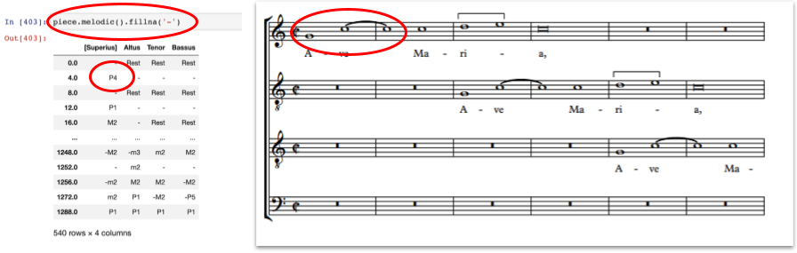
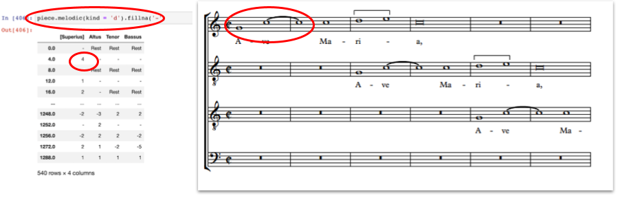
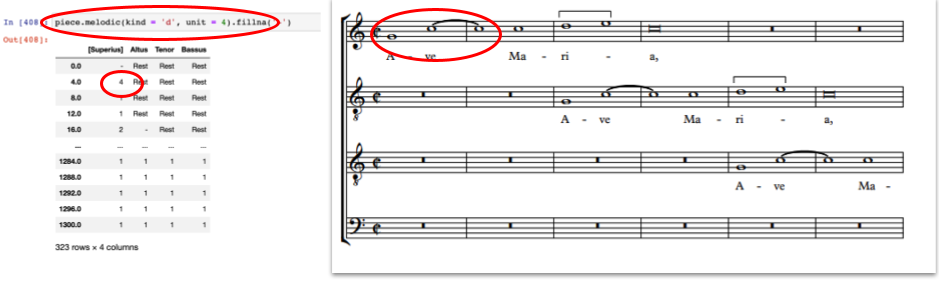
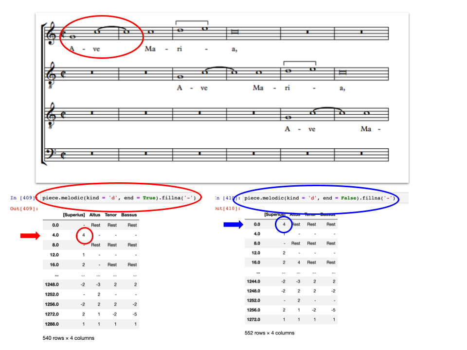
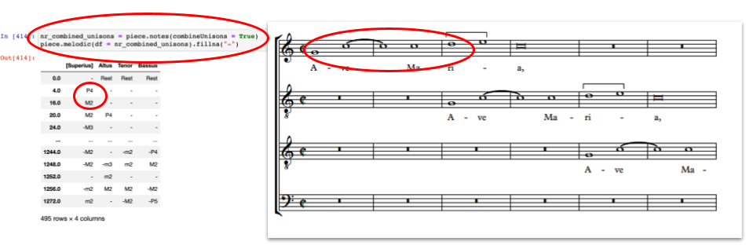

# Finding the Melodic Intervals in Pieces  

We have previously seen how `piece.notes()` can output a table of each time a note in the piece changes. Using functions in the CRIM Intervals library, we are also able to create tables of intervallic distances between notes.  

## The `melodic()` Function  

In its simplest form, `piece.melodic()` returns a DataFrame of diatonic intervals within each voice part in the piece. There is more to the story, however, since the `melodic()` function has a number of parameters that users can adjust to report intervallic distances in different ways:  

Default usage:  

```python
piece.melodic()  
```


​
The most important parameters:
* `kind`, for controlling if diatonic, chromatic, or other types of intervals are reported; default is diatonic  
* `directed`, whether the report is simply a raw interval, or also reports whether it goes up or down; default includes direction  
* `compound`, whether intervals larger than an octave are reported as simpler versions; default reports compounds as they actually appear  
​
And the more specialized parameters:
* `unit`, the possibility to measure the intervals at each new onset of a note, or to sample them at some regular time interval; default uses **actual** onsets and values
* `end`, determines the offset with which interval is associated (the first or second note of the pair): default places intervals at the offset of their **second** note
* `df`, the possibility to pass some dataframe of notes to the function in order to check the intervals of that passage or selection  
​
The details of each parameter's usage and default values are explained below. 

## `melodic()` parameters  

### Differentiating between Diatonic, Chromatic, and other intervals: the `kind` (str) parameter  

The `melodic()` function contains a parameter `kind`, which has a default value of "q". These inputs are case sensitive:  
Diatonic with quality. This refers to "P8" for a perfect octave (e.g. C4 -> C5), "M3" for a major third interval (e.g. C5 -> E5), and "m3" for minor third interval (e.g. C5 -> E-5), for example:  

```python
piece.melodic(kind = 'q')  
```

**Diatonic without quality**. Provides outputs such as "8" for an octave, and "3" for a third interval.  

```python
piece.melodic(kind = "d")
```



**Chromatic**. The difference between two pitches in semitones. Outputs "12" for an octave interval (e.g. C4 -> C5), "6" for a tritone interval (e.g. C5 -> F#5), and "0" for a unison (e.g. C5 -> C5):  

```python
piece.melodic(kind = "c")
```


**Zero-based diatonic** intervals. To musicians it makes sense that a unison is represented as one, but this can produce some odd results in computational systems, in which calculated distances are 'zero-based':  the distance between C4 and C4 is in fact 0, not 1 (as musicians would have it). Zero-Based Diatonic intervals are thus sometimes useful.  The problem does not occur in Chromatic intervals, where the system reports the absolute distance in semitones between any two tones (C4 to C#4 is 1, not 2). Outputs "7" for a perfect octave interval up (e.g. D3 -> D4), "-4" for a fifth interval down (e.g. F5 -> A5), "2" for a third interval up (e.g. G4 -> B5):  

```python
piece.melodic(kind = "z")
```

### Up and Down vs. Aboslute: The `directed` Parameter  

By default, `directed = True`, which causes the melodic intervals to report their direction; "4" is an ascending fourth; "-4" is descending. Itt might be useful, however, simply to report the absolute distance without direction, such as if the aim is to know how many leaps of a sixth appear in a piece regardless of direction.  In this case, use `directed = False`.  


```python
#Default value:  
piece.melodic(directed = True) 
``` 

[C5 -> G5] will return a diatonic interval of "4"  
[G5 -> C5] will return a diatonic interval of "-4"  

```python
piece.melodic(directed = False)
```


[C5 -> G5] will return a diatonic interval of "4"  
[G5 -> C5] will return a diatonic interval of "4"  

### Managing Intervals Greater than an Octave: The `compound` Parameter  

The `melodic()` function contains a parameter `compound`, with a default value of `True`. This means that intervals with a span greater than an octave will always be returned as such.  The interval from C4 to E5 would be a diatonic 10, a chromatic 16, M10 using 'with quality', and 9 using 'zero-based diatonic'. 

```python
piece.melodic(compound = True)
```

Using `piece.melodic(compound = False)`, in contrast, analyzes all intervals as if they are within a octave (what musicians call the 'simple' intervallic distances). In this case the interval from C4 to E5 would be a diatonic 3, a chromatic 4, M3 using 'with quality', and 2 using 'zero-based with quality'. Note that an octave itself is not reduced to a unison.  

### Sampling Melodies at Regular Time Intervals: The `unit` Parameter  

In most cases, the `melodic()` function will be used to trace movement at each new onset of a note. Sometimes, however, it could be useful to 'sample' the tone being sounded at some regular time interval (for instance, if the purpose was to consider time series data). This can be accomplished with the `unit` parameter. This parameter's default value, `unit = 0`, simply means that melodic intervals will be assigned at each new onset of a note. Setting `unit = 1`, however, will force a 'sampled' reading of the intervallic distance at every quarter note (since '1.0 corresponds to that value in music21'):  

```python
#default value [redundant to include in code]:  
piece.melodic(unit = 0)  

#possible replacement values:  
piece.melodic(unit = 1)  
piece.melodic(unit = 4) 
``` 


​
Setting `unit` to a small value might be helpful in comparing the degree of movement in several voices.
​
Setting `unit` to larger number could be used to ignore ornamental tones (2.0, for instance, corresponds to the half-note [minim], a common basic unit of motion in Renaissance melodies).
​
Note that `beatStrength` provides another way of sampling melodic motion to highlight accented tones. For more information about beat strength, see the section of this guide dedicated to [time signatures and beat strength](08_TimeSignatures_BeatStrength.md).  

### Where Does the Interval Actually Occur? The `end` Parameter  

Normally, CRIM Intervals associates melodic intervals with the moment of change, namely the onset of the **second** note of the pair. If C5 sounds on offset 1.0 and D5 sounds on offset 2.0, a melodic interval of M2 will be associated with offset 2.0. Therefore, the default value of this parameter is `end = True`, in which the interval is associated with the 'end' of the pair. In some cases, it might be useful to associate the interval with the first note of the pair instead. In this case, `end = False`.  

Assuming a C5 sounds on offset 1.0, and a D5 sounds on offset 2.0:  

Default value, which would return an interval on **beat 2**:  

```python
piece.melodic(end = True)
``` 
 

Alternate value, which would return an interval on **beat 1**:  

```python
piece.melodic(end = False)
```  



### Applying `melodic()` to a Custom Set of Notes: The `df` Parameter  

Normally `melodic()` will be used with a complete piece, as in `piece.melodic()`, along with any special parameters needed. Sometimes, however, it might be useful to provide a special set of notes to melodic. For example, to run `melodic()` on the piece with combined unisons, it will first be necessary to create a DataFrame of the piece with combined unisons, and in turn pass that DataFrame to the `melodic()` function via the `df` parameter:  

```python
nr_combined_unisons = piece.notes(combineUnisons = True)
piece.melodic(df = nr_combined_unisons)
```

Compare the results of this with `piece.melodic()` to see the difference!

Of course there might be other situations in which a special DataFrame of notes and rests would be passed to the `melodic()` function.  For example, if 'structural tones' are derived from `beatStrengths()`, then passing that dataframe to the `melodic()` function would produce a kind of 'Ur' melody devoid of non-structural tones:  

```python
beat_strength_notes = piece.beatStrengths()  
piece.melodic(df = beat_strength_notes)
```  

### Dealing with Consecutive Pitch Repetition/Rests: The `combineUnisons` and `combineRests` Parameters:  

Unlike the `notes()` functions, the `melodic()` function does not contain `combineUnisons` or `combineRests` parameters. These parameters, however, can still be used in conjunction with the `melodic()` function as follows:  

```python
nr_no_unisons = piece.notes(combineUnisons = True)
piece.melodic(df = nr_no_unisons)
```



Or (though less useful),  

```python
nr_separate_rests = piece.notes(combineRests = False)  
piece.melodic(df = nr_separate_rests) 
``` 

## `fillna()` and `dropna()` Functions  

We have previously seen the `fillna()` function which, when applied to a DataFrame, replaces all "NaN" objects with the chosen text. For example:  

```python
piece.melodic().fillna('-')  
```

We are also able to apply the `dropna()` function, which (by default) removes all rows (beats) from the table consisting *entirely* of "NaN" values.  

```python
piece.melodic().dropna()
```

This would be equivalent to specifiying the function as follows:  

```python
piece.melodic().dropna(how = 'all')
```

Alternatively, rows could be dropped if they contian *any* "NaN" values:  

```python
piece.melodic().dropna(how = 'any')
```


## More About Measures, Beats, and Offsets: The `detailIndex()` Function  

By default, the `melodic()` function returns a DataFrame which indexes by offsets: That is, events in the piece are counted by which overall beat in the piece they fall on. This is useful for measuring absolute time distances between events, but not as useful for a human reader who wants to refer back to the musical score itself. It is easy to include measure and beat indexes, where each event will be shown in reference to which measure (and beat of that measure) in which it appears by passing the result of the function to the `detailIndex()` function as shown. Note the capitalization of the `detailIndex()` function:  

```python
mel = piece.melodic()  
mel_di = piece.detailIndex(mel)
```

For more information about the `detailIndex` function, consult [the function's documentation](09_DetailIndex.md).  

-----

## Sections in this guide

  * [01_Introduction_and_Corpus](tutorial/01_Introduction_and_Corpus.md)
  * [02_Notes_Rests](tutorial/02_Notes_Rests.md)
  * [03_Durations](tutorial/03_Durations.md) 
  * [04_TimeSignatures_Beat_Strength](tutorial/04_TimeSignatures_Beat_Strength.md)
  * [05_Detail_Index](tutorial/05_Detail_Index.md)
  * [06_Melodic_Intervals](tutorial/06_Melodic_Intervals.md)
  * [07_Harmonic_Intervals](tutorial/07_Harmonic_Intervals.md)
  * [08_Contrapuntal_Modules](tutorial/08_Contrapuntal_Modules.md)
  * [09_Ngrams_Heat_Maps](tutorial/09_Ngrams_Heat_Maps.md)
  * [10_Lyrics_Homorhythm](tutorial/10_Lyrics_Homorhythm.md)
  * [11_Cadences](tutorial/11_Cadences.md)
  * [12_Presentation_Types](tutorial/12_Presentation_Types.md)
  * [13_Musical_Examples_Verovio](tutorial/13_Musical_Examples_Verovio.md)
  * [14_Model_Finder](tutorial/14_Model_Finder.md)
  * [15_Visualizations_Summary](tutorial/15_Visualizations_Summary.md)
  * [16_Network_Graphs](tutorial/16_Network_Graphs.md)
  * [17_Python_Basics](tutorial/17_Python_Basics.md)
  * [18_Pandas_Basics](tutorial/18_Pandas_Basics.md)
  * [19_Music21_Basics](tutorial/18_Music21_Basics.md)
  * [99_Local_Installation](tutorial/99_Local_Installation.md)