# Finding the Harmonic Intervals in Pieces  

We have just seen how the `melodic()` function allows us to examine the points in the score where the pitch changes in a single voice, resulting in a melodic intervals. We are also able to examine harmonic intervals, which is the difference in pitch between two voices who sound a note simultaneously. This can be accomplished with the `harmonic()` function.  

## The `harmonic()` Function  

Harmony is one of the most important elements of music, and of musical similarity. By searching for patterns where pieces utilize certain harmonic intervals, we are able to find points of similarity within and between different pieces. In its simplest form, `harmonic()` simply produces a DataFrame of each harmonic interval present in a piece, between all possible voice pairs:  

```python
piece.harmonic() 
``` 

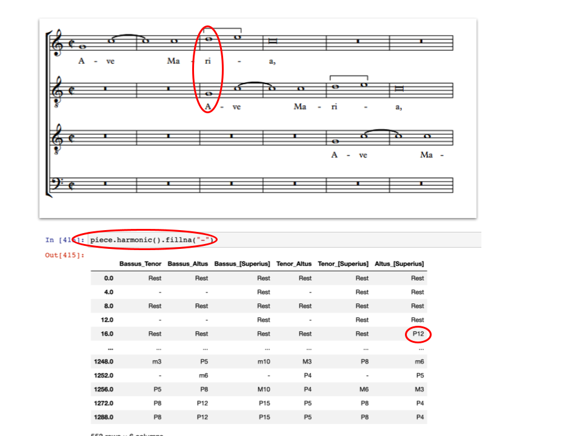

The function can, however, be modified by each of its parameters:  
* `kind`, for controlling if diatonic, chromatic, or other types of intervals are reported; default is diatonic  
* `directed`, for controlling whether the report is simply a raw interval, or also reports whether it goes up or down (indicated with a '-' if down); default includes direction  
* `compound`, whether intervals larger than an octave are reported as simpler versions; default reports compounds as they actually appear  
* `againstLow`, whether harmonic intervals are produced for every combination of voices, or just between each non-lowest voice and the lowest active voice at each harmonic offset; default generates every combination of voices

## `harmonic()` Parameters  

### Differentiating Between Diatonic, Chromatic, and Other Intervals: The `kind` Parameter  

The `harmonic()` function contains a parameter `kind`, which has a default value of "q". These inputs are case sensitive:  

**Diatonic with qualities**. These qualities are outputs such as "P8" for a perfect octave (e.g. C4 -> C5), "M3" for a major third interval (e.g. C5 -> E5), and "m3" for minor third interval (e.g. C5 -> E-5):  

```python
piece.harmonic(kind = 'q')
```

**Diatonic without qualities**. Provides outputs such as "8" for an octave, and "3" for a third interval:  

```python
piece.harmonic(kind = "d")
```  

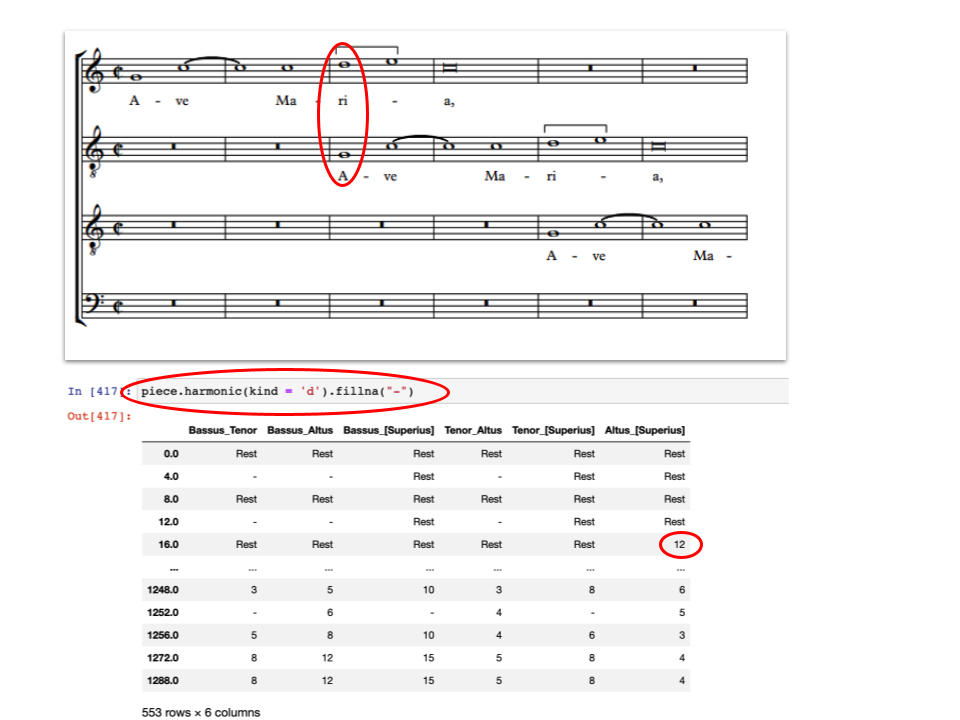

**Chromatic**. Simply the difference in pitch including all intermediary notes. Outputs "12" for an octave interval (e.g. C4 -> C5), "6" for a tritone interval (e.g. C5 -> F#5), and "0" for a unison (e.g. C5 -> C5):  

```python
piece.harmonic(kind = "c")
```  

**Zero-based**. Diatonic intervals, begins counting at 0 rather than 1. Outputs "7" for a perfect octave interval up (e.g. D3 -> D4), "-4" for a fifth interval down (e.g. F5 -> A5), "2" for a third interval up (e.g. G4 -> B5):  

```python
piece.harmonic(kind = "z")
```

### Up and Down vs. Aboslute: The `directed` Parameter  

By default, `directed = True`, which causes the melodic intervals to report their direction; "4" is an ascending fourth; "-4" is descending. It might be useful, however, simply to report the absolute distance without direction, such as if the aim is to know how many harmonic intervals of a sixth appear in a piece regardless of their direction.  In this case, use `directed = False`.  

```python
#Default value:  
piece.harmonic(directed = True)
``` 

[C5 -> G5] will return a diatonic interval of "4"  
[G5 -> C5] will return a diatonic interval of "-4"  

```python
piece.harmonic(directed = False)
```


[C5 -> G5] will return a diatonic interval of "4"  
[G5 -> C5] will return a diatonic interval of "4"  

### Managing Intervals Greater than an Octave: The `compound` Parameter  

The `harmonic()` function contains a parameter `compound`, with a default value of `True`. This means that intervals with a span greater than an octave will always be returned as such.  The interval from C4 to E5 would be a diatonic 10, a chromatic 16, M10 using 'with quality', and 9 using 'zero-based diatonic'. 

```python
piece.harmonic(compound = True)
```

Using `piece.harmonic(compound = False)`, in contrast, analyzes all intervals as if they are within a octave (what musicians call the 'simple' intervallic distances). In this case the interval from C4 to E5 would be a diatonic 3, a chromatic 4, M3 using 'with quality', and 2 using 'zero-based with quality'. Note that an octave itself is not reduced to a unison.  

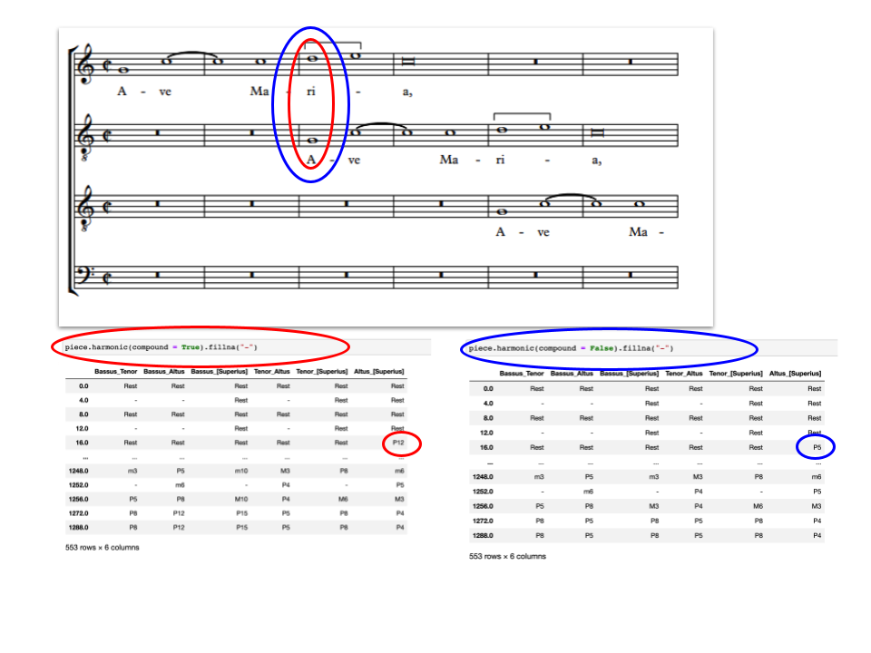

### Harmonic Intervals Between All Voice Pairs, or Only Comparing to the Lowest Voice? The `againstLow` Parameter  

By default, `harmonic()` generates a DataFrame of the harmonic intervals between **ALL** voice pairs present at a given offset. This is the case when the `againstLow` parameter is set to its default, `False`. Alternatively, however, we may wish to explore each voice's harmonic relationship only to the lowest voice present at each offset, and not need other harmonic pairs creating clutter in our DataFrame output. When changed to `True`, harmonic intervals will only be shown between the lowest voice and each other voice at a given offset:  

```python
piece.harmonic(againstLow = True)
```

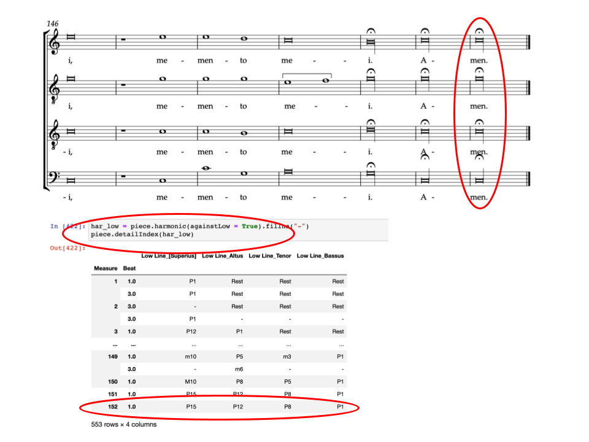

This means that if a piece contained a Bass, Tenor, Alto, and Soprano voice, all four voices were sounding, and `againstLow` was set to **True**, `harmonic()` will generate the interval between the Bass and the Tenor, the Bass and the Alto, and the Bass and the Soprano. It will **NOT** generate any harmonic interval between the Tenor and Alto, Tenor and Soprano, or Alto and Soprano. The same logic would also apply even if the Bass was not present, where only the harmonic intervals appearing would be between the Tenor and Alto voices, and between the Tenor and Soprano voices.  

### The `sonorities` Function:  Reporting All Harmonic Intervals in One Column

There is also a separate `sonorities` function, which in turn uses the results from harmonic to produce a single column representing all of the vertical intervals heard at each 'onset' of any note throughout the piece.  The result is something like a figured bass representation of the harmonies at each moment.

In its simplest form, we call this on piece as follows:

```python
piece.sonorities()
```

There are also several parameters.  The first three are simply those used with `harmonic`, as described above.  There are their defaults:

kind='d'
directed=True
compound='simple'

One additional parameter, `sort`, determines the *order* of the intervals.  If `sort=True` (which is the default), then the intervals will be sorted from largest to smallest.  Duplicates and unisons will be removed.  


```python
piece.sonorities(sort=True)
```

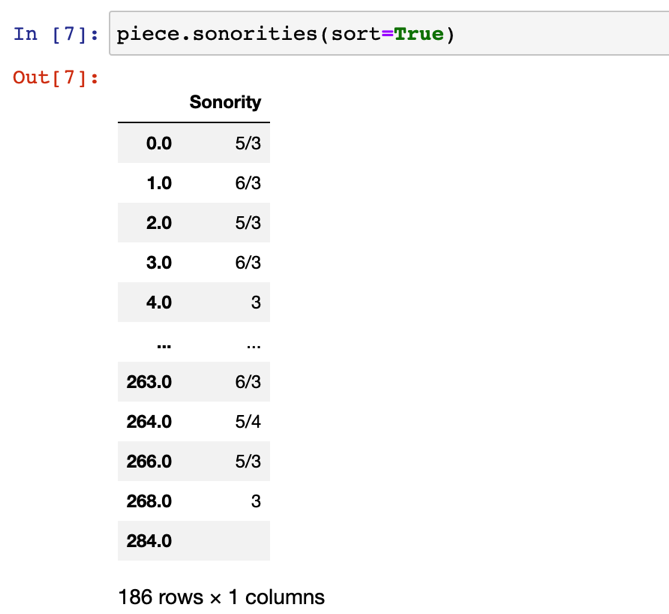

But if `sort=False`, then *all* intervals will be reported (unisons and duplicates included), and they will appear in order from top staff to bottom.

```python
piece.sonorities(sort=False)
```

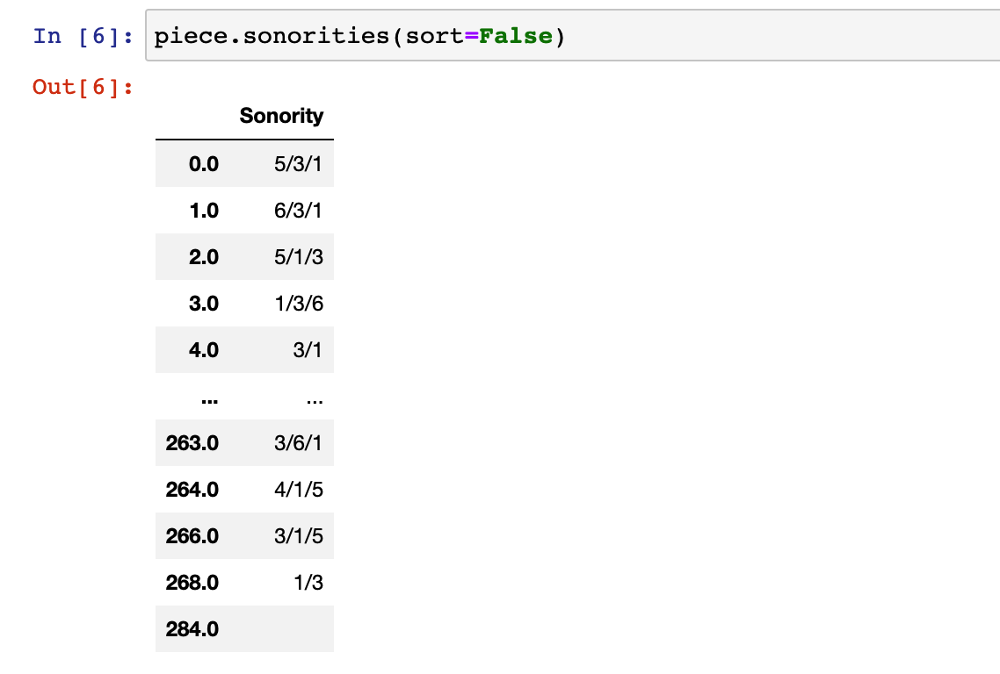

It would also be possible to pass these to the ngram method to see higher level patterns:

```python
son = piece.sonorities(sort=False)
piece.ngrams(df = son)
```


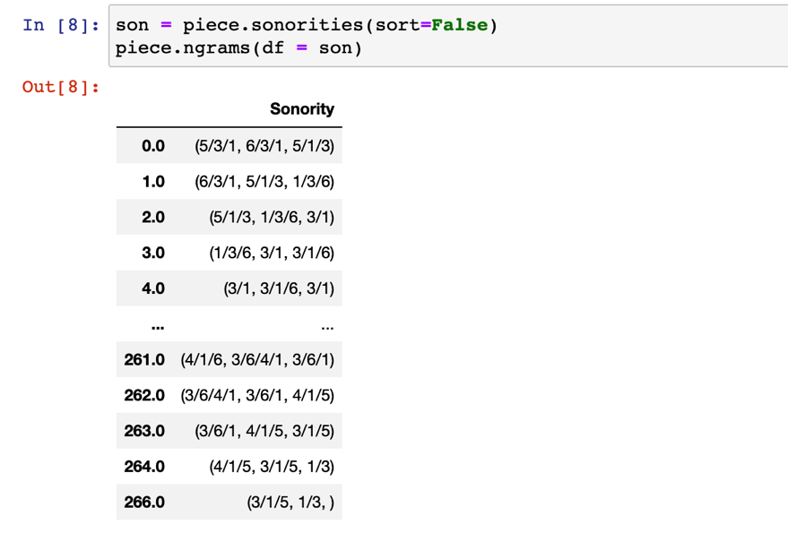

### Dealing with Consecutive Pitch Repetition/Rests: The `combineUnisons` and `combineRests` Parameters:  

Unlike the `notes()` functions, the `harmonic()` function does not contain `combineUnisons` or `combineRests` parameters. These parameters, however, can still be used in conjunction with the `harmonic()` function as follows:  

```python
nr_no_unisons = piece.notes(combineUnisons = True)
piece.harmonic(df = nr_no_unisons)
```

Or (though less useful),  

```python
nr_separate_rests = piece.notes(combineRests = False)  
piece.harmonic(df = nr_separate_rests)
```  

## 

## `fillna()` and `dropna()` Functions  

We have previously seen the `fillna()` function which, when applied to a DataFrame, replaces all "NaN" objects with the chosen text. For example:  

```python
piece.harmonic().fillna('-')
``` 

We are also able to apply the `dropna()` function, which (by default) removes all rows (beats) from the table consisting *entirely* of "NaN" values.  

```python
piece.harmonic().dropna()
```


This would be equivalent to specifiying the function as follows:  

```python
piece.harmonic().dropna(how = 'all')
```


Alternatively, rows could be dropped if they contian *any* "NaN" values:  

```python
piece.harmonic().dropna(how = 'any')
``` 

## More About Measures, Beats, and Offsets: The `detailIndex()` Function  

By default, the `harmonic()` function returns a DataFrame which indexes by offsets: That is, events in the piece are counted by which overall beat in the piece they fall on. This is useful for measuring time distances between events, but not for a human reader to refer back to the musical score itself. It is easy to include measure and beat indexes by passing the result of the function to the `detailIndex()` function as shown:  

```python
har = piece.harmonic()  
har_DI = piece.detailIndex(har)
``` 

For more information about the `detailIndex` function, consult [the function's documentation](09_DetailIndex.md).  


## Harmonic Intervals in a Corpus


The `corpus.batch` method will help you produce a combined picture of harmonic intervals across any corpus.

<br>

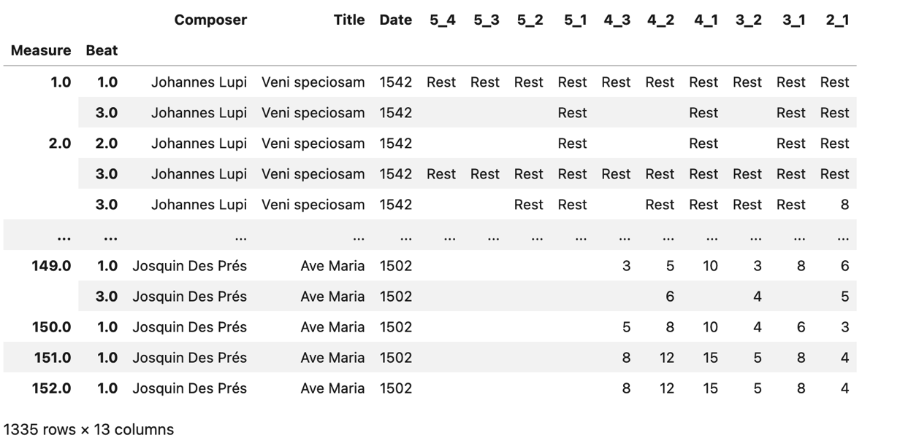

<br>

<Details>

<Summary>Code to Run</Summary>

```python
def corpus_har(corpus, combine_unisons_choice, combine_rests_choice, kind_choice, directed, compound):
    func = ImportedPiece.notes  # <- NB there are no parentheses here
    list_of_dfs = corpus.batch(func = func, 
                                kwargs = {'combineUnisons': combine_unisons_choice, 'combineRests': combine_rests_choice}, 
                                metadata=False)
    func1 = ImportedPiece.numberParts
    list_of_dfs = corpus.batch(func = func1,
                               kwargs = {'df' : list_of_dfs},
                               metadata=False)
    
    func2 = ImportedPiece.harmonic
    list_of_dfs = corpus.batch(func = func2,
                               kwargs = {'df' : list_of_dfs, 'kind' : kind_choice, 'directed' : directed, 'compound' : compound},
                               metadata = False)
    func3 = ImportedPiece.detailIndex
    list_of_dfs = corpus.batch(func = func3, 
                            kwargs = {'df': list_of_dfs}, 
                            metadata = True)
    har = pd.concat(list_of_dfs)
    cols_to_move = ['Composer', 'Title', 'Date']
    har = har[cols_to_move + [col for col in har.columns if col not in cols_to_move]]
    return har

# define the settings
combine_unisons_choice = False
combine_rests_choice = False
kind_choice = 'd'
directed = True
compound = True


# run the function
har = corpus_har(corpus, combine_unisons_choice, combine_rests_choice, kind_choice, directed, compound).fillna('')
har
```

</Details>

## Charts with Harmonic Intervals

As we explain the [Visualizations_Summary](/18_Visualizations_Summary.md), the **Plotly** library provides some powerful tools for displaying tabular data in various charts and plots.

### For a Single Piece

First with the voices as separate charts:

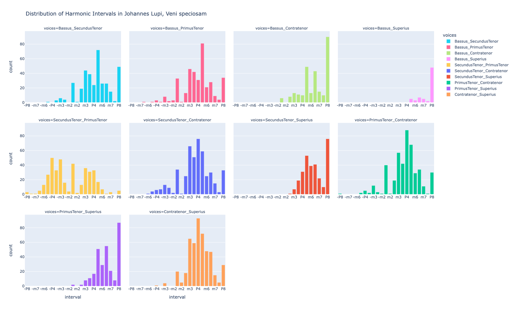

<br>

<Details>

<Summary>Code to Use</Summary>

```python
url = 'https://crimproject.org/mei/CRIM_Model_0001.mei'
piece = importScore(url)

# give the chart a meaningful title based on your piece:
md = piece.metadata  
chart_title = "Distribution of Harmonic Intervals in " + md['composer'] + ", " + md['title']

# custom interval order
int_order = ["-P8", "-M7", "-m7", "-M6", "-m6", "-P5", "-P4", "-M3", 
                          "-m3", "-M2", "-m2", "P1", "m2", "M2", "m3", "M3",
                          "P4", "P5", "m6", "M6", "m7", "M7", "P8"]
# get the harmonic intervals
har = piece.harmonic().fillna("-")  
har = har.apply(pd.Series.value_counts).fillna(0).astype(int).reset_index().copy()  
har.rename(columns={'index': 'interval', 'voice' : 'voices'}, inplace=True)  
har['interval'] = pd.Categorical(har["interval"], categories=int_order)  
har = har.sort_values(by="interval").dropna().copy()  
voices = mel.columns.to_list()[1:]  # Exclude 'interval' column
# Create a custom color palette
custom_palette = px.colors.qualitative.Plotly + px.colors.qualitative.Dark24 + px.colors.qualitative.Light24
color_dict = {voice: custom_palette[i % len(custom_palette)] for i, voice in enumerate(voices)}
# Melt the DataFrame to long format suitable for px.bar
melted_har = har.melt(id_vars='interval', var_name='voices', value_name='count')
# Plot using Plotly Express
fig = px.bar(melted_har, 
             x='interval', 
             y='count', 
             color='voices', 
             facet_col='voices', 
             category_orders={'interval': int_order}, 
             color_discrete_map=dict(zip(voices, custom_palette)),
             facet_col_wrap=4,  # Wrap facets after every 4 columns; adjust according to your results
             height=1000,  # Overall figure height
             facet_row_spacing=0.08,  # Spacing between rows; adjust according to height chosen
             title=chart_title)
for i in range(len(set(melted_har['voices']))):
    fig.update_xaxes(showticklabels=True)


fig.show()
```

</Details>

<br>


And then combined:

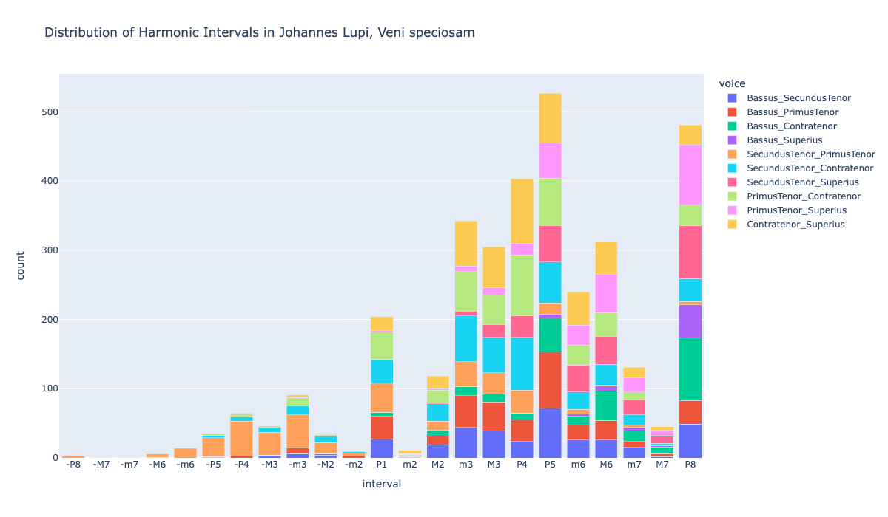


<br>

<Details>

<Summary>Code to Use</Summary>

```python
url = 'https://crimproject.org/mei/CRIM_Model_0001.mei'
piece = importScore(url)

# give the chart a meaningful title based on your piece:
md = piece.metadata  
chart_title = "Distribution of Harmonic Intervals in " + md['composer'] + ", " + md['title']

# custom interval order
int_order = ["-P8", "-M7", "-m7", "-M6", "-m6", "-P5", "-P4", "-M3", 
                          "-m3", "-M2", "-m2", "P1", "m2", "M2", "m3", "M3",
                          "P4", "P5", "m6", "M6", "m7", "M7", "P8"]
# get the harmonic intervals
har = piece.harmonic().fillna("-")  
har = har.apply(pd.Series.value_counts).fillna(0).astype(int).reset_index().copy()  
har.rename(columns={'index': 'interval'}, inplace=True)  
har['interval'] = pd.Categorical(har["interval"], categories=int_order)  
har = har.sort_values(by="interval").dropna().copy()  
voices = har.columns.to_list()[1:]  # Exclude 'interval' column
# Create a custom color palette
custom_palette = px.colors.qualitative.Plotly + px.colors.qualitative.Dark24 + px.colors.qualitative.Light24
color_dict = {voice: custom_palette[i % len(custom_palette)] for i, voice in enumerate(voices)}
# Melt the DataFrame to long format suitable for px.bar
melted_har = har.melt(id_vars='interval', var_name='voice', value_name='count')


# Create the stacked bar chart
fig = px.bar(melted_har, 
             x='interval', 
             y='count', 
             color='voice', 
             barmode='stack',
             height=700,
             width=1200,
            title=chart_title)

fig.show()
```

</Details>

<br>


### For a Corpus

Here is a chart for an entire corpus:


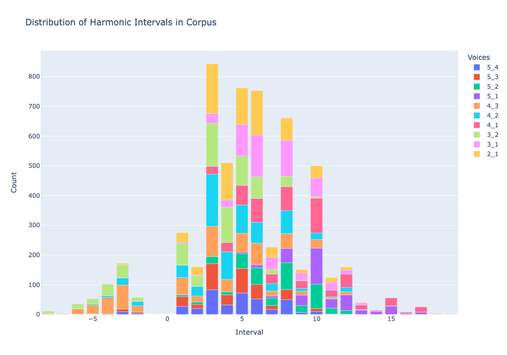

<br>

<Details>

<Summary>Code to Use</Summary>

```python
# har corpus function for batch processing
def corpus_har(corpus, combine_unisons_choice, combine_rests_choice, kind_choice, directed, compound):
    func = ImportedPiece.notes  # <- NB there are no parentheses here
    list_of_dfs = corpus.batch(func = func, 
                                kwargs = {'combineUnisons': combine_unisons_choice, 'combineRests': combine_rests_choice}, 
                                metadata=False)
    func1 = ImportedPiece.numberParts
    list_of_dfs = corpus.batch(func = func1,
                               kwargs = {'df' : list_of_dfs},
                               metadata=False)
    
    func2 = ImportedPiece.harmonic
    list_of_dfs = corpus.batch(func = func2,
                               kwargs = {'df' : list_of_dfs, 'kind' : kind_choice, 'directed' : directed, 'compound' : compound},
                               metadata = False)
    func3 = ImportedPiece.detailIndex
    list_of_dfs = corpus.batch(func = func3, 
                            kwargs = {'df': list_of_dfs}, 
                            metadata = True)
    har = pd.concat(list_of_dfs)
    cols_to_move = ['Composer', 'Title', 'Date']
    har = har[cols_to_move + [col for col in har.columns if col not in cols_to_move]]
    return har

# settings
combine_unisons_choice = False
combine_rests_choice = False
kind_choice = 'd'
directed = True
compound = True

# orderings

interval_order_quality = ["-P8", "-M7", "-m7", "-M6", "-m6", "-P5", "-P4", "-M3", 
                          "-m3", "-M2", "-m2", "P1", "m2", "M2", "m3", "M3",
                          "P4", "P5", "m6", "M6", "m7", "M7", "P8"]

# load corpus


file_list = ['https://crimproject.org/mei/CRIM_Model_0001.mei', 'https://crimproject.org/mei/CRIM_Model_0008.mei']

corpus = CorpusBase(file_list)

# run function and create plot


har = corpus_har(corpus, combine_unisons_choice, combine_rests_choice, kind_choice, directed, compound)
filtered_har = har
har_no_mdata = filtered_har.drop(['Composer', 'Title', "Date"], axis=1)
har_no_mdata = har_no_mdata.map(str)
har_counts = pd.DataFrame(har_no_mdata.apply(pd.Series.value_counts).fillna(0))

# drop row of nas:
har_counts = har_counts.drop('nan', axis=0)

if exclude_rests == True:
    har_counts = har_counts.drop('Rest', axis=0)
# apply the categorical list and sort.  
if kind_choice == 'q':
    # har_counts = har_counts.drop(index='')
    har_counts.index = pd.CategoricalIndex(har_counts.index, categories=interval_order_quality, ordered=True)
    har_counts.sort_index(inplace=True)
else:
    har_counts.index = pd.to_numeric(har_counts.index, errors='coerce')

    # Filter out rows with NaN index if necessary
    # df = df.dropna(subset=[df.index.name])
    negative_df = har_counts[har_counts.index < 0].sort_index(ascending=True)
    non_negative_df = har_counts[har_counts.index >= 0].sort_index(ascending=True)
    
    # Step 2: Concatenate the two DataFrames
    har_counts = pd.concat([negative_df, non_negative_df])
    # har_counts = har_counts.drop(index='')
    har_counts.index.rename('interval', inplace=True)
voices = har_counts.columns.to_list() 


chart_title = "Distribution of Harmonic Intervals in Corpus"

fig = px.bar(har_counts, x=har_counts.index, y=list(har_counts.columns),
                    title=chart_title)
fig.update_layout(xaxis_title="Interval", 
                    yaxis_title="Count",
                    legend_title='Voices',
                       height=700,
                       width=1000)
fig.show()
```


</Details>

<br>


-----

## Sections in this guide

  * [01_Introduction_and_Corpus](/tutorial/01_Introduction_and_Corpus.md)
  * [02_Notes_Rests](/tutorial//02_Notes_Rests.md)
  * [03_Durations](/tutorial//03_Durations.md) 
  * [04_TimeSignatures_Beat_Strength](/tutorial//04_TimeSignatures_Beat_Strength.md)
  * [05_Detail_Index](/tutorial//05_Detail_Index.md)
  * [06_Melodic_Intervals](/tutorial//06_Melodic_Intervals.md)
  * [07_Harmonic_Intervals](/tutorial//07_Harmonic_Intervals.md)
  * [08_Contrapuntal_Modules](/tutorial//08_Contrapuntal_Modules.md)
  * [09_Ngrams_Heat_Maps](/tutorial//09_Ngrams_Heat_Maps.md)
  * [10_Lyrics_Homorhythm](/tutorial//10_Lyrics_Homorhythm.md)
  * [11_Cadences](/tutorial//11_Cadences.md)
  * [12_Presentation_Types](/tutorial//12_Presentation_Types.md)
  * [13_Musical_Examples_Verovio](/tutorial//13_Musical_Examples_Verovio.md)
  * [14_Model_Finder](/tutorial//14_Model_Finder.md)
  * [15_Visualizations_Summary](/tutorial//15_Visualizations_Summary.md)
  * [16_Network_Graphs](/tutorial//16_Network_Graphs.md)
  * [17_Python_Basics](/tutorial//17_Python_Basics.md)
  * [18_Pandas_Basics](/tutorial//18_Pandas_Basics.md)
  * [19_Music21_Basics](/tutorial//18_Music21_Basics.md)
  * [20_Melodic_Interval_Families](/tutorial//20_Melodic_Interval_Families.md)
  * [99_Local_Installation](/tutorial//99_Local_Installation.md)