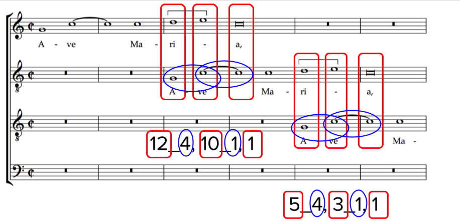
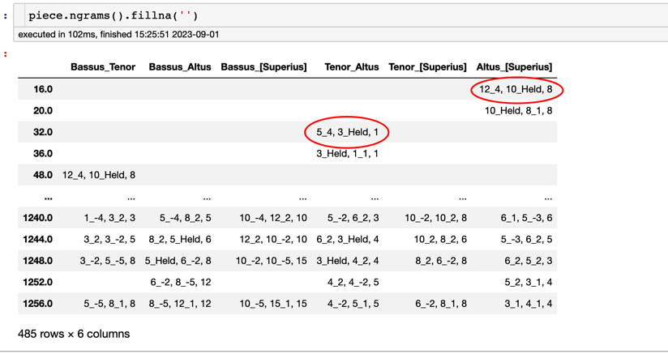
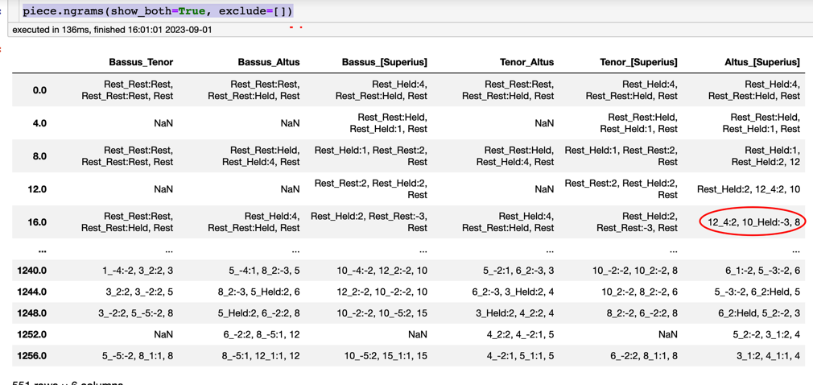
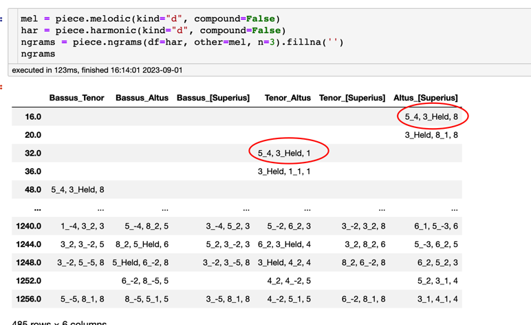
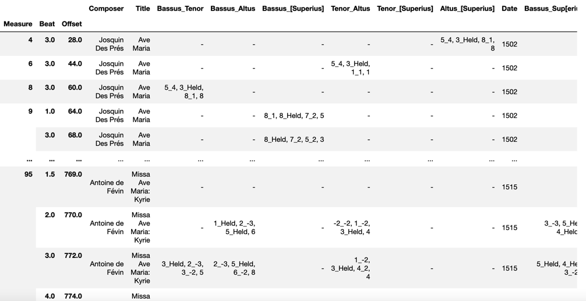
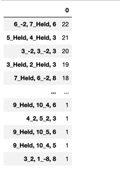
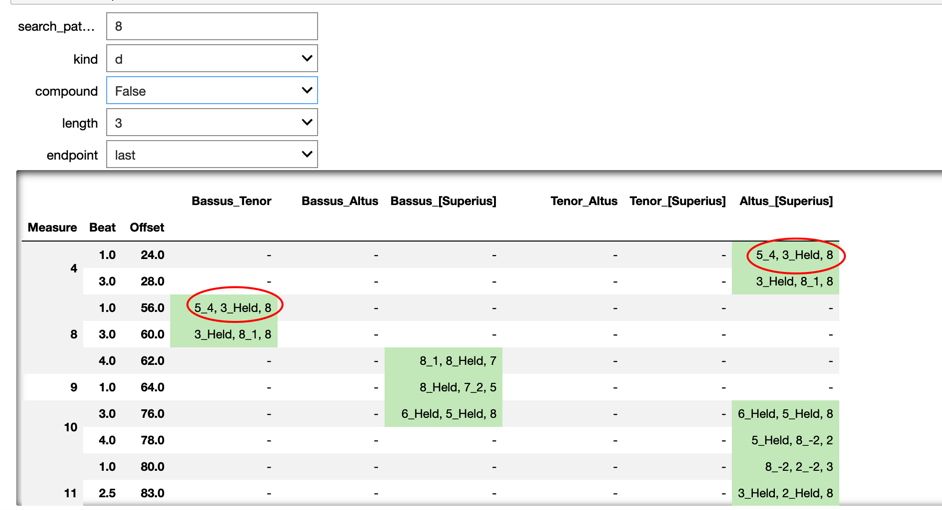

# Finding Contrapuntal Modules (and Other Complex nGrams)

## What is a Contrapuntal Module?
A **contrapuntal module** (as formulated by our colleagues Julie Cumming and Peter Schubert) is a special kind **nGram** that describes the movement of any two voices:  

- a succession of **harmonic intervals** between the two voices (normally reprensented by the odd-numbered positions in the nGram), and
- a succession of **melodic intervals** made by the lower ('tenor') voice of the pair.

One might think that we would need to describe the melodic motion of *both voices* (and that is possible via an advanced setting of the CRIM Intervals `nGrams` method).  But in fact knowing the movement of the harmonic intervals and the melodic intervals of the lower voice alone is enough to fully describe the counterpoint (since we could infer the motion of the upper voice from the parts of the result).

Consider the following example from Josquin's *Ave Maria*:



The **red squares represent the harmonic intervals**; the **blue ovals represent the melodic motion in the lower part**.  Together they form a 3-gram, since there are three harmonic 'states'. The `n` parameter (explained below) allows us to find contrapuntal ngrams of any length. But '3' is the default.

## The `ngram()` Function in Detail

Default usage:  

    piece.ngrams()

You will probably want to fill the `na values`:

    piece.ngrams().fillna(')



It is also worth noting that by default the `ngrams` method uses `compound` intervals (melodic and harmonic alike). This is why the ngrams for the Cantus-Altus pair are different from the Tenor-Bassus pair (the Altus begins a 12th below the Cantus when it first enters; the Bassus is only a 5th below the Tenor). If you would like to use `simple` intervals instead (and thus find identical modules regardless of these octave differences) then see below.

## `ngrams()` Main Parameters
​
* **Length of nGrams**.  Remember that this will be number of the odd-numbered positions.  An `n=3` will in fact show 5 intervals (three harmonic surrounding two melodic).  Thus: `piece.ngrams(n=5)`. The default value is 3.
* **interval type** (such as diatonic, chromatic, etc, or in CRIM Intervals: d, c, z, or q): `piece.ngrams(interval_settings='c')`.  The default value is 'd'.
* The **'endpoint' of the offset reference** (whether the offset represents the start or end of the ngram).  Thus `piece.ngrams(offsets=
first)` or `piece.ngrams(offsets=last)`. 

Thus a typical request:

    piece.ngrams(interval_settings='c', offsets='first', n=5).fillna('')

## Showing Both Voices.  Excluding Certain Values
* **exclude** is normally used to keep Rests out of the results.  `piece.ngrams(exclude=['Rests'])` (note that the string 'Rests' must be in a list `[]`) will make sure that the results are only nGrams consisting of melodic and harmonic intervals.  If you want *include* rests, then `piece.ngrams(exclude=[])`.  Note that in fact we could *exclude* any strings included in the list, thus: `piece.ngrams(show_both=True, exclude=['8', '5'])` will eliminate any nGram that contains either of those strings.
* The **show_both** parameter, determines the results show only the melodic intervals of the lowest part (which is default), or both voices: `piece.ngrams(show_both=True)`.  This latter setting can be helpful in finding cadences.  But note:  you *must use an empty list with **exclude** in order for this to work properly.  Thus:  `piece.ngrams(show_both=True, exclude=[])`

The results will in turn look a bit dense, but in fact how we can see the melodic motion of both voices:



## The `df` and `other` Parameters

By default, the `ngrams` method uses the default behaviors of the `melodic` and `harmonic` methods, then combines these as noted above.  But it is also possible to combine *any* pair of dataframes created on a piece.  And this is what you will need to do if you want to use features like:

* combineUnisons
* simple rather than compound
* Or build custom 'combined' ngrams from something like melodic intervals and durations, or lyrics and durations.

For example, here is how we this might look for *diatonioc* intervals, although we can already do this with ngram parameters as noted above.  But since `melodic` anb `harmonic` return *compound* intervals by default, this will in turn force the ngrams to be *simple* instead.

```
mel = piece.melodic(kind="d", compound=False)
har = piece.harmonic(kind="d", compound=False)
ngrams = piece.ngrams(df=har, other=mel, n=3).fillna('')
ngrams
```



Or combining unisons 

```
nr_no_unisons = piece.notes(combineUnisons=True)
mel = piece.melodic(df=nr_no_unisons, kind="d", compound=False)
har = piece.harmonic(kind="d", compound=False)
ngrams = piece.ngrams(df=har, other=mel).fillna('')
ngrams.head()
```

## Corpus Methods with Contrapuntal nGrams

Define the corpus:
```
corpus = CorpusBase(['https://crimproject.org/mei/CRIM_Model_0008.mei',
                    'https://crimproject.org/mei/CRIM_Mass_0005_1.mei'])
```

Then:

* Get the ngrams for all of them. In this case: modules of length "3", with diatonic simple intervals
* Then combine them into one frame
* NB: use ImportedPiece, not piece!
* NB: for func do NOT include the closing parentheses!

```
func = ImportedPiece.ngrams
list_of_modules = corpus.batch(func=func, kwargs={'n': 3, 'interval_settings': ('d', False, True)}, metadata=True)
title_of_output = pd.concat(list_of_melodic_ngrams)
```
Note that the output lists voice pairs by staff position. In a four-voice piece, the lowest part would be 4, then 3, etc. 4_3 represents the two lowest voices of the piece, and so on.


```
func = ImportedPiece.ngrams
list_of_modules = corpus.batch(func=func, kwargs={'n': 4, 'interval_settings': ('d', True, False), 'offsets': 'last'}, metadata=True)
func2 = ImportedPiece.detailIndex
list_of_details = corpus.batch(func=func2, kwargs={'offset': True, 'df': list_of_modules})

module_corpus = pd.concat(list_of_details).fillna('-').dropna(how="all")

c = module_corpus['Composer']
t = module_corpus["Title"]
module_corpus.pop("Composer")
module_corpus.pop("Title")
module_corpus.insert(0, "Composer", c)
module_corpus.insert(1, "Title", t)
module_corpus
```



## Filtering and Counting

    piece.ngrams(exclude=['Rest']).stack().value_counts().to_frame()




## Searching with Interact in a Notebook

```
@interact
def get_modules(search_pattern="", kind=["d", "q", "c", "z"], compound=[True, False], length=[3, 4, 5, 6], endpoint=["last", "first"]):
    
    piece_mel = piece.melodic(kind=kind)
    piece_har = piece.harmonic(kind=kind, compound=compound)
    ngrams = piece.ngrams(df=piece_har, other=piece_mel, n=length, offsets=endpoint)
    filtered_ngrams = ngrams[ngrams.apply(lambda x: x.astype(str).str.contains(search_pattern).any(), axis=1)]#.copy()
    beats_measures_mod = piece.detailIndex(filtered_ngrams, offset=True)

    return beats_measures_mod.fillna("-").applymap(str).style.applymap(lambda x: "background: #ccebc5" if re.search(search_pattern, x) else "")
```


-----  

## Sections in this guide

  * [01_Introduction_and_Corpus](tutorial/01_Introduction_and_Corpus.md)
  * [02_Notes_Rests](tutorial/02_Notes_Rests.md)
  * [03_Durations](tutorial/03_Durations.md) 
  * [04_TimeSignatures_Beat_Strength](tutorial/04_TimeSignatures_Beat_Strength.md)
  * [05_Detail_Index](tutorial/05_Detail_Index.md)
  * [06_Melodic_Intervals](tutorial/06_Melodic_Intervals.md)
  * [07_Harmonic_Intervals](tutorial/07_Harmonic_Intervals.md)
  * [08_Contrapuntal_Modules](tutorial/08_Contrapuntal_Modules.md)
  * [09_Ngrams_Heat_Maps](tutorial/09_Ngrams_Heat_Maps.md)
  * [10_Lyrics_Homorhythm](tutorial/10_Lyrics_Homorhythm.md)
  * [11_Cadences](tutorial/11_Cadences.md)
  * [12_Presentation_Types](tutorial/12_Presentation_Types.md)
  * [13_Model_Finder](tutorial/13_Model_Finder.md)
  * [14_Visualizations_Summary](tutorial/14_Visualizations_Summary.md)
  * [15_Network_Graphs](tutorial/15_Network_Graphs.md)
  * [16_Python_Basics](tutorial/16_Python_Basics.md)
  * [17_Pandas_Basics](tutorial/17_Pandas_Basics.md)
  * [18_Music21_Basics](tutorial/18_Music21_Basics.md)