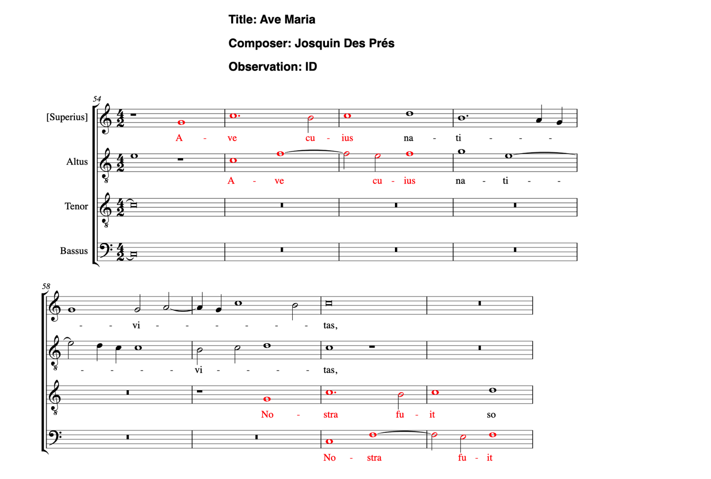

# Engraving Musical Examples with Verovio

Thanks to Laurent Pugin's powerful suite of [Verovio](https://www.verovio.org/index.xhtml) engraving library, it is also possible to render musical examples from MEI and MusicXML files.  

###  *A Note about Saving and Printing Examples*

As in the case of charts and figures, you might want to save or print your work for review outside the Jupyterlab environment.  The best solution in this case is to Export your notebook to *html*, which is essentially a web page downloaded to your computer.  You can then open the html file in your browser for review or printing.  Here is now to do it:


# How to Use the Verovio Print Functions

CRIM Intervals works with Verovio in various ways:

## 1. Print Example

Pass a range of measures (as integers) to print the given range.

Measures 10-15, for instance:

```python
piece.verovioPrintExample(10, 15)
```

The result looks like this:


Depending on how your MEI file has been encoded it is possible you will see Verovio warnings (but you can ignore these).  You can nevertheless suppress these by adding the following code (although this will also suppress the metadata printed by the `verovioPrintExample` function):


```python
%%capture --no-display
piece.verovioPrintExample(10, 15)
```

The cleaned result looks like this:


For last measure you can also use '-1'; thus for all measures you would use the following:


```python
piece.verovioPrintExample(1, -1)
```

If your example is long, it will be broken into several pages.  You will need to scroll through the pages in your notebook.


## 2.  Print Cadences

This function is used to display the results of the Cadence
classifier in the Notebook with Verovio.  Each excerpt is
two measures long:  the measure of the final tone of the cadence
and the previous measure.

The function also displays metadata about each excerpt, drawn from the
cadence results dataframe:  piece ID, composer, title, measures, type of
cadence, beat of the bar in which the final tone is heard, and evaded
status.

How to use it:

You will first need to find the cadences:

```python
cadences = piece.cadences()
```

Then pass these results to the Verovio print function:

```python
piece.verovioCadences(cadences)
```

Notice that the output can be *very long* in this case, since all of the cadences in your dataframe of results will be printed, one after the other.


You can scroll through these.  But you might also find it helpful to *Export to HTML* as explained above.


It is also possible to pass a *filtered* list of cadences to this function 
by specifying a df into verovioCadences() as shown below:

```python
cadences = piece.cadences()
cadences_filtered = cadences[cadences['Tone'] == 'G']
piece.verovioCadences(cadences_filtered)
```

## 3.  Print Homorhythm

Prints HR passages for a given piece with Verovio, based on imported piece and 
other parameters.

Users can supply either of two arguments:

- 'ngram_length' (which is 4 by default, and determines the number of durations and syllables that must be in common among the voices in order to be marked as HR);

- 'full_hr' (which is True by default).  When `full_hr=True` the method will find any passage where _all active voices_ share the same durational ngram and syllables; if `full_hr=False` the method will find any passage where even *two voices* share the same durational ngram and the same syllables.

Typical use:

```python
piece.verovioHomorhythm()
```


OR with custom parameters:

```python
piece.verovioHomorhythm(ngram_length=5, full_hr=False)
```

It is also to run `piece.homorhythm()`, then filter the results in some way and pass those results to the print function:

```python
# first, run hr function and convert hr['syllable_set'] to string
hr = piece.homorhythm(ngram_length=6, full_hr=True).fillna('')
hr["hr_voices"] = hr["hr_voices"].apply(lambda x: ', '.join(map(str, x))).copy()

# now supply names of voices.  They must match the voice names in `piece.notes.columns()` 
chosen_voices = ["Tenor", "Bassus"]

# next, filter the results for hr passages involving chosen voices:
hr_with_chosen_voices = hr[hr.apply(lambda x: hr['hr_voices'].str.contains('|'.join(chosen_voices)))].dropna()

# finally, render just the hr_with_chosen_voices using `piece.verovioHomorhythm()`:
piece.verovioHomorhythm(hr_with_chosen_voices)
```


## 4.  Print Presentation Types

This function is used to display the results of the *presentationTypes* function
in the Notebook with Verovio.  Each excerpt begins with
the *first* measure of the given presentation type and continues through *four
measures after* the last entry.

The function also displays metadata about each excerpt, drawn from the
presentation type dataframe:  piece ID, composer, title, measure range,
presentation type, voices in order of entry, number of entries, the soggetti
, melodic entry intervals, time entry intervals.

How to use it:

You must first run presentationTypes to build the initial list of results and define
these as a new variable name, such as "p_types":

```python
p_types = piece.presentationTypes()
```

Remember that there are many options in the *presentationTypes* methods to
determine the length of soggetti, degree of head or body flex, status
of unisons, whether to use main entries only (or moving window of soggetti)
and status of hidden entries.

After any additional filtering, pass the results of that work to *verovioPtypes* to print all of the results with metadata before each one:

```python
piece.verovioPtypes(p_types)
```


## 5.  Print with Analytic Highlights

Finally it is now also possible to print examples with analytic highlights corresponding to the notes identified by various CRIM Intervals methods.  This is accomplished with the `piece.linkExample()` function, which takes in a dataframe of results produced with any of the following:

- ngrams (these could be melodic, harmonic, lyrics, durations, or modular ngrams)
- cadences 
- homorhythm
- presentation types

The `linkExample` works by calculating the 'address' of each pattern, in this case formulated according to the Raffaele Viglianti's [Enhancing Music Addressability(https://music-encoding.org/projects/ema.html)] API, which reduces any complex of selected notes to a string representing measures/staves/beats that can be used to return a valid segment of any MEI score corresponding to the passage in question.

These score selections can then be rendered by Verovio with highlights and relevant metadata, thanks to a [JS REACT(https://github.com/eleon024/ema_react_app/tree/main)] application created by Haverford College student Edgar Leon. 

In practice we combined these tools with Juypyter Notebook:

- Return your chosen pattern in a dataframe
- Filter it as needed (to narrow the results, for instance)
- Pass the results to `piece.linkExample(df=my_data_frame)`
- View the dataframe with and click on individual cells (they are 'links') to view the score with highlights and basic metadata about the composer, piece, and musical type.


Given a dataframe of EMA addresses, return a dataframe of clickable
links to the EMA React app. The `piece_url` parameter is the URL of the
piece on the EMA React app. If you don't pass a `piece_url`, the method
will try to construct one based on the piece's metadata. The resulting
dataframe will have the same data results, but instead of plain text
they will be links to highlighted examples of each result.


How to use it:

### 5a. linkExample with Cadences

```python
url = 'https://crimproject.org/mei/CRIM_Model_0008.mei'
piece = importScore(url)
cd=piece.cadences()
piece.linkExamples(df=cd, piece_url=url)
```

The 'linked' dataframe:


A 'highlighted' result for one cadence:


It is also possible to load MEI files from any github or other public repository:

```python
prefix = 'https://raw.githubusercontent.com/CRIM-Project/CRIM-online/master/crim/static/mei/MEI_4.0/'
piece_id = 'CRIM_Model_0008.mei'
url = prefix + piece_id
piece = importScore(url)
cd=piece.cadences()
piece.linkExamples(df=cd, piece_url=url)
```

The method can also be used with other CRIM Intervals functions.

### 5b. linkExample with Melodic n-grams:

Note that you must use `offsets='both'` with the ngram function!

```python
prefix = 'https://raw.githubusercontent.com/CRIM-Project/CRIM-online/master/crim/static/mei/MEI_4.0/'
piece_id = 'CRIM_Model_0008.mei'
url = prefix + piece_id
piece = importScore(url)
mel = piece.melodic(kind='d')
ng = piece.ngrams(df=mel, n=6, offsets='both')
piece.linkExamples(df=ng, piece_url=url)
```

The result for melodic ngrams.  Note that this dataframe will be *very long*.  You might want to filter it before passing it to the `linkExamples()` function!


And view an individual example:


### 5c. linkExample with Presentation Types

Remember that the `presentationTypes` function has many parameters to set:

```python
prefix = 'https://raw.githubusercontent.com/CRIM-Project/CRIM-online/master/crim/static/mei/MEI_4.0/'
piece_id = 'CRIM_Model_0008.mei'
url = prefix + piece_id
piece = importScore(url)
pt = piece.presentationTypes(limit_to_entries = True,
                        head_flex=1,
                        body_flex = 0,
                        include_hidden_types = False,
                        combine_unisons = True,
                        melodic_ngram_length = 4)
```

Then pass (or perhaps first filter) these results to the `linkExample` function:

Here we filter for Imitative Duos only:

```python
ids = pt[pt['Presentation_Type'] == "ID"]
```

And then pass these ID's to the `linkExample` function:


```python
piece.linkExamples(df=ids, piece_url=url)
```


A single result:




### 5d. linkExample with Homorhythm

```python
prefix = 'https://raw.githubusercontent.com/CRIM-Project/CRIM-online/master/crim/static/mei/MEI_4.0/'
piece_id = 'CRIM_Model_0008.mei'
url = prefix + piece_id
piece = importScore(url)
hr = piece.homorhythm()
piece.linkExamples(df=hr, piece_url=url)
```


Click any link to view the annotated result:


## Sections in this guide

  * [01_Introduction_and_Corpus](tutorial/01_Introduction_and_Corpus.md)
  * [02_Notes_Rests](tutorial/02_Notes_Rests.md)
  * [03_Durations](tutorial/03_Durations.md) 
  * [04_TimeSignatures_Beat_Strength](tutorial/04_TimeSignatures_Beat_Strength.md)
  * [05_Detail_Index](tutorial/05_Detail_Index.md)
  * [06_Melodic_Intervals](tutorial/06_Melodic_Intervals.md)
  * [07_Harmonic_Intervals](tutorial/07_Harmonic_Intervals.md)
  * [08_Contrapuntal_Modules](tutorial/08_Contrapuntal_Modules.md)
  * [09_Ngrams_Heat_Maps](tutorial/09_Ngrams_Heat_Maps.md)
  * [10_Lyrics_Homorhythm](tutorial/10_Lyrics_Homorhythm.md)
  * [11_Cadences](tutorial/11_Cadences.md)
  * [12_Presentation_Types](tutorial/12_Presentation_Types.md)
  * [13_Musical_Examples_Verovio](tutorial/13_Musical_Examples_Verovio.md)
  * [14_Model_Finder](tutorial/14_Model_Finder.md)
  * [15_Visualizations_Summary](tutorial/15_Visualizations_Summary.md)
  * [16_Network_Graphs](tutorial/16_Network_Graphs.md)
  * [17_Python_Basics](tutorial/17_Python_Basics.md)
  * [18_Pandas_Basics](tutorial/18_Pandas_Basics.md)
  * [19_Music21_Basics](tutorial/18_Music21_Basics.md)
  * [99_Local_Installation](tutorial/99_Local_Installation.md)