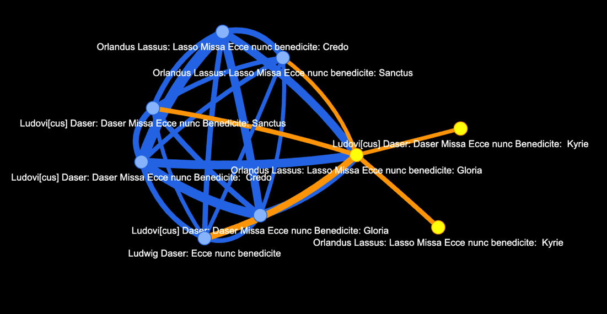
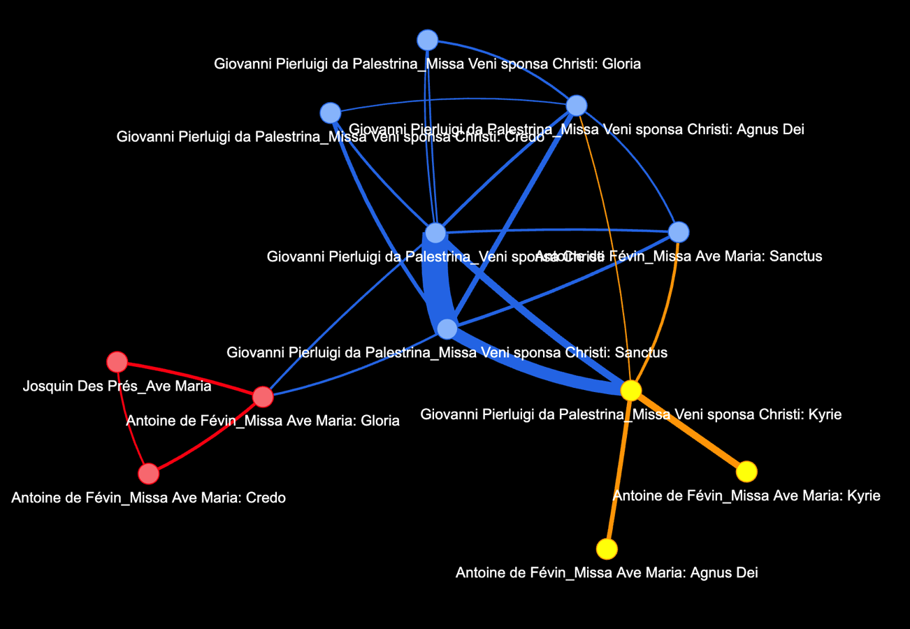

# Networks with CRIM Intervals Data

## Networks:  Basic Concepts and Methods 


<br>




<br>


In the field of data science, networks (also known as graphs) are powerful tools used to represent and study relationships between entities. A network is composed of **nodes** (also called vertices) and **edges** (also called links). Each node represents an entity, while each edge represents a relationship between two entities.

### Nodes
**Nodes are the fundamental building blocks of a network.** Think of them as the entities or objects you want to study. In a social network, nodes could represent individuals, while in a transportation network, nodes could represent cities.  You could even have different **kinds** of nodes in the same network--for instance some nodes representing musical works and others representing the groups that performed them. These could be distinguished by color or shape.

### Edges
**Edges are the connections between nodes.** They show how the entities are related to each other. In a social network, edges could represent friendships, and in a transportation network, edges could represent roads connecting cities.

### Weights
**Edges can have an associated weight**. The weight of an edge represents the strength or intensity of the relationship between the connected nodes. For example, in a network of academic writings, the weights could represent the number of times authors cited each other. In the transporation network, the weights could represent the number of journeys taken between each pair of places. 

### How are Two Things more Related than Others?
Determining the strength of the relationship between two nodes depends on the context of the network. For example, in a social network, the frequency and duration of interactions, mutual friends, and common interests can help establish the strength of friendships. In other cases, such as a transportation network, the distance between nodes could be a factor in determining the weight of the edges.

### Centrality as a Key Concept in Networks

By design, network visualization tools arrange the nodes so that those with the greatest number of connections to other nodes appear at the center of a two-dimensional field.  Conversely nodes with only a few connections to other nodes wind up at the periphery. Such representations thus reveal "communities". And indeed, there are special algorithms, like *Louvain Community Detection*, that help us discover neighborhoods in complex networks.

### More about Network Theory
You can learn more about [Network Theory](https://en.wikipedia.org/wiki/Network_theory) and explore Network Graphs [here](https://en.wikipedia.org/wiki/Graph_(discrete_mathematics)).

## Using CRIM Intervals Data with Networks

Here are the functions needed to create the networks with CRIM Intervals melodic, harmonic, ngrams, and other important methods

<Details>

<Summary>Get the Code</Summary

```python
# import libraries
import pandas as pd
import numpy as np
import networkx as nx
from pyvis import network as net
from itertools import combinations
from community import community_louvain
from copy import deepcopy

# Adding Louvain Communities
def add_communities(G):
    G = deepcopy(G)
    partition = community_louvain.best_partition(G)
    nx.set_node_attributes(G, partition, "group")
    return G

# network function
def crim_network(input_df, node_column, edge_column, network_name, pair_count_min, weight_normalize_factor, height, width):

    """
    input_df:  a cleaned df of patterns, with one column containing a combination of composer+title, and the other relevant pattern
    node_column:  the col in the input df to be used for the groupby of the graph, normally the feature, like ngrams
    edge_column:  the comp-title col, normally
    network_name:  the output name of the html file
    pair_count_min: minimum number of times two comp-titles must be connected in order to show; thins network
    weight_normalize_factor:  if no 0, then will be used as the number against which edge values are normalized; makes network more legible
    # typical use:

    # settings for cadence network
    input_df = corpus_cadences
    node_column = 'paired_cadences'
    edge_column = 'Title'
    network_name = "cadence_network.html"
    pair_count_min = 2 # minimum number of times that any pair of titles is paired.  higher number means sparser network
    weight_normalize_factor = 25 # lower number means thinner edges; all edges remain in proportion to each other
    """

    grouped_titles = input_df.groupby(node_column)[edge_column].unique().reset_index(name='nodes')
    
    
    # group the cadences by this combined tag and get the titles
    grouped_titles = input_df.groupby(node_column)[edge_column].unique().reset_index(name='nodes')
    
    # Generate all pairs of titles for each group and make a new df
    all_pairs = []
    for _, row in grouped_titles.iterrows():
        pairs = list(combinations(row['nodes'], 2))
        all_pairs.append((row[node_column], pairs))
    result_df = pd.DataFrame(all_pairs, columns=[node_column, 'node_pairs'])
    
    # remove the empty pairs and explode the complex list of tuples.  the result is 'tidy' data
    df_filtered = result_df[result_df['node_pairs'].apply(len) > 0]
    exploded_df = df_filtered.explode('node_pairs')
    
    # get the counts of each pair, which provides the basis of the weights
    pair_counts = exploded_df['node_pairs'].value_counts()
    # filter them for minimum number of pairs for given titles
    pair_counts = pair_counts[pair_counts >= pair_count_min]
    # get the counts of each pair, which provides the basis of the weights
    pair_counts = exploded_df['node_pairs'].value_counts()
    # filter them for minimum number of pairs for given titles
    if pair_count_min > pair_counts.max():
        print("'pair_count_min' cannot be greater than " + str(pair_counts.max()))
    else:
        pair_counts = pair_counts[pair_counts >= pair_count_min]
        # normalize edge weight display for legibility
        pair_counts_dict = pair_counts.to_dict()
        max_weight = max(pair_counts_dict.values())
        if weight_normalize_factor > 0:
            pair_counts = {k: v / max_weight * weight_normalize_factor for k, v in pair_counts_dict.items()}
            
        # Create an empty NetworkX graph
        G = nx.Graph()
        
        # Add nodes and assign weights to edges
        for pair, count in pair_counts.items():
            # Directly unpacking the tuple into node1 and node2
            node1, node2 = pair
            # Adding nodes if they don't exist already
            if node1 not in G.nodes:
                G.add_node(node1)
            if node2 not in G.nodes:
                G.add_node(node2)
            # Adding edge with weight
            G.add_edge(node1, node2, weight=count)
        
        # Adjusting edge thickness based on weights
        for edge in G.edges(data=True):
            edge[2]['width'] = edge[2]['weight']
            
        G = add_communities(G)
        
        # set display parameters
        network_graph = net.Network(notebook=True,
                           width=width,
                                  height=height,
                                  bgcolor="black", 
                                  font_color="white")
        
        # Set the physics layout of the network
        network_graph.set_options("""
        {
        "physics": {
        "enabled": true,
        "forceAtlas2Based": {
            "springLength": 1
        },
        "solver": "forceAtlas2Based"
        }
        }
        """)
        
        network_graph.from_nx(G)
        # # return the network
        
        return network_graph.show(network_name)

# function for corpus melodic ngrams
def corpus_mel_ng(corpus, combine_unisons_choice, combine_rests_choice, kind_choice, directed, compound, ngram_length):
    func = ImportedPiece.notes  # <- NB there are no parentheses here
    list_of_dfs = corpus.batch(func = func, 
                                kwargs = {'combineUnisons': combine_unisons_choice, 'combineRests': combine_rests_choice}, 
                                metadata=False)
    func1 = ImportedPiece.numberParts
    list_of_dfs = corpus.batch(func = func1,
                               kwargs = {'df' : list_of_dfs},
                               metadata=False)
    
    func2 = ImportedPiece.melodic
    list_of_mel_dfs = corpus.batch(func = func2,
                               kwargs = {'df' : list_of_dfs, 'kind' : kind_choice, 'directed' : directed, 'compound' : compound},
                               metadata = False)
    
    func3 = ImportedPiece.ngrams
    list_of_ng_dfs = corpus.batch(func = func3,
                               kwargs = {'df' : list_of_mel_dfs, 'n' : ngram_length},
                               metadata = False)
    
    func4 = ImportedPiece.detailIndex
    list_of_ng_dfs_det = corpus.batch(func = func4, 
                            kwargs = {'df': list_of_ng_dfs, 'offset' : True, 'beat' : False, 'measure' : False}, 
                            metadata = True)
    
    ng = pd.concat(list_of_ng_dfs_det)
    cols_to_move = ['Composer', 'Title', 'Date']
    ng = ng[cols_to_move + [col for col in ng.columns if col not in cols_to_move]]
    return ng


# function for corpus modular ngrams
def corpus_mod_ng(corpus, combine_unisons_choice, combine_rests_choice, kind_choice, directed, compound, ngram_length):
    func = ImportedPiece.ngrams
    list_of_modules = corpus.batch(func=func, kwargs={'n': 3, 'interval_settings': ('d', False, True)}, metadata=True)
    modules = pd.concat(list_of_modules)
    return modules
```

</Details>


### Build a Corpus

First, let's make a corpus:

``` python
# corpus
file_list = ['https://crimproject.org/mei/CRIM_Model_0019.mei', 
             'https://crimproject.org/mei/CRIM_Mass_0019_1.mei',
            'https://crimproject.org/mei/CRIM_Mass_0019_2.mei',
            'https://crimproject.org/mei/CRIM_Mass_0019_3.mei',
            'https://crimproject.org/mei/CRIM_Mass_0019_4.mei',
            'https://crimproject.org/mei/CRIM_Mass_0019_5.mei',
            'https://crimproject.org/mei/CRIM_Model_0008.mei', 
             'https://crimproject.org/mei/CRIM_Mass_0005_1.mei',
            'https://crimproject.org/mei/CRIM_Mass_0005_2.mei',
            'https://crimproject.org/mei/CRIM_Mass_0005_3.mei',
            'https://crimproject.org/mei/CRIM_Mass_0005_4.mei',
            'https://crimproject.org/mei/CRIM_Mass_0005_5.mei',]


corpus = CorpusBase(file_list)
```

## A Network of Cadences

Here we render the pieces as a network based on their shared cadences.
In this case the simple information about tone or type alone (and tone
and type combined) will not be sufficient for us to understand much
about the connections among compositions.

A more subtle way of tracing the ‘cadential similarity’ is to find
shared *pairs of cadences*.

In python we can do this with a few lines of code. Working with the
`Tone`, `CadType` and `CVFs` (or ‘cadential voice functions’) columns of
our results, we can:

-   combine these features into a single categorical ‘combined’ tag
-   combine *successive pairs* of cadences into a ‘paired_cadences’ tag
    with the `shift()` method in Pandas.


A Groupby operation will return a df consisting of all the **pairs of
pieces** that **share the same successive pair of cadences**. The pieces
will become the **nodes** of our network, and the **paired pieces** will
determine the edges. The **counts** of the paired pieces will determine
the weights of the edges.

### Get the Cadence Data and Clean Up

``` python
func = ImportedPiece.cadences
list_of_dfs = corpus.batch(func = func, kwargs = {'keep_keys': True}, metadata = True)
corpus_cadences = pd.concat(list_of_dfs, ignore_index = True)
col_list = ['Composer', 'Title', 'Measure', 'Beat', 'Pattern', 'CadType', 'Tone','CVFs',
                'LeadingTones', 'Sounding', 'Low','RelLow','RelTone',
                'Progress','SinceLast','ToNext']
corpus_cadences = corpus_cadences[col_list]

# create a new column that combines data from several others, so we get a complex cadence type
corpus_cadences['combined'] = corpus_cadences['Tone'] + "_" + corpus_cadences['CadType'] + "_" + corpus_cadences['CVFs']
# and now combine a given cadence tag with the following one
corpus_cadences['paired_cadences'] = corpus_cadences['combined'] + "_" + corpus_cadences['combined'].shift(-1)
# fill in the last cell, so there is no NAN, and that we get the final cadence
corpus_cadences['paired_cadences'].iloc[-1] = corpus_cadences['combined'].iloc[-1]
```

### Set the Input Values for the Network

Here are the arguments we pass to the function:


``` python
# settings for cadence network
input_df = corpus_cadences
node_column = 'paired_cadences'
edge_column = 'Title'
network_name = "cadence_network.html"
pair_count_min = 2 # minimum number of times that any pair of titles is paired.  higher number means sparser network
weight_normalize_factor = 25 # lower number means thinner edges; all edges remain in proportion to each other
height = "1000"
width = "1000"
```

### And now run the function:


``` python
crim_network(input_df, node_column, edge_column, network_name, pair_count_min, weight_normalize_factor, height, width)
```

<br>


<br>


## Network of Presentation Types

Here we create a network based on shared Presentation Types in a corpus
of pieces. The nodes will represent the pieces. The edges connect pieces
that share the same presentation type. The weights of the edges will be
determined by the number of times any pair of pieces share a
presentation type.

In this case we are using the ‘combined’ presentation type (with
information about *both the soggetto and the melodic intervals of
imitation*) as the basis of our edges:

These combined types look like this:

`-3_2_2_P-4_P-5`

### Assemble the Presentation Type Dataframe and Prepare the Data

``` python
corpus = CorpusBase(file_list)
func = ImportedPiece.presentationTypes
list_of_dfs = corpus.batch(func = func, kwargs = {'head_flex': 0,
                                                  'melodic_ngram_length' : 2,
                                                  'limit_to_entries' : True,
                                                  'include_hidden_types' : True,
                                                  'head_flex' : 0}, metadata = True)

corpus_pts = pd.concat(list_of_dfs, ignore_index = False)
corpus_pts['Comp_Title'] = corpus_pts['Composer'] + "_" + corpus_pts['Title']
corpus_pts['Melodic_Entry_Intervals'] = corpus_pts['Melodic_Entry_Intervals'].apply(lambda x: '_'.join(x))
corpus_pts['Soggetti'] = corpus_pts['Soggetti'].apply(lambda x: '_'.join(map(str, x[0])))
corpus_pts['combined'] = corpus_pts['Soggetti'] + "_" + corpus_pts['Melodic_Entry_Intervals']
```

### Set up the Arguments

``` python
input_df = corpus_pts
node_column = 'combined'
edge_column = 'Comp_Title'
network_name = "ptype_network.html"
pair_count_min = 10 # 1 will return all pairs; higher numbers will filter out all the pairs (and thus edges) with fewer occurences, thus pruning the network
weight_normalize_factor = 25  # use 0 for real weights.  otherwise:  integer sets normalization range to thin down the edges.  1 is thinnest.  25 is typical
height = "1000"
width = "1000"
```


### Run the Network Function


``` python
crim_network(input_df, node_column, edge_column, network_name, pair_count_min, weight_normalize_factor, height, width)
```
<br>



<br>

## Network of Melodic Ngrams

### Get the Melodic Ngrams for the Corpus and Prepare the Data

``` python
# mel arguments and settings
combine_unisons_choice = False
combine_rests_choice = False
kind_choice = 'd'
directed = True
compound = True
exclude_rests = True
ngram_length = 4

# combine composer and title cols for unique name, then clean up
corpus_mel_ngs = corpus_mel_ng(corpus, combine_unisons_choice, combine_rests_choice, kind_choice, directed, compound, ngram_length)
corpus_mel_ngs['Comp_Title'] = corpus_mel_ngs['Composer'] + "_" + corpus_mel_ngs['Title']
corpus_mel_ngs_dropped = corpus_mel_ngs.drop(['Composer', 'Title', 'Date'], axis=1)
corpus_mel_ngs_clean = corpus_mel_ngs_dropped.set_index('Comp_Title')
corpus_mel_ngs_stacked = corpus_mel_ngs_clean.stack().reset_index()
corpus_mel_ngs_stacked_drop_level = corpus_mel_ngs_stacked.drop('level_1', axis=1)
corpus_mel_ngs = corpus_mel_ngs_stacked_drop_level.rename(columns={0: 'ngram'})
corpus_mel_ngs = corpus_mel_ngs.dropna(subset=['ngram'])
```


### Set up the Arguments for the Network Function


``` python
input_df = corpus_mel_ngs
node_column = 'ngram'
edge_column = 'Comp_Title'
network_name = "ng_network.html"
pair_count_min = 50 # 1 will return all pairs; higher numbers will filter out all the pairs (and thus edges) with fewer occurences, thus pruning the network
weight_normalize_factor = 5  # use 0 for real weights.  otherwise:  integer sets normalization range to thin down the edges.  1 is thinnest.  25 is typical
height = "1000"
width = "1000"
```

### Run the Network Function


``` python
crim_network(input_df, node_column, edge_column, network_name, pair_count_min, weight_normalize_factor, height, width)
```
<br>


<br>

## Network of Modular Ngrams in a Corpus

``` python
# ng arguments and settings
combine_unisons_choice = False
combine_rests_choice = False
kind_choice = 'd'
directed = True
compound = True
exclude_rests = True
ngram_length = 4

# combine composer and title cols for unique name, then clean up
corpus_mod_ngs_results = corpus_mod_ng(corpus, combine_unisons_choice, combine_rests_choice, kind_choice, directed, compound, ngram_length)
corpus_mod_ngs_results['Comp_Title'] = corpus_mod_ngs_results['Composer'] + "_" + corpus_mod_ngs_results['Title']
corpus_mod_ng_dropped = corpus_mod_ngs_results.drop(['Composer', 'Title', 'Date'], axis=1)
corpus_mod_ng_clean = corpus_mod_ng_dropped.set_index('Comp_Title')
corpus_mod_ng_stacked = corpus_mod_ng_clean.stack().reset_index()
corpus_mod_ng_stacked_drop_level = corpus_mod_ng_stacked.drop('level_1', axis=1)
corpus_mod_ng = corpus_mod_ng_stacked_drop_level.rename(columns={0: 'ngram'})
corpus_mod_ng_final = corpus_mod_ng.dropna(subset=['ngram'])
```

### Set up the Arguments for the Network Function

``` python
input_df = corpus_mod_ng_final
node_column = 'ngram'
edge_column = 'Comp_Title'
network_name = "ng_network.html"
pair_count_min = 300 # 1 will return all pairs; higher numbers will filter out all the pairs (and thus edges) with fewer occurences, thus pruning the network
weight_normalize_factor = 5  # use 0 for real weights.  otherwise:  integer sets normalization range to thin down the edges.  1 is thinnest.  25 is typical
height = "1000"
width = "1000"
```


### Run the Network Function

``` python
crim_network(input_df, node_column, edge_column, network_name, pair_count_min, weight_normalize_factor, height, width)
```


---

## Sections in this guide

  * [01_Introduction_and_Corpus](/tutorial/01_Introduction_and_Corpus.md)
  * [02_Notes_Rests](/tutorial//02_Notes_Rests.md)
  * [03_Durations](/tutorial//03_Durations.md) 
  * [04_TimeSignatures_Beat_Strength](/tutorial//04_TimeSignatures_Beat_Strength.md)
  * [05_Detail_Index](/tutorial//05_Detail_Index.md)
  * [06_Melodic_Intervals](/tutorial//06_Melodic_Intervals.md)
  * [07_Harmonic_Intervals](/tutorial//07_Harmonic_Intervals.md)
  * [08_Contrapuntal_Modules](/tutorial//08_Contrapuntal_Modules.md)
  * [09_Ngrams_Heat_Maps](/tutorial//09_Ngrams_Heat_Maps.md)
  * [10_Lyrics_Homorhythm](/tutorial//10_Lyrics_Homorhythm.md)
  * [11_Cadences](/tutorial//11_Cadences.md)
  * [12_Presentation_Types](/tutorial//12_Presentation_Types.md)
  * [13_Musical_Examples_Verovio](/tutorial//13_Musical_Examples_Verovio.md)
  * [14_Model_Finder](/tutorial//14_Model_Finder.md)
  * [15_Network_Graphs](/tutorial//15_Network_Graphs.md)
  * [16_Python_Basics](/tutorial//16_Python_Basics.md)
  * [17_Pandas_Basics](/tutorial//17_Pandas_Basics.md)
  * [18_Visualizations_Summary](/tutorial//18_Visualizations_Summary.md)
  * [19_Music21_Basics](/tutorial//18_Music21_Basics.md)
  * [20_Melodic_Interval_Families](/tutorial//20_Melodic_Interval_Families.md)
  * [99_Local_Installation](/tutorial//99_Local_Installation.md)