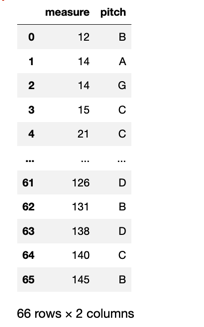

# Music21 Basics

Learn more about [music21](http://web.mit.edu/music21/), created by Dr. Myke Cuthbert, supported by MIT, and generously shared with the musicological community.

Music21 is used as part of CRIM Intervals to do all of the 'heavy lifting' to find notes, intervals, and so on.

This tutorial explains some of the key music21 methods used in CRIM Intervals.

## Import the Libraries
```python
from music21 import *
import music21 as m21
import requests
import pandas as pd
# !pip install musescore-scraper
```
## Load and Convert MEI to a Music21 object

```python
path = 'https://raw.githubusercontent.com/CRIM-Project/CRIM-online/master/crim/static/mei/MEI_4.0/CRIM_Model_0008.mei'
score = m21.converter.parse(requests.get(path).text)
```

## Load Libraries to Find Particular MEI Elements

```python
import xml.etree.ElementTree as ET
import requests

MEINSURI = 'http://www.music-encoding.org/ns/mei'
MEINS = '{%s}' % MEINSURI


mei_doc = ET.fromstring(requests.get(path).text)
  # Find the title from the MEI file and update the Music21 Score metadata
title = mei_doc.find(f'{MEINS}meiHead//{MEINS}titleStmt/{MEINS}title').text
score.metadata.title = title

mei_doc = ET.fromstring(requests.get(path).text)
  # Find the composer from the MEI file and update the Music21 Score metadata
composer = mei_doc.find(f'{MEINS}meiHead//{MEINS}respStmt/{MEINS}persName').text
score.metadata.composer = composer
```

## View Metadata from music21 Object


```python
print(score.metadata.composer)
print(score.metadata.title)

```

    Josquin Des Prés
    Ave Maria

## Finding Notes


### All the Notes in the all the Voices

This is a truncated view, but illustrates how music21 elements are nested:  notes within measures within parts.

```python
voice_parts = score.getElementsByClass(m21.stream.Part)
print(voice_parts.show('text'))
```

    {0.0} <music21.stream.Part 0x7fe0586eb1f0>
        {0.0} <music21.instrument.Instrument '1: [Superius]: '>
        {0.0} <music21.stream.Measure 1 offset=0.0>
            {0.0} <music21.clef.TrebleClef>
            {0.0} <music21.key.Key of C major>
            {0.0} <music21.meter.TimeSignature 4/2>
            {0.0} <music21.stream.Voice 1>
                {0.0} <music21.note.Note G>
                {4.0} <music21.note.Note C>
        {8.0} <music21.stream.Measure 2 offset=8.0>
            {0.0} <music21.stream.Voice 1>
                {0.0} <music21.note.Note C>
                {4.0} <music21.note.Note C>
        {16.0} <music21.stream.Measure 3 offset=16.0>
            {0.0} <music21.stream.Voice 1>
                {0.0} <music21.note.Note D>
                {4.0} <music21.note.Note E>
        {24.0} <music21.stream.Measure 4 offset=24.0>
            {0.0} <music21.stream.Voice 1>
                {0.0} <music21.note.Note C>
        {32.0} <music21.stream.Measure 5 offset=32.0>
            {0.0} <music21.stream.Voice 1>
                {0.0} <music21.note.Rest breve>
        {40.0} <music21.stream.Measure 6 offset=40.0>
            {0.0} <music21.stream.Voice 1>
                {0.0} <music21.note.Rest breve>


### List of Voice Parts

To list all the parts, we use `score.getElementsByClass(m21.stream.Part)`:


```python
voice_parts = score.getElementsByClass(m21.stream.Part)
print(voice_parts)
```

And now iterate over those parts to report the names:

```python
for part in voice_parts:
  print(part.partName)
```

    <music21.stream.iterator.StreamIterator for Score:0x7fe0586ebee0 @:0>
    [Superius]
    Altus
    Tenor
    Bassus


### Notes from One Voice Part

- Define the variable `parts` and then showing where to obtain these with m21
- Define the variable for your staff by index number (`[0]` is the top voice, `[2]` is the third from the top, etc.)
- The `show` method, with the parameter `text` reveals the **all the notes** found in that part.


```python
parts = score.getElementsByClass(m21.stream.Part)
print(parts[0].show('text'))
```

    {0.0} <music21.instrument.Instrument '1: [Superius]: '>
    {0.0} <music21.stream.Measure 1 offset=0.0>
        {0.0} <music21.clef.TrebleClef>
        {0.0} <music21.key.Key of C major>
        {0.0} <music21.meter.TimeSignature 4/2>
        {0.0} <music21.stream.Voice 1>
            {0.0} <music21.note.Note G>
            {4.0} <music21.note.Note C>
    {8.0} <music21.stream.Measure 2 offset=8.0>
        {0.0} <music21.stream.Voice 1>
            {0.0} <music21.note.Note C>
            {4.0} <music21.note.Note C>
    {16.0} <music21.stream.Measure 3 offset=16.0>
        {0.0} <music21.stream.Voice 1>
            {0.0} <music21.note.Note D>
            {4.0} <music21.note.Note E>
    {24.0} <music21.stream.Measure 4 offset=24.0>
        {0.0} <music21.stream.Voice 1>
            {0.0} <music21.note.Note C>
    {32.0} <music21.stream.Measure 5 offset=32.0>
        {0.0} <music21.stream.Voice 1>
            {0.0} <music21.note.Rest breve>


### "Notes" are Pitch Classes
- looking for all the notes in a given part
- `[X]` is index of the given part (so `part[0]` is the uppermost part in your score)
- Note that the code must include `flat` (as shown below) for reasons that the documentation does not explain!


```python
notes_selected_part = parts[0].flat.getElementsByClass(['Note'])
for note in notes_selected_part:
  print(note)
```

    <music21.note.Note G>
    <music21.note.Note C>
    <music21.note.Note C>
    <music21.note.Note C>
    <music21.note.Note D>
    <music21.note.Note E>
    <music21.note.Note C>
    <music21.note.Note C>
    <music21.note.Note B>
    <music21.note.Note A>
    <music21.note.Note G>
    <music21.note.Note A>
    <music21.note.Note G>
    <music21.note.Note C>
    <music21.note.Note C>
    <music21.note.Note B>
    <music21.note.Note A>
    <music21.note.Note B>
    

### Printing One Note (and its Attributes)

- `[x]` is zero-based index among the results for the length.  So if your number is larger than the number of results, error!
- Thus `[1]` is the *second note* of that part:


```python
print(notes_selected_part[1])
```

    <music21.note.Note C>

- adding `.pitch` (for instance) tells us class and octave of the note:


```python
print(notes_selected_part[1].pitch)
```

    C5

- adding `.name` (for instance) tells us class alone:

```python
print(notes_selected_part[1].name)
```

    C

- or the `.measure number` in which the 99th note is found:

```python
print(notes_selected_part[99].measureNumber)
```

    56

### Find Durations (and use with Pandas!)

In music21, each value of `1.0` represents one quarter-note in the score.  Thus `2.0` is a half-note (minim), etc.

Must include "flat" for reasons that the documentation does note explain

Here we look for all notes with `2.0` duration in the Tenor part (the third from the top of the score), find the pitch for each, and then make a dictionary of each, which in turn becomes a dataframe:


```python
list_notes = []
notes_tenor = parts[2].flat.getElementsByClass(['Note'])
for note_tenor in notes_tenor:
  if note_tenor.quarterLength == 2.0:  
    note_dict = {'measure' : note_tenor.measureNumber,
                 'pitch' : note_tenor.pitch.name}
    list_notes.append(note_dict)
list_notes


df = pd.DataFrame(list_notes)
df
```


### Rests are not the Same as Notes!  Let's Count Them

- `parts` are a submodule, and the `getElementsByClass` is a method.  The particular class we're after is `Rest`

Here we create a dictionary for each measure/restDuration pair, then add those to a list.  The list becomes a dataframe, and we can count the values:


```python
list_rests = []
rests_tenor = parts[2].flat.getElementsByClass(['Rest'])

for tenor_rest in rests_tenor:
    rest_dict = {'measure' : tenor_rest.measureNumber,
                 'duration' : tenor_rest.duration.type}
    list_rests.append(rest_dict)
list_rests
df = pd.DataFrame(list_rests)
df['duration'].value_counts()
```
    breve    34
    whole    11
    half      1

### Pitch (Note in a particular Octave)
- here we look for notes in specific octaves, like `C4`.
- `parts` are a submodule, and the `getElementsByClas`s is a method. The particular class we're after is `Notes`, and then `nameWithOctave`


```python
notes_tenor = parts[2].flat.getElementsByClass(['Note'])
for note_tenor in notes_tenor:
  if note_tenor.nameWithOctave == 'C4':  
    print(str(note_tenor.measureNumber) + ": " +note_tenor.nameWithOctave)

```
    5: C4
    6: C4
    6: C4
    8: C4

### Intervals

Note the differences:

-`pitch` is the module (a collection of methods and classes); 
- `Pitch` is the class (data structure)

And

- `interval` is part of the `pitch` module (it's a submodule), and has the method `notesToInterval`.  
- Here `Interval` is another class (data structure), and `interval` is another module

Here we declare two pitches, the find the interval between them:

```python
pitch_1 = pitch.Pitch('C5')
pitch_2 = pitch.Pitch('G5')
output_interval = interval.Interval(pitch_1, pitch_2)
```

The name 'with Quality' (for instance Perfect, Major, Minor):

```python
output_interval.name
```


    'P5'


With Quality, written out:

```python
output_interval.niceName
```


    'Perfect Fifth'


Expressed in semintones:

```python
output_interval.semitones
```


    7


Here we make a list of all the notes in the Tenor, then `zip` together two lists of adjacent notes.  These are in turn used to find the intervals between all successive notes in the voice part.   In this case, we print all the different ways of representing the intervals

```python
notes_tenor = parts[2].flat.getElementsByClass(['Note'])
out = zip(notes_tenor,notes_tenor[1:])
for item in out:
    pitch1 = pitch.Pitch(item[0].nameWithOctave)
    pitch2 = pitch.Pitch(item[1].nameWithOctave)
    print(interval.Interval(pitch1, pitch2).directedSimpleName)
    print(interval.Interval(pitch1, pitch2).niceName)
    print(interval.Interval(pitch1, pitch2).name)


```

    P4
    Perfect Fourth
    P4
    P1
    Perfect Unison
    P1
    P1
    Perfect Unison
    P1
    M2
    Major Second
    M2
    M2
    Major Second
    M2
    M-3
    Major Third
    M3
