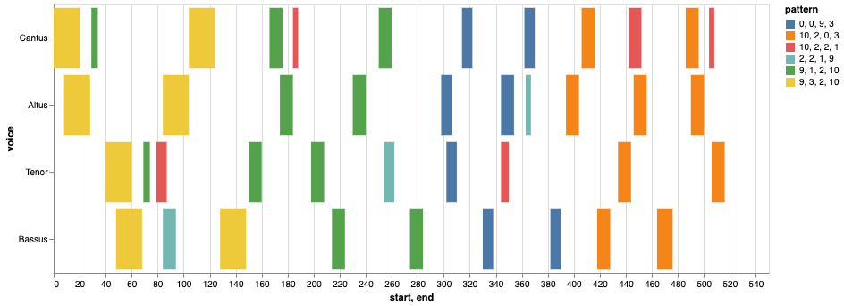

# Visualizations with CRIM Intervals

Various Python libraries exist to help create graphs and charts. To date (as of 2023) the CRIM Intervals team has developed tools for:

* **Histograms** (to show distribution or ranges of notes and melodic intervals, for example)
* **Ngram Heat Maps** (to show distribution of ngrams across a composition)
* **Melodic Families** (plots that show melodies as a branching series of intervallic steps)
* **Cadence Radar Plots** (circular grids that show the distribution of cadences in one or more pieces)

Note that some of these are built in to CRIM Intervals, and called with a simple function.  Others are built up in a series of steps, as shown in the samples below. 

All of following examples work in Jupyter Notebooks with CRIM Intervals. Some will work in VS Code or similar environments with some modfication.

### Histograms

#### Histogram of Notes

Below is an example of how to use Matplot to create a histogram of the of how many times each pitch is heard in each voice of the given piece. 

Note that this will only work in a Jupyter Notebook:

```python
pitch_order = ['E-2', 'E2', 'F2', 'F#2', 'G2', 'A2', 'B-2', 'B2', 
            'C3', 'C#3', 'D3', 'E-3','E3', 'F3', 'F#3', 'G3', 'G#3','A3', 'B-3','B3',
            'C4', 'C#4','D4', 'E-4', 'E4', 'F4', 'F#4','G4', 'A4', 'B-4', 'B4',
            'C5', 'C#5','D5', 'E-5','E5', 'F5', 'F#5', 'G5', 'A5', 'B-5', 'B5']
%matplotlib inline  
nr = piece.notes().fillna('-')  
nr = nr.apply(pd.Series.value_counts).fillna(0).astype(int).reset_index().copy()  
nr.rename(columns = {'index':'pitch'}, inplace = True)  
nr['pitch'] = pd.Categorical(nr["pitch"], categories = pitch_order)  
nr = nr.sort_values(by = "pitch").dropna().copy()  
voices = nr.columns.to_list()  
palette = sns.husl_palette(len(voices), l = .4)  
md = piece.metadata  
for key, value in md.items():  
    print(key, ':', value)  
sns.set(rc = {'figure.figsize':(15,9)})  
nr.set_index('pitch').plot(kind = 'bar', stacked = True) 
``` 

**Sample Output**


#### Histogram of Intervals

Or use the Matplot library to create a chart of the frequence of interval usage: 

```python
%matplotlib inline
int_order = ["P1", "m2", "-m2", "M2", "-M2", "m3", "-m3", "M3", "-M3", "P4", "-P4", "P5", "-P5", "m6", "-m6", "M6", "-M6", "m7", "-m7", "M7", "-M7", "P8", "-P8"]
mel = piece.melodic()
mel = mel.fillna("-")
#count up the values in each item column--sum for each pitch.  
#make a copy 
mel = mel.apply(pd.Series.value_counts).fillna(0).astype(int).reset_index().copy()
#rename the index column to something more useful
mel.rename(columns = {'index':'interval'}, inplace = True)
#apply the categorical list and sort
mel['interval'] = pd.Categorical(mel["interval"], categories = int_order)
mel = mel.sort_values(by = "interval").dropna().copy()
voices = mel.columns.to_list()
#collect and print information about composer and piece
md = piece.metadata
for key, value in md.items():
    print(key, ':', value)
#set the figure size, type and colors
palette = sns.husl_palette(len(voices), l = .4)
sns.set(rc = {'figure.figsize':(15,9)})
mel.set_index('interval').plot(kind = 'bar', stacked = True)
```


**Sample Output**


#### NGram Heat Maps

## Visualizing nGrams (and Comparing nGrams across a Corpus)

The CRIM Intervals visualization library makes it possible to display ngrams as a dynamic chart, with each nGram displayed from the start (left) to end (right) of the piece, voice-by-voice.  Identical nGrams receive the same color.

We can display these 'heat maps' for one piece or an entire corpus:

```python
# define piece list
piece_list = ['CRIM_Model_0019.mei',
                     'CRIM_Mass_0019_1.mei',
                     'CRIM_Mass_0019_2.mei',
                     'CRIM_Mass_0019_3.mei',
                     'CRIM_Mass_0019_4.mei',
                     'CRIM_Mass_0019_5.mei']
```

A map for just one piece:


```python
# select the model from the list
model = piece_list[0]
prefix = 'https://crimproject.org/mei/' 
# prefix = 'Music_Files/'
url = prefix + model
model = importScore(url)

# find entries for model
nr = model.notes(combineUnisons=combineUnisons)
mel = model.melodic(df=nr, kind=kind, compound=False, unit=0, end=False)
mod_mel_ngrams = model.ngrams(df=mel, n=n)
mod_entry_ngrams = model.entries(df=mel, n=n, thematic=True, anywhere=True)
mod_mel_ngrams_duration = model.durations(df=mel, n=n, mask_df=mod_entry_ngrams)
mod_entries_stack = list(mod_entry_ngrams.stack().unique())

print(model.metadata)

display(viz.plot_ngrams_heatmap(mod_entry_ngrams, mod_mel_ngrams_duration, 
                        selected_patterns=mod_entries_stack,
                        voices=[]))
```



Now for a corpus consisting of a 'model' (the first piece in the list) and any set of other pieces (normally the movements of a Mass). Note that the code below shows only the 'entry' ngrams shared by each pair of pieces.

```python
# select the model from the list
model = piece_list[0]
prefix = 'https://crimproject.org/mei/' 
# prefix = 'Music_Files/'
url = prefix + model
model = importScore(url)

# find entries for model
nr = model.notes(combineUnisons=combineUnisons)
mel = model.melodic(df=nr, kind=kind, compound=False, unit=0, end=False)
mod_mel_ngrams = model.ngrams(df=mel, n=n)
mod_entry_ngrams = model.entries(df=mel, n=n, thematic=True, anywhere=True)
mod_mel_ngrams_duration = model.durations(df=mel, n=n, mask_df=mod_entry_ngrams)
mod_entries_stack = list(mod_entry_ngrams.stack().unique())

# find entries mass movements:
mass_movements = piece_list[1:6]

for movement in mass_movements:
    
    prefix = 'https://crimproject.org/mei/' 
    url = prefix + movement
    m_movement = importScore(url)
    nr = m_movement.notes(combineUnisons=combineUnisons)
    mel = m_movement.melodic(df=nr, kind=kind, compound=False, unit=0, end=False)
    mass_mvmt_mel_ngrams = m_movement.ngrams(df=mel, n=n)
    mass_mvmt_entries = m_movement.entries(df=mel, n=n, thematic=True, anywhere=True)
    mass_mvmt_mel_ngrams_duration = m_movement.durations(df=mel, n=n, mask_df=mass_mvmt_entries)
    mass_mvmt_entries_stack = mass_mvmt_entries.stack()

    
    # find shared entries
    
    shared_entries = list(set(mass_mvmt_entries_stack).intersection(mod_entries_stack))

    # print model metadata and chart
    print(model.metadata)

    display(viz.plot_ngrams_heatmap(mod_entry_ngrams, mod_mel_ngrams_duration, 
                        selected_patterns=shared_entries,
                        voices=[])) #.plot_ngrams_heatmap(entry_ngrams,


    # print mass movement metadata and chart
    print(m_movement.metadata)
    display(viz.plot_ngrams_heatmap(mass_mvmt_entries, mass_mvmt_mel_ngrams_duration, 
                                selected_patterns=shared_entries,
                                voices=[])) #.plot_ngrams_heatmap(entry_ngrams,
```
Here we show just the first pair:


#### Melody Families


#### Cadence Radar Plots

See [11_Cadences](tutorial/11_Cadences.md)

---

## Sections in this guide

  * [01_Introduction_and_Corpus](/tutorial/01_Introduction_and_Corpus.md)
  * [02_Notes_Rests](/tutorial//02_Notes_Rests.md)
  * [03_Durations](/tutorial//03_Durations.md) 
  * [04_TimeSignatures_Beat_Strength](/tutorial//04_TimeSignatures_Beat_Strength.md)
  * [05_Detail_Index](/tutorial//05_Detail_Index.md)
  * [06_Melodic_Intervals](/tutorial//06_Melodic_Intervals.md)
  * [07_Harmonic_Intervals](/tutorial//07_Harmonic_Intervals.md)
  * [08_Contrapuntal_Modules](/tutorial//08_Contrapuntal_Modules.md)
  * [09_Ngrams_Heat_Maps](/tutorial//09_Ngrams_Heat_Maps.md)
  * [10_Lyrics_Homorhythm](/tutorial//10_Lyrics_Homorhythm.md)
  * [11_Cadences](/tutorial//11_Cadences.md)
  * [12_Presentation_Types](/tutorial//12_Presentation_Types.md)
  * [13_Musical_Examples_Verovio](/tutorial//13_Musical_Examples_Verovio.md)
  * [14_Model_Finder](/tutorial//14_Model_Finder.md)
  * [15_Visualizations_Summary](/tutorial//15_Visualizations_Summary.md)
  * [16_Network_Graphs](/tutorial//16_Network_Graphs.md)
  * [17_Python_Basics](/tutorial//17_Python_Basics.md)
  * [18_Pandas_Basics](/tutorial//18_Pandas_Basics.md)
  * [19_Music21_Basics](/tutorial//18_Music21_Basics.md)
  * [99_Local_Installation](/tutorial//99_Local_Installation.md)