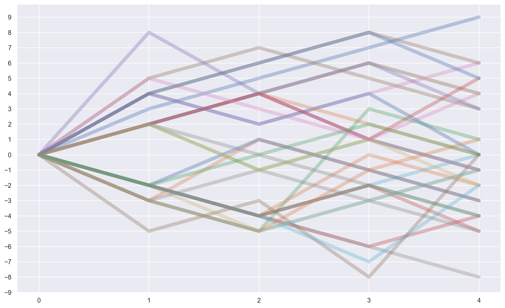

# Visualizations with CRIM Intervals

There are three different resources for creating various kinds of charts, plots, and networks with CRIM Intervals.  Unless otherwise noted, all the necessary libraries are already imported when you `import crim_intervals` and `from crim_intervals import *`.  We show the import statements below just to remind you!

### Plotly Charts

Our main resource is the [Plotly Express](https://plotly.com/python/plotly-express/) library, which allows for interactive visualizations and more complex/powerful graphs with less code. . The Plotly Express documentation details the very wide range of bar charts, histograms, scatter plots, heat maps, polar (radar) figures you can create, and various ways of adding captions, legends, colors, etc.

The charts and plots produced with **Plotly** (and described below) include:

* **Bar Graphs and Histograms** (to show distribution or ranges of notes and melodic intervals, for example)
* **Cadence Radar Plots** (circular grids that show the distribution of cadences in one or more pieces)

### CRIM Plots with Altair

The following methods have been developed especially for **CRIM Intervals**, and use the [Altair](https://altair-viz.github.io/) library.  Read more about the functions [here](https://github.com/HCDigitalScholarship/intervals/blob/main/crim_intervals/visualizations.py).  Since **Altair** is already imported as part of the **import crim_intervals.visualizations as viz** statement, you will not need to import that library separated for these methods:

* **Ngram Heat Maps** (showing grams across one or more works, including comparison of shared ngrams)
* **Melodic Families** (showing melodies as a branching series of intervallic steps)
* **Cadence Progress Plots** (showing the succession of cadences across one or more pieces)

### Networks with NetworkX and Pyvis

* [Networks](/15_Network_Graphs.md) are a complex topic, and are covered in a separate tutorial.


## Plotly Charts in Detail
---

The first step is always to import the relevant library (but this will already have been imported with `crim_intervals`:

```python
import plotly.express as px
```

From here you will normally:

- Define a figure by passing a dataframe to a method (such as `fig = px.histogram(df_hist(df)`)
- Specify special labels, formatting, legend, or other features
- Show the figure with `fig.show()`, or specify a file name if you would prefer to save it.

For example, the final fixgure update might include any of the following arguments.

<br>

```python
fig = px.bar(melted_nr, 
             x='pitch', 
             y='count', 
             color='voice', 
             barmode='stack',
             height=700,
             width=1000,
             title="Chart of Notes")

fig.show(legend=True)
```
<br>


## Plotly Bar Charts

Bar charts are used to display categorical data. They consist of vertical or horizontal bars that represent different categories and their corresponding values. Bar charts are excellent for comparing data across different categories.  Learn more at [Plotly Express](https://plotly.com/python/bar-charts/)


### Bar Graphs of Notes in Each Voice

Here we the counts of each pitch (including octave) in each voice of a given piece.  Note that we can declare a custom 'order' for the pitches, so it's possible to present these as you like.  Here we have sorted them from lowest to highest.  You could also display only a subset of pitches.


<br>

<Details>

<Summary>Code to Produce this Chart</Summary>

```python
# assuming all the usual CRIM Intervals imports already done .  . 
url = 'https://crimproject.org/mei/CRIM_Model_0001.mei'
piece = importScore(url)

# give the chart a meaningful title based on your piece:
md = piece.metadata  
chart_title = "Distribution of Notes in " + md['composer'] + ", " + md['title']

# set the custom order for pitches
pitch_order = ['E-2', 'E2', 'F2', 'F#2', 'G2', 'A2', 'B-2', 'B2', 
               'C3', 'C#3', 'D3', 'E-3','E3', 'F3', 'F#3', 'G3', 'G#3','A3', 'B-3','B3',
               'C4', 'C#4','D4', 'E-4', 'E4', 'F4', 'F#4','G4', 'A4', 'B-4', 'B4',
               'C5', 'C#5','D5', 'E-5','E5', 'F5', 'F#5', 'G5', 'A5', 'B-5', 'B5']

# get the notes and create the dataframe for the chart
nr = piece.notes().fillna('-')  
nr = nr.apply(pd.Series.value_counts).fillna(0).astype(int).reset_index().copy()  
nr.rename(columns={'index': 'pitch'}, inplace=True)  
nr['pitch'] = pd.Categorical(nr["pitch"], categories=pitch_order)  
nr = nr.sort_values(by="pitch").dropna().copy()  
voices = nr.columns.to_list()[1:]  # Exclude 'pitch' column
# melt the dataframe to long format suitable for px.bar
melted_nr = nr.melt(id_vars='pitch', var_name='voice', value_name='count')
# create a custom color palette
custom_palette = px.colors.qualitative.Plotly + px.colors.qualitative.Dark24 + px.colors.qualitative.Light24
color_dict = {voice: custom_palette[i % len(custom_palette)] for i, voice in enumerate(voices)}
# Plot using Plotly Express with stacked bars
fig = px.bar(melted_nr, 
             x='pitch', 
             y='count', 
             color='voice', 
             facet_col='voice', 
             category_orders={'pitch': pitch_order}, 
             color_discrete_map=color_dict, barmode='stack',
             height=700,
             width=1000,
             title=chart_title)

fig.update_layout(showlegend=True)
fig.show()
``` 
</Details>


### Barcharts of Notes in Each Voice Stacked in One Chart


<Details>

<Summary>Code to Produce this Chart</Summary>

```python
import plotly.express as px
# set order of tones
pitch_order = ['E-2', 'E2', 'F2', 'F#2', 'G2', 'A2', 'B-2', 'B2', 
               'C3', 'C#3', 'D3', 'E-3','E3', 'F3', 'F#3', 'G3', 'G#3','A3', 'B-3','B3',
               'C4', 'C#4','D4', 'E-4', 'E4', 'F4', 'F#4','G4', 'A4', 'B-4', 'B4',
               'C5', 'C#5','D5', 'E-5','E5', 'F5', 'F#5', 'G5', 'A5', 'B-5', 'B5']
nr = piece.notes().fillna('-')  
nr = nr.apply(pd.Series.value_counts).fillna(0).astype(int).reset_index().copy()  
nr.rename(columns={'index': 'pitch'}, inplace=True)  
nr['pitch'] = pd.Categorical(nr["pitch"], categories=pitch_order)  
nr = nr.sort_values(by="pitch").dropna().copy()  

voices = nr.columns.to_list()[1:]  # Exclude 'pitch' column

# Melt the dataframe to long format suitable for px.bar
melted_nr = nr.melt(id_vars='pitch', var_name='voice', value_name='count')

# Create a custom color palette
custom_palette = px.colors.qualitative.Plotly + px.colors.qualitative.Dark24 + px.colors.qualitative.Light24
color_dict = {voice: custom_palette[i % len(custom_palette)] for i, voice in enumerate(voices)}

# Create the stacked bar chart
fig = px.bar(nr_melted, 
             x='pitch', 
             y='count', 
             color='voice', 
             barmode='stack',
            title="Chart of Melodic Intervals")

fig.show()
```

</Details>


### Barcharts of Notes in a Corpus

with the `corpus.batch` methods, it is also possible to do same kind of thing for a collection of pieces.


<br>


<Details>

<Summary>Code to Run</Summary>

```python
# notes in a corpus
def corpus_notes(corpus, combine_unisons_choice, combine_rests_choice):
    func = ImportedPiece.notes  # <- NB there are no parentheses here
    list_of_dfs = corpus.batch(func = func, 
                                kwargs = {'combineUnisons': combine_unisons_choice, 'combineRests': combine_rests_choice}, 
                                metadata=False)
    func1 = ImportedPiece.numberParts
    list_of_dfs = corpus.batch(func = func1,
                               kwargs = {'df' : list_of_dfs},
                               metadata=True)
    
    
    nr = pd.concat(list_of_dfs)
    cols_to_move = ['Composer', 'Title', 'Date']
    nr = nr[cols_to_move + [col for col in nr.columns if col not in cols_to_move]]
    return nr

# settings
combine_unisons_choice = False
combine_rests_choice = False
kind_choice = 'd'
directed = True
compound = True
exclude_rests = True

# load corpus
file_list = ['https://crimproject.org/mei/CRIM_Model_0001.mei', 'https://crimproject.org/mei/CRIM_Model_0008.mei']
corpus = CorpusBase(file_list)

# run function and create chart
nr = corpus_notes(corpus, combine_unisons_choice, combine_rests_choice)
nr_no_mdata = nr.drop(['Composer', 'Title', "Date"], axis=1)

nr_counts = pd.DataFrame(nr_no_mdata.apply(pd.Series.value_counts))

if exclude_rests == True:
    nr_counts = nr_counts.drop('Rest', axis=0)
                                                               
voices = nr_counts.columns.to_list() 

chart_title = "Distribution of Notes in Corpus"
fig = px.bar(nr_counts, x=nr_counts.index, y=list(nr_counts.columns),
                    title=chart_title)
fig.update_layout(xaxis_title="Note", 
                    yaxis_title="Count",
                    legend_title='Voices',
                       height=700,
                       width=1000)
fig.show()
```

</Details>

<br>


### Bar Charts with Melodic and Harmonic Intervals

See the tutorials for [Melodic](/06_Melodic_Intervals.md) and [Harmonic](/07_Harmonic_Intervals.md) for ways to create charts like this for one or more pieces using those methods.


## NGram Heat Maps

### Heat Map of Ngrams in One Piece

The CRIM Intervals visualization library makes it possible to display ngrams as a dynamic chart, with each nGram displayed from the start (left) to end (right) of the piece, voice-by-voice.  Identical nGrams receive the same color.

Note that these are built-in functions, and work with the Altair library.  Find the documentation via [CRIM Interval Visualization](https://github.com/HCDigitalScholarship/intervals/blob/main/crim_intervals/visualizations.py) module.

Here is a map for just one piece:

<br>


<br>

<Details>

<Summary>Code to Produce this Chart</Summary>

```python
# import piece
url = 'https://crimproject.org/mei/CRIM_Model_0019.mei' 
model = importScore(url)

# settings:
combineUnisons = True
kind = "d"
compound = False
ngram_length = 4


# find entries for model
nr = model.notes(combineUnisons=combineUnisons)
mel = model.melodic(df=nr, kind=kind, compound=compound, unit=0, end=False)
mod_mel_ngrams = model.ngrams(df=mel, n=ngram_length)
mod_entry_ngrams = model.entries(df=mel, n=ngram_length, thematic=True, anywhere=True)
mod_mel_ngrams_duration = model.durations(df=mel, n=ngram_length, mask_df=mod_entry_ngrams)
mod_entries_stack = list(mod_entry_ngrams.stack().unique())

print(model.metadata)

display(viz.plot_ngrams_heatmap(mod_entry_ngrams, mod_mel_ngrams_duration, 
                        selected_patterns=mod_entries_stack,
                        voices=[]))
```


</Details>


<br>

### Heat Map of Shared Ngrams in Two or More Pieces

Now for a corpus consisting of a 'model' (the first piece in the list) and any set of other pieces (normally the movements of a Mass). Note that the code below shows only the 'entry' ngrams shared by each pair of pieces. Here we show just the first pair:


<Details>

<Summary>Code to Use</Summary>

```python

# settings:
combineUnisons = True
kind = "d"
compound = False
ngram_length = 4

# define piece list
piece_list = ['CRIM_Model_0019.mei',
                     'CRIM_Mass_0019_1.mei',
                     'CRIM_Mass_0019_2.mei',
                     'CRIM_Mass_0019_3.mei',
                     'CRIM_Mass_0019_4.mei',
                     'CRIM_Mass_0019_5.mei']
# select the model from the list
model = piece_list[0]
prefix = 'https://crimproject.org/mei/' 
# prefix = 'Music_Files/'
url = prefix + model
model = importScore(url)

# find entries for model
nr = model.notes(combineUnisons=combineUnisons)
mel = model.melodic(df=nr, kind=kind, compound=compound, unit=0, end=False)
mod_mel_ngrams = model.ngrams(df=mel, n=ngram_length)
mod_entry_ngrams = model.entries(df=mel, n=ngram_length, thematic=True, anywhere=True)
mod_mel_ngrams_duration = model.durations(df=mel, n=ngram_length, mask_df=mod_entry_ngrams)
mod_entries_stack = list(mod_entry_ngrams.stack().unique())

# find entries mass movements:
mass_movements = piece_list[1:6]

for movement in mass_movements:
    
    prefix = 'https://crimproject.org/mei/' 
    url = prefix + movement
    m_movement = importScore(url)
    nr = m_movement.notes(combineUnisons=combineUnisons)
    mel = m_movement.melodic(df=nr, kind=kind, compound=compound, unit=0, end=False)
    mass_mvmt_mel_ngrams = m_movement.ngrams(df=mel, n=ngram_length)
    mass_mvmt_entries = m_movement.entries(df=mel, n=ngram_length, thematic=True, anywhere=True)
    mass_mvmt_mel_ngrams_duration = m_movement.durations(df=mel, n=ngram_length, mask_df=mass_mvmt_entries)
    mass_mvmt_entries_stack = mass_mvmt_entries.stack()

    
    # find shared entries
    
    shared_entries = list(set(mass_mvmt_entries_stack).intersection(mod_entries_stack))

    # print model metadata and chart
    print(model.metadata)

    display(viz.plot_ngrams_heatmap(mod_entry_ngrams, mod_mel_ngrams_duration, 
                        selected_patterns=shared_entries,
                        voices=[])) #.plot_ngrams_heatmap(entry_ngrams,


    # print mass movement metadata and chart
    print(m_movement.metadata)
    display(viz.plot_ngrams_heatmap(mass_mvmt_entries, mass_mvmt_mel_ngrams_duration, 
                                selected_patterns=shared_entries,
                                voices=[])) #.plot_ngrams_heatmap(entry_ngrams,
```

</Details>

<br>

## Melody Families

The **Melodic Interval Families** method allows you to chart the "progress" of one or more melodies (in one or more pieces).  The results are presented as a series of branching line charts:

<br>




<br>

See more in the [Melodic Interval Families](/tutorial//20_Melodic_Interval_Families.md) tutorial.


## Cadence Radar Plots

Radar plots a good way to provide insights about the tonal 'footprint' of one or more pieces. Information derived from the `piece.cadences()` is plotted as a circular graph:  cadence tones (and types, depending on the settings) are indicated at the perimeter. The count of cadences of each tone (or type) is then used as a scalar value (0 is the very center of the plot, with increasing numbers moving out from the center to indicate relative count and therefore weight). 

The plots are interactive:

* Hover to see count details for single piece plots
* Click to include/exclude individual pieces in corpus comparison plots

### Radar Plot of Single Piece


<br>


<br>

### Radar Plot of Corpus Cadences


<br>


<br>


See [11_Cadences](tutorial/11_Cadences.md) to learn more.


## Cadence Progress Plots

These are a way to see the 'flow' of cadences in one or more pieces:  `piece.cadenceProgressPlot()` and `corpus.compareCadenceProgressPlots()`


### Progress Plot of Cadences in One Piece


<br>


<br>


### Progress Plot of Cadences in a Corpus


<br>


<br>


See [11_Cadences](tutorial/11_Cadences.md) to learn more.


## Networks

# Networks:  Basic Concepts and Methods 

In the field of data science, networks (also known as graphs) are powerful tools used to represent and study relationships between entities. A network is composed of **nodes** (also called vertices) and **edges** (also called links). Each node represents an entity, while each edge represents a relationship between two entities.

Learn more in the [Networks Tutorial](/15_Network_Graphs.md).


---

## Sections in this guide

  * [01_Introduction_and_Corpus](/tutorial/01_Introduction_and_Corpus.md)
  * [02_Notes_Rests](/tutorial//02_Notes_Rests.md)
  * [03_Durations](/tutorial//03_Durations.md) 
  * [04_TimeSignatures_Beat_Strength](/tutorial//04_TimeSignatures_Beat_Strength.md)
  * [05_Detail_Index](/tutorial//05_Detail_Index.md)
  * [06_Melodic_Intervals](/tutorial//06_Melodic_Intervals.md)
  * [07_Harmonic_Intervals](/tutorial//07_Harmonic_Intervals.md)
  * [08_Contrapuntal_Modules](/tutorial//08_Contrapuntal_Modules.md)
  * [09_Ngrams_Heat_Maps](/tutorial//09_Ngrams_Heat_Maps.md)
  * [10_Lyrics_Homorhythm](/tutorial//10_Lyrics_Homorhythm.md)
  * [11_Cadences](/tutorial//11_Cadences.md)
  * [12_Presentation_Types](/tutorial//12_Presentation_Types.md)
  * [13_Musical_Examples_Verovio](/tutorial//13_Musical_Examples_Verovio.md)
  * [14_Model_Finder](/tutorial//14_Model_Finder.md)
  * [15_Network_Graphs](/tutorial//15_Network_Graphs.md)
  * [16_Python_Basics](/tutorial//16_Python_Basics.md)
  * [17_Pandas_Basics](/tutorial//17_Pandas_Basics.md)
  * [18_Visualizations_Summary](/tutorial//18_Visualizations_Summary.md)
  * [19_Music21_Basics](/tutorial//18_Music21_Basics.md)
  * [20_Melodic_Interval_Families](/tutorial//20_Melodic_Interval_Families.md)
  * [99_Local_Installation](/tutorial//99_Local_Installation.md)