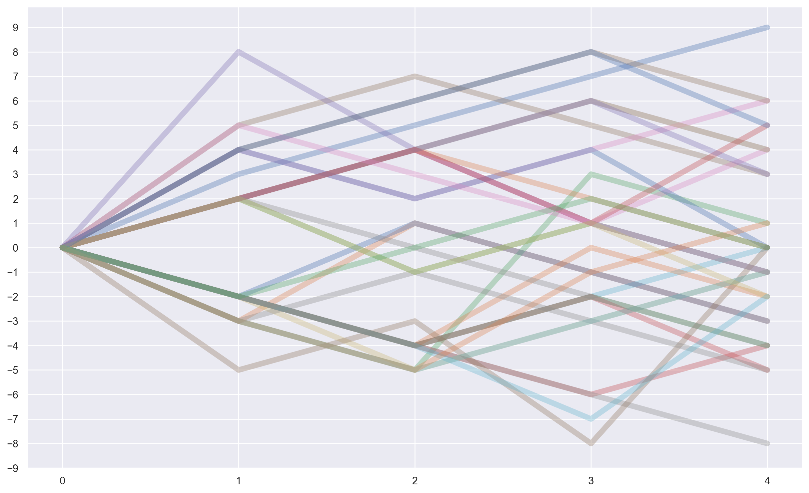
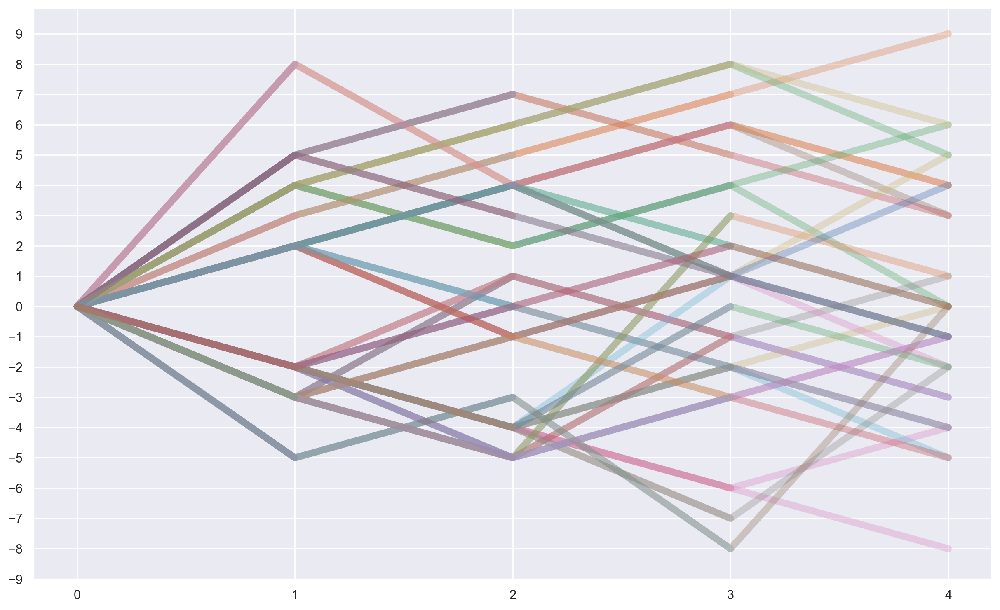
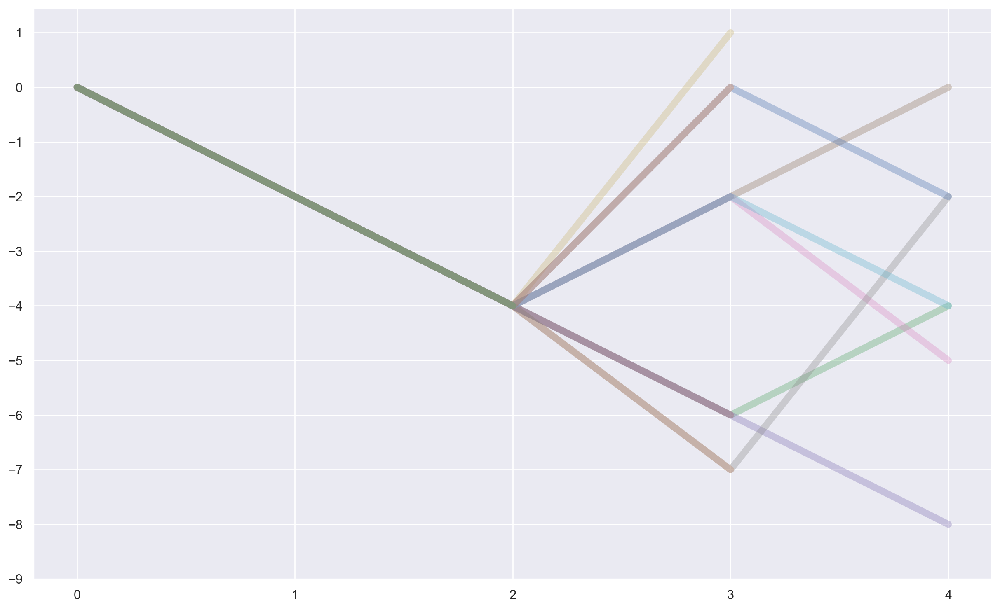
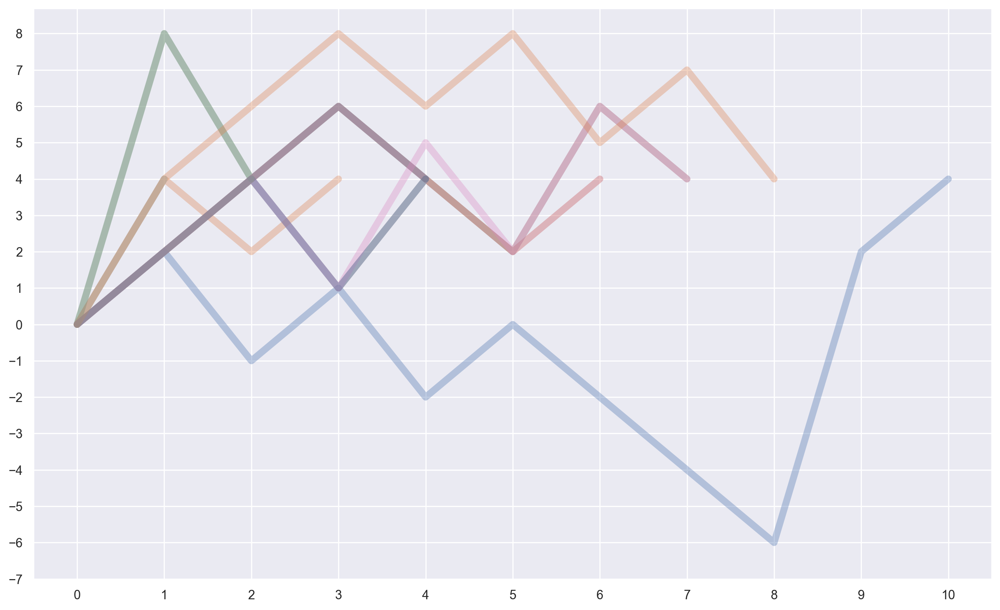
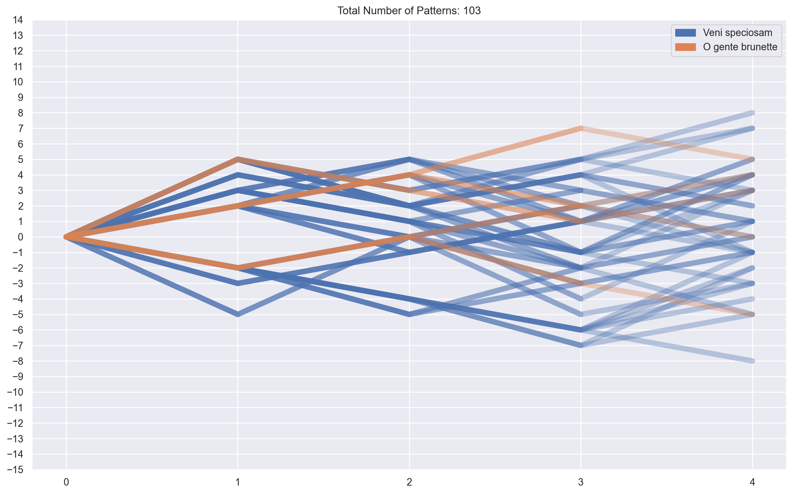
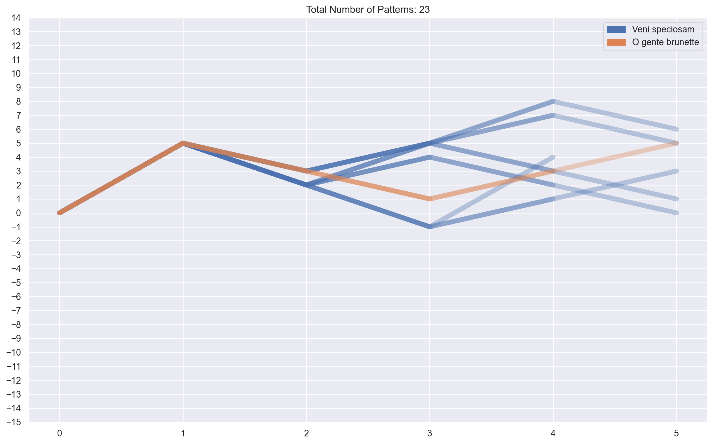

# CRIM Families of Melodies

The **Melodic Interval Families** method allows you to chart the "progress" of one or more melodies (in one or more pieces).  The results are presented as a series of branching line charts:

<br>




<br>

#### Typical Use

The simplest way to call the method is to run this on piece:  `piece.graphIntervalFamilies()`

#### With Arguments

But you can also provide various arguments(defaults shown)

```python
length=4
combineUnisons=True
kind="d"
end=False
variableLength=False
suggestedPattern=None
useEntries=True
```

For example:

```python
piece.graphIntervalFamilies(length=4, combineUnisons=True, kind="d", end=False, variableLength=False, suggestedPattern=None, useEntries=True, arriveAt=None, includeLegend=False)
```


Another useful option is `variableLength=True`, therefore including **all unique patterns up to the specified length**:

```python
graphIntervalFamilies(length=4, variableLength=True)
```


We can narrow down patterns of interested by specifying `suggestedPattern=Tuple(Str*)`, for example looking for **all patterns that start with `-2, -2`**:

`graphIntervalFamilies(length=4, variableLength=True, suggestedPattern=("4", "2"))`


Find the documentation via [CRIM Interval Visualization](https://github.com/HCDigitalScholarship/intervals/blob/main/crim_intervals/visualizations.py) module for explanation of other arguments.

#### Corpus Methods

It is also possible to use **compareIntervalFamilies** with a corpus of
pieces. See below.

## A. Import Intervals and Other Code

``` python
import crim_intervals
from crim_intervals import * 
from crim_intervals import main_objs
import crim_intervals.visualizations as viz
import pandas as pd
# from pandas.io.json import json_normalize
import re
import altair as alt
import matplotlib.pyplot as plt
import matplotlib.cm as cm
import matplotlib.patches as mpatches
import seaborn as sns
from ipywidgets import interact
import pyvis
from pyvis.network import Network
from pyvis import network as net
from IPython.display import display
import requests
import os
import glob as glob
import numpy as np
import random
import inspect
```

## B. Importing a Piece

### B.1 Import a Piece

``` python
piece = importScore('https://crimproject.org/mei/CRIM_Model_0008.mei')
```

### Create the Graph

Graphing the Interval Families for **Josquin Des Prés’s Ave Maria** with
defaults: `length=4` and `useEntries=True`):

``` python
piece.graphIntervalFamilies()
```

<br>


<br>

### Variable Length Up to Limit of “n”

Another useful option is `variableLength=True`, therefore including
**all unique patterns up to the specified length**:

``` python
piece.graphIntervalFamilies(4, variableLength=True)
```

<br>



<br>

### Limit Results with SuggetedPattern

Finally, we can narrow down patterns of interested by specifying
`suggestedPattern=Tuple(Str*)`, for example looking for **all patterns
that start with `-2, -2`**:

``` python
piece.graphIntervalFamilies(4, variableLength=True, suggestedPattern=("-2", "-2"))
```

<br>



<br>

### Arrive at Endpoint

Alternatively, we can specify where we want to **arrive** with our
patterns by setting the `arriveAt` parameter to an integer value of how
far apart (pitch-wise) we want to end up:

``` python
piece.graphIntervalFamilies(10, variableLength=True, useEntries=True, arriveAt=4)
```

<br>



<br>

### Corpus Families

Import a **corpus** of pieces (models 1 through 9):

``` python
piece_corpus = list()
for i in range(1, 3):
    piece_corpus.append((f'{"https://crimproject.org/mei/CRIM_Model_000%x.mei" % i}'))
corpus = CorpusBase(piece_corpus)
```

## Working with a Corpus: corpus.compareIntervalFamilies()

Similarly to the `graphIntervalFamilies` method above, we define the `compareIntervalFamilies` method, which graphs Interval Families for a list of pieces. Its arguments follow those of the single-piece method.

It is possible to select:

```python

length=4
combineUnisons=True
kind="d"
end=False
variableLength=False
suggestedPattern=None
useEntries=True
```

For example:

``` python
corpus.compareIntervalFamilies(variableLength=True)
```

<br>



<br>

``` python
corpus.compareIntervalFamilies(variableLength=True, 
                               length=5,
                               useEntries=True, 
                               suggestedPattern=("5",))
```

<br>



<br>


-----

## Sections in this guide

  * [01_Introduction_and_Corpus](/tutorial/01_Introduction_and_Corpus.md)
  * [02_Notes_Rests](/tutorial//02_Notes_Rests.md)
  * [03_Durations](/tutorial//03_Durations.md) 
  * [04_TimeSignatures_Beat_Strength](/tutorial//04_TimeSignatures_Beat_Strength.md)
  * [05_Detail_Index](/tutorial//05_Detail_Index.md)
  * [06_Melodic_Intervals](/tutorial//06_Melodic_Intervals.md)
  * [07_Harmonic_Intervals](/tutorial//07_Harmonic_Intervals.md)
  * [08_Contrapuntal_Modules](/tutorial//08_Contrapuntal_Modules.md)
  * [09_Ngrams_Heat_Maps](/tutorial//09_Ngrams_Heat_Maps.md)
  * [10_Lyrics_Homorhythm](/tutorial//10_Lyrics_Homorhythm.md)
  * [11_Cadences](/tutorial//11_Cadences.md)
  * [12_Presentation_Types](/tutorial//12_Presentation_Types.md)
  * [13_Musical_Examples_Verovio](/tutorial//13_Musical_Examples_Verovio.md)
  * [14_Model_Finder](/tutorial//14_Model_Finder.md)
  * [15_Network_Graphs](/tutorial//15_Network_Graphs.md)
  * [16_Python_Basics](/tutorial//16_Python_Basics.md)
  * [17_Pandas_Basics](/tutorial//17_Pandas_Basics.md)
  * [18_Visualizations_Summary](/tutorial//18_Visualizations_Summary.md)
  * [19_Music21_Basics](/tutorial//18_Music21_Basics.md)
  * [20_Melodic_Interval_Families](/tutorial//20_Melodic_Interval_Families.md)
  * [99_Local_Installation](/tutorial//99_Local_Installation.md)