# Running CRIM Intervals Locally

[Learn about CRIM Intervals]( https://github.com/HCDigitalScholarship/intervals/blob/main/README.md)

## Run it Locally on your Own Computer in a Virtual Environment

This version runs well, and is extremely fast!

### 1. Get Anaconda Navigator to Manage Virtual Environments 

"Virtual Environments" are in effect small computing worlds on your computer.  They allow you to run special sets of tools in a way that keeps them isolated from all other programs.  Different programs require different 'dependencies', and different versions of these dependencies.  So keeping them separate is a good idea.

If you are new to virtual environments, one good solution is to manage environments is with **Anaconda Navigator**.  [Download it for your machine for free](https://www.anaconda.com/download).  [Learn more about Anaconda Navigator](https://learning.anaconda.cloud/).  


### 2. Create a New Virtual Environment

Here are the steps:

- A. Click "+ create" at the bottom of Navigator
- B. Name it (anything you like, but perhaps "crim_streamlit")
- C. On the **Python** dialogue, select "**3.10.13**" or any version that starts with "3.10"
- D. Click "create" in the dialogue, and wait a minute or two . . 


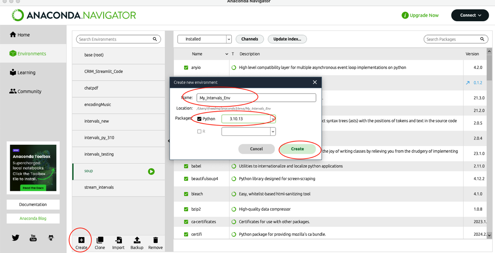

### 3. Create a Project Folder on your Computer

Now you will need to create a dedicated folder on your computer where you will keep the code for the CRIM Intervals Streamlit application.

- Make a **new folder** in the **Documents** folder on your machine.  You can name it as you like, but something simple like "**CRIM Intervals Code**" will do.  
- You will not be editing any of the files here, but instead you will sync this folder to an online repository on GitHub.  Don't worry, this won't put anything strange on your computer!
- Make sure you know where to find this folder, since you will need to point to it in the next step

### 4. Return to Anaconda Navigator and your Virtual Env

- Make sure that the new environment you created is the active one (see image).

- Click on the arrow next your enviroment and select **Open Terminal**

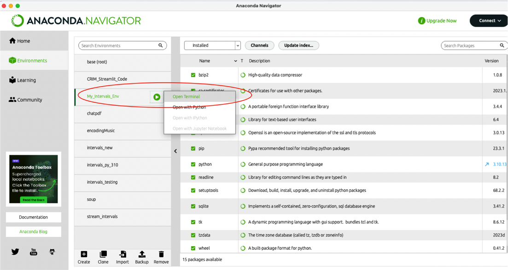

- This will create an interactive 'Terminal' session, through which you can write commands to your computer that will download the code you need.
- You should see something like this, with the **name of your environment**, followed by the **name of your computer**, all followed by a **symbol and space for your cursor**:

```
(My_Intervals_Env) rfreedma@rfreedma-22 ~ % 
```

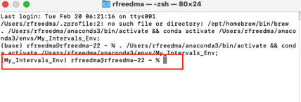

### 5. Get the Code from Github via the Terminal

- Now you will first need to make sure you have the 'git' code that will allow you to request code from github.  Install it by pasting the following into your terminal: 

```
conda install git
```
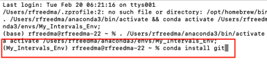


- This will in turn ask you to confirm that you want to install this software.  Type **y** for 'yes'.

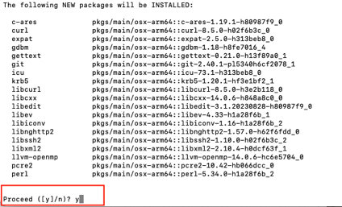

- You will see the code install and then something to confirm success, like the following:

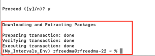

### 6. Change the Terminal to Point to your New Project Folder

- Now find the **new project folder** (which we will call a 'directory') you created in Step 3 above.  We will enter the 'path' to that directory in the terminal, preceeded by "cd", like this:

```
cd Documents/Projects/MyProject
```

- The 'path' to your folder might look like this:


```
/Users/rfreedma/Documents/CRIM_Python/intervals_local_test
```

- The whole command would be (remember ONE space between 'cd' and the 'path' to your folder!)


```
cd /Users/rfreedma/Documents/CRIM_Python/intervals_local_test
```

Type that into the Terminal and press enter.  Now the terminal command prompt should include the name of your directory:


### 7.  Sync Your Folder to the GitHub Repository for CRIM Intervals Streamlit

- Now you will issue the command to 'clone' the code and put it in your Project Folder.  Don't worry, you can always delete this, and it will have no effect on any other software on your computer!

- At the terminal prompt paste in the following (remember just one space between each element), and press Enter/Return:

```
git clone https://github.com/HCDigitalScholarship/intervals.git
```

- This should only take a few seconds, but you will see the following confirmation:

 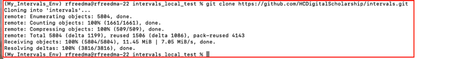

### 8. Install the Requirements for CRIM Intervals

- Now you need to install the various dependencies that make CRIM Intervals work.  

- The first step is to 'cd' to a folder *within* the one you just created.  Copy and paste the following into your terminal:

```
cd intervals
```


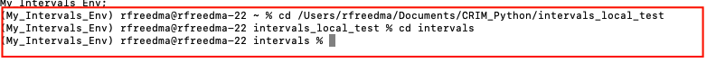

Now you are ready to install your local code. Copy and paste the following into your terminal.  Yes, you need to *include the period after the word 'install'*!  This simply makes sure that *all* the code will be installed.

```
pip install .
```

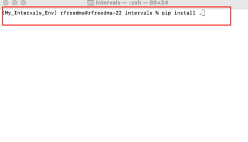

- There will be a lot of activity for a minute or two as all the libraries are installed.  But eventually you will return to the command prompt.  But meanwhile you might see this:


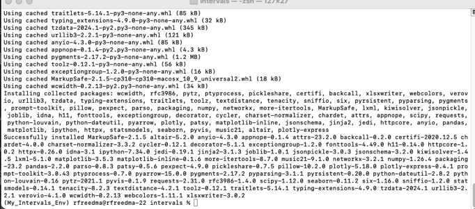

- Congratulations, you are ready to run CRIM Intervals in a Jupyter Notebook!

### 9.  Install and Launch Jupyter Lab via Anaconda Navigator

- Go back to Anaconda Navigator
- While your environment is active, go to the Home menu at left
- Now you will see a gallery of programs that can be 'installed'
- Install **Jupyter Lab**, which is how we will create, save and interact with Notebooks


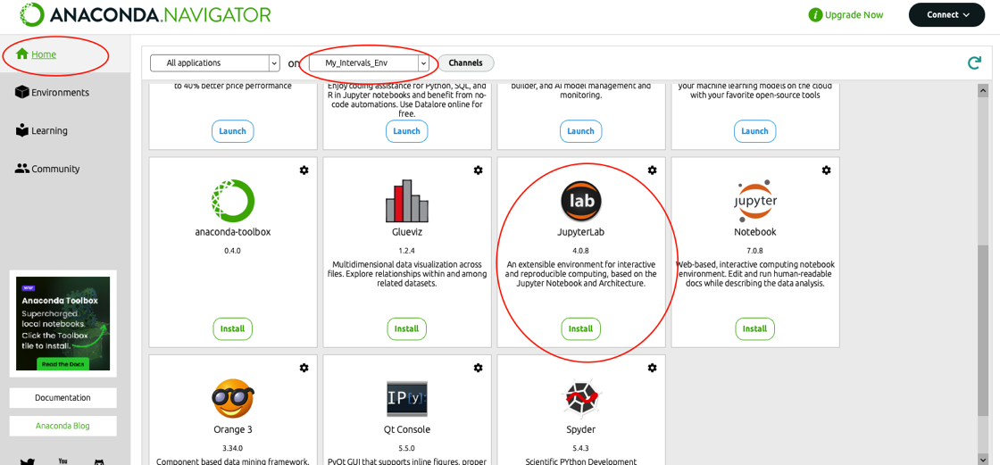


- After a brief 30 seconds or so, you will be ready to 'Launch' Jupyter Lab:

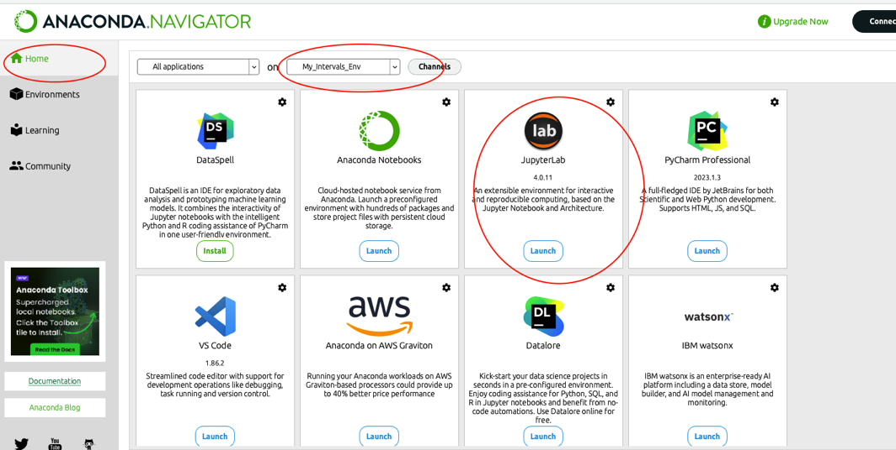


### 10.  Create Folder for your Notebooks and Run Them

- Jupyter Lab will 'look' into the Documents on your computer.
- Create a new My_CRIM_Notebooks folder somewhere convenient.  You can name it anything you like.
- Probably best to _avoid_ putting it in the CRIM Intervals code folder you just created!
- Next, start a new Python Session via the "Launcher" in the middle of your screen.

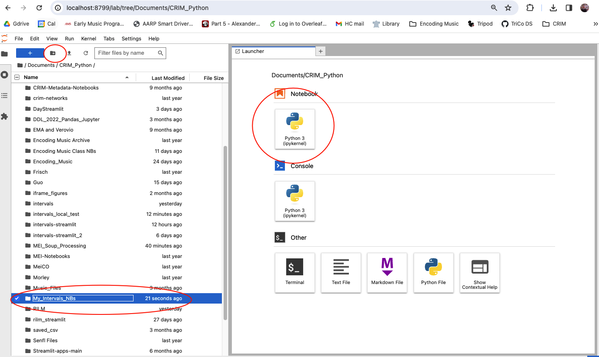


- Now use the "+" icon at the top left to create a new notebook.  
- Or open an existing Notebook . . . 

### 11.  Build a Notebook with the CRIM Intervals Tutorials

- Return to the [CRIM Intervals Tutorials Pages](https://github.com/HCDigitalScholarship/intervals/tree/main/tutorial) to learn how to build up your Notebook!


### 12.  Shut Down and Restart

- When you are finished you can simply close your browser window, and quit Anaconda Navigator and the Terminal application

- If you want to restart another time you will need to:

1.  Open Navigator
2.  Click on your Virtual Environment to activate it
3.  Go to the Home menu in Anaconda Navigator
4.  Launch Jupyter Lab
5.  Navigate to the folder where you keep your notebooks.

### 13.  Help with Jupyter Lab

Learn more via the [Jupyter Lab documentation](https://jupyterlab.readthedocs.io/en/latest/)


