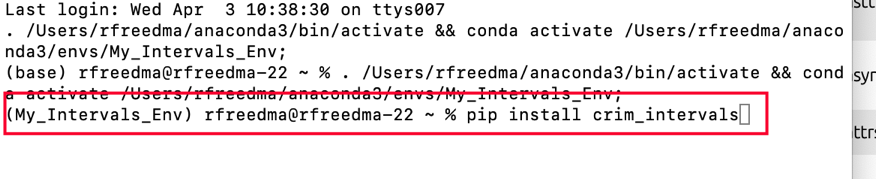
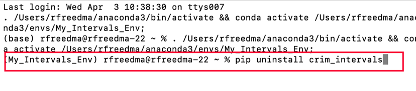

# Running CRIM Intervals Locally

[Learn about CRIM Intervals]( https://github.com/HCDigitalScholarship/intervals/blob/main/README.md)

## Run it Locally on your Own Computer in a Virtual Environment

This version runs well, and is extremely fast!

### 1. Get Anaconda Navigator to Manage Virtual Environments 

"Virtual Environments" are in effect small computing worlds on your computer.  They allow you to run special sets of tools in a way that keeps them isolated from all other programs.  Different programs require different 'dependencies', and different versions of these dependencies.  So keeping them separate is a good idea.

If you are new to virtual environments, one good solution is to manage environments is with **Anaconda Navigator**.  [Download it for your machine for free](https://www.anaconda.com/download).  [Learn more about Anaconda Navigator](https://learning.anaconda.cloud/).  


### 2. Create a New Virtual Environment

Here are the steps:

- A. Click "+ create" at the bottom of Navigator
- B. Name it (anything you like, but perhaps "crim_streamlit")
- C. On the **Python** dialogue, select "**3.10.13**" or any version that starts with "3.10"
- D. Click "create" in the dialogue, and wait a minute or two . . 


### 3. Create a Project Folder on your Computer

Now you will need to create a dedicated folder on your computer where you will keep your notebooks

- Make a **new folder** in the **Documents** folder on your machine.  You can name it as you like, but something simple like "**CRIM Intervals Notebooks**" will do.  

- Make sure you know where to find this folder, since you will need to work with files and notebooks there.

### 4. Return to Anaconda Navigator and your Virtual Env

- Make sure that the new environment you created is the active one (see image).

- Click on the arrow next your enviroment and select **Open Terminal**


- This will create an interactive 'Terminal' session, through which you can write commands to your computer that will download the code you need.
- You should see something like this, with the **name of your environment**, followed by the **name of your computer**, all followed by a **symbol and space for your cursor**:

```
(My_Intervals_Env) rfreedma@rfreedma-22 ~ % 
```


### 5. Install CRIM Intervals

- Now you will install the CRIM Intervals code as a Python 'package'.  Type:

```python
pip install crim_intervals
```


#### Need to Update CRIM Intervals?

If you learn of a new update for CRIM Intervals, it's simple to install this and replace your current version.

Open a terminal (as described above), then type:

```python
pip uninstall crim_intervals
```



You will be type "Y" to confirm the removal of the old version.

Now reinstall:

```python
pip install crim_intervals
```


### 6. Install iPywidgets

There is one other library you will need to install in order to use *@interact* filters with dataframes:

```python
pip install ipywidgets
```


### 7.  Install and Launch Jupyter Lab via Anaconda Navigator

- Go back to Anaconda Navigator
- While your environment is active, go to the Home menu at left
- Now you will see a gallery of programs that can be 'installed'
- Install **Jupyter Lab**, which is how we will create, save and interact with Notebooks
- Be sure to install **Version 4.0.11**.  If your version seems to be different, use the *gear* icon to update to 4.0.11


- After a brief 30 seconds or so, you will be ready to 'Launch' Jupyter Lab:


### 8.  Create Folder for your Notebooks and Run Them

- Jupyter Lab will 'look' into the Documents on your computer.
- Create a new My_CRIM_Notebooks folder somewhere convenient.  You can name it anything you like.
- Next, start a new Python Session via the "Launcher" in the middle of your screen.


- Now use the "+" icon at the top left to create a new notebook.  
- Or open an existing Notebook . . . 

### 9.  Build a Notebook with the CRIM Intervals Tutorials

- Return to the [CRIM Intervals Tutorials Pages](https://github.com/HCDigitalScholarship/intervals/tree/main/tutorial) to learn how to build up your Notebook!


### 10.  Shut Down and Restart

- When you are finished you can simply close your browser window, and quit Anaconda Navigator and the Terminal application

- If you want to restart another time you will need to:

1.  Open Navigator
2.  Click on your Virtual Environment to activate it
3.  Go to the Home menu in Anaconda Navigator
4.  Launch Jupyter Lab
5.  Navigate to the folder where you keep your notebooks.

### 11.  Help with Jupyter Lab

Learn more via the [Jupyter Lab documentation](https://jupyterlab.readthedocs.io/en/latest/)


## Sections in this guide

  * [01_Introduction_and_Corpus](/tutorial/01_Introduction_and_Corpus.md)
  * [02_Notes_Rests](/tutorial//02_Notes_Rests.md)
  * [03_Durations](/tutorial//03_Durations.md) 
  * [04_TimeSignatures_Beat_Strength](/tutorial//04_TimeSignatures_Beat_Strength.md)
  * [05_Detail_Index](/tutorial//05_Detail_Index.md)
  * [06_Melodic_Intervals](/tutorial//06_Melodic_Intervals.md)
  * [07_Harmonic_Intervals](/tutorial//07_Harmonic_Intervals.md)
  * [08_Contrapuntal_Modules](/tutorial//08_Contrapuntal_Modules.md)
  * [09_Ngrams_Heat_Maps](/tutorial//09_Ngrams_Heat_Maps.md)
  * [10_Lyrics_Homorhythm](/tutorial//10_Lyrics_Homorhythm.md)
  * [11_Cadences](/tutorial//11_Cadences.md)
  * [12_Presentation_Types](/tutorial//12_Presentation_Types.md)
  * [13_Musical_Examples_Verovio](/tutorial//13_Musical_Examples_Verovio.md)
  * [14_Model_Finder](/tutorial//14_Model_Finder.md)
  * [15_Visualizations_Summary](/tutorial//15_Visualizations_Summary.md)
  * [16_Network_Graphs](/tutorial//16_Network_Graphs.md)
  * [17_Python_Basics](/tutorial//17_Python_Basics.md)
  * [18_Pandas_Basics](/tutorial//18_Pandas_Basics.md)
  * [19_Music21_Basics](/tutorial//18_Music21_Basics.md)
  * [99_Local_Installation](/tutorial//99_Local_Installation.md)
